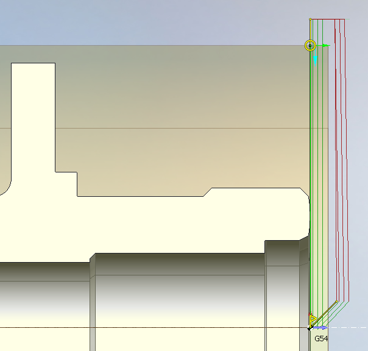
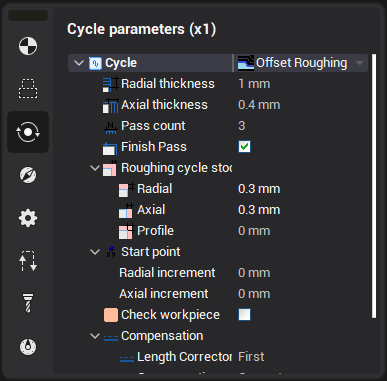

# Facing

Facing cycle based on Offset roughing or simple Profile machining cycles. It just defines another source geometrical contour as right or left face of the part with extending it to the workpiece bounds.

It designed to simply machine front and back axial faces of the part and frequently it is the first operation that prepare surface of the workpiece for the following machining.

Parameters of this item depend on the active cycle type. By default it is [Offset roughing](10190.md) so you can redefine Axial thickness, pass count and stocks etc. See documentation of exact cycle type to get more detailed info about parameters of each cycle.

