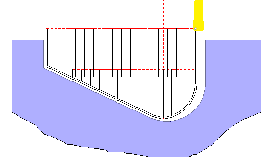
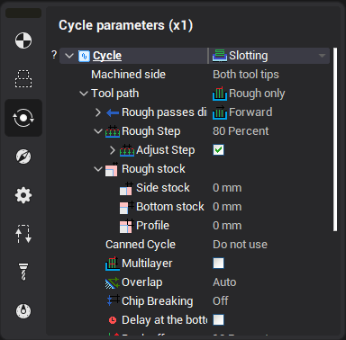
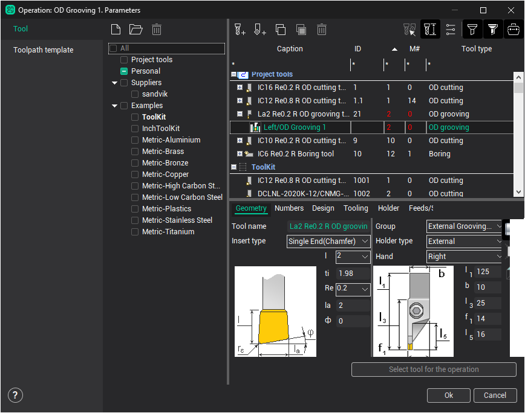
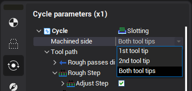
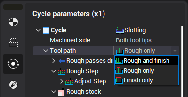
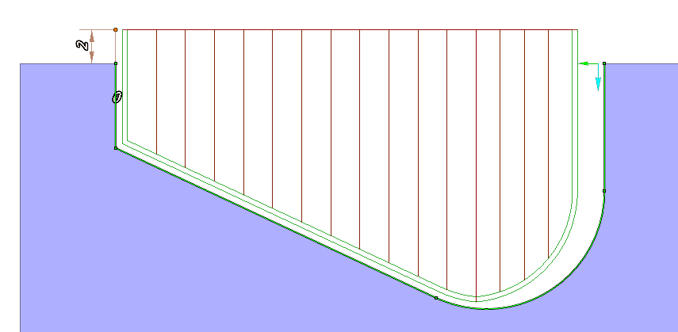
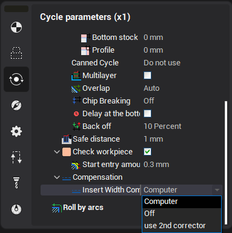
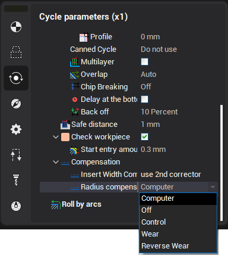
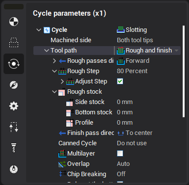

# Grooving cycle

Advanced grooving element generates the complex tool path for the any kinds of the lathe grooves. It allows to machine the outer radial, inner radial, face or inclined grooves.

The cycle parameters can be defined in the properties window.

The groove cycle defines the bottom point of the groove contour and machines the both sides of the groove by the different tool tips. every side is machined from the end point of the profile to the bottom point. The tool tips are defined in the Tool dialog that is shown below.

Machined side parameter allow to machine only one side of the groove. If 1st tool tip is selected then the only side that is touched by the first tool tip will be machined.

Advanced grooving cycle generates rough and finish passes. Tool path parameter defines what passes must be generated.

If Finish only is selected then finish pass only will be generated and the dialog will show only the parameters for the finish path. If Rough only is selected then the rough path will be generated and the parameter for the rough pass only is shown in the dialog. If Rough and finish is selected then all parameters are shown.

Safe distance parameter defines the distance from the groove top to the level of the rapid motions. To edit the safe distance it is possible to drag the point in the graphical window or input the value in the dialog.

Parameters of the finish path

Insert width compensation defines the correctors using.

Computer mode generates the tool path for the first corrector only.

Off mode is not realized.

Use 2nd corrector mode generates the tool path for the first and second correctors.

<strong>Radius compensation</strong> parameter is described [here](10208.md).

Parameters of the rough path

Rough step defines the distance between the rough passes. It can be defined in the percents of the tool width or in the units of the length. If option Adjust step is defined then CAM system automatically changes the step for the equal force on every plunge. Max Step deviation defines the maximal deviation of the adjusted step from the defined step. This value can be defined in the length units or in the percents of the tool width.

Canned cycle option allow to use or not use the canned cycles in the tool path.

Rough stock defines the additional stock for the rough passes.

Multilayer option is necessary to generate the rough passes in some layers. It is possible to define the layers count or the depth of the layer.

If Overlap option is enabled then the additional tool path is generated from the end of the rough cut to the end of the previous rough cut. In <strong>Auto</strong> mode, the <strong>Overlap</strong> option is enabled when the <strong>Multilayer</strong> option is enabled..Overlap option would be inactive if toolpath uses the canned cycles.

Chip breaking option can be enabled on the first rough cut or on every rough cut. It is possible to define the number of the breaks or the step for the chip breaking. The return distance for the chip breaking can be defined in the length units or in the % of the plunge step.

If Delay at the bottom option is enabled then the Delay command is generated in the end of the rough cut. The delay time can be defined in seconds or in the turns of the part.

Back off distance can be defined in the length units or the percents of the rough cut step.

The <strong>Check workpiece</strong> feature can significantly reduce the machining time. That portion of the moves on the working feed, which is outside the workpiece, is replaced by rapid movements. The parameter <strong>Start entry amount</strong> determines the distance from the workpiece at which to switch the feed.
