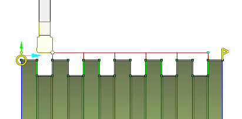

# Slotting cycle

The Lathe slotting cycle is the same with the [Grooving](10195.md) cycle just more finely tuned for rectangular grooves machining. So rectangular grooves now can be cleared in one click with minimal tool motions.

