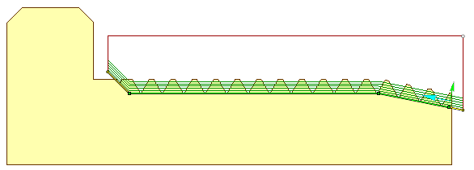

# Thread cycles

Thread cycle allows to generate passes (one ore more) for creating thread with specified parameters.

Threading area is specified by geometrical contour. Contour defines thread bottom diameter (inner diameter for external thread and outer diameter for inner thread). Second diameter is calculated by Depth parameter. Thread type - inner or outer - is specified by contour machining side (Perpendicular arrow near contour start point). Thread type - left or right - is specified by contour machining direction (Parallel arrow near contour start point) and spindle rotation direction. Contour approach and retract areas allows to set prolongation or chamfer for tool output.

Lathe threading cycles visualization exists. Interactive representation of the thread appears on the screen just after adding one of the threading cycles. Dimensions for thread pitch, depth top and bottom diameters can be edited directly in the graphical screen.

.png)

Pop-up action bar with the thread name allows to open threads table quickly and select one of the standard threads. The list of threads can be modified in this panel intuitively.

The Properties window for the job assignment item has the following parameters.

The <strong>Clearance stock</strong> is the distance from the thread to the transitions level. The cycle goes through this level while moving from the end of the previous pass to the start of the next one.

Thread profile is specified by tool form, parameters in Thread form group and for a free form thread only you additionally need to specify a <strong>threaded groove profile</strong> as a separate Job assignment's item.

<strong>Symbolic name</strong> it's just an optional symbolic designation of the thread type and size, M10 for example. You can use it to quick search the thread in the threads' table.

Thread pitch can be set by two cases. In the first case lead is defined as the distance between two same points of the profile, located on the neighboring threads. In the second case lead is specified by count of turns per length unit.

Operation allows to create multistart threads by editing Number of starts and Spindle start angle parameters. Various cycle types use Number of starts differently. In ISO G76 numbers of starts send to cycle as a parameter. But some machines have not this parameter in cycle. In this case it is possible to create multistart threads by making the same cycle with another Spindle start angle parameter value. Another way is using ISO G92 or ISO G32/33. In this case operation automatically generates passes with different spindle start angles.

Parameters in Sequence, Roughing and Finishing groups defines number and mutual arrangement of passes. They are different for the type of a thread profile, therefore, see the relevant topics:

- [Standard form thread](10198.md);
- [Free-form thread](10199.md).

Thread toolpath can be generated in [various output formats](10200.md): Multipass thread cycle (ISO G76), Single pass thread cycle ISO G92 or Advanced (expanded) thread machining.
