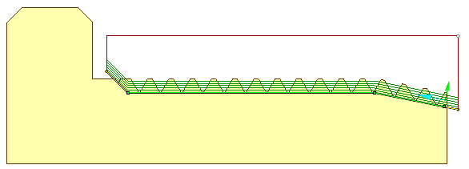
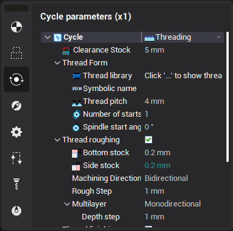

# ねじ切りサイクル

ねじ切りサイクルでは、指定されたパラメータに基づいてねじ切りを作成するための１つまたは複数のパスを生成できます。

ねじ加工領域は幾何輪郭で指定します。輪郭はねじ底の直径（外ねじでは内径、内ねじでは外径）を定義します。もう一方の直径はDepthパラメータで計算します。外ねじと内ねじの区別は、輪郭の加工側（輪郭開始点付近の垂直な矢印）で指定します。左ねじと右ねじの区別は、輪郭の加工方向（輪郭開始点付近の平行な矢印）と主軸回転方向で指定します。輪郭のアプローチ／退避領域では、工具の退出に対して延長または面取り量を設定できます。

旋盤ねじ切りサイクルには、可視化機能があります。いずれかのねじ切りサイクルを追加すると、ねじのインタラクティブな表示が画面上に現れます。ねじピッチ、深さ、および上下の直径の寸法は、グラフィック画面で直接編集できます。

.png)

ねじ名が表示されたポップアップアクションバーから、ねじテーブルをすばやく開き、標準ねじのいずれかを選択できます。ねじのリストは、このパネル上で直感的に編集できます。

ジョブ割り当て要素のプロパティウィンドウには、以下のパラメータがあります。

<strong>クリアランスストック</strong>は、ねじから移行高さまでの距離を示します。このサイクルは、前のパスの終了位置から次のパスの開始位置へと移動する際、この高さを通過します。

ねじプロファイルは、工具形状とThread formグループのパラメータで指定します。自由形状ねじの場合に限り、追加で<strong>ねじ溝輪郭</strong>をジョブ割り当ての別項目として指定する必要があります。

<strong>記号名</strong>は、ねじの種類とサイズを表す任意の記号名称です。（例： M10 など）ねじテーブル内で目的のねじをすばやく検索するために使用できます。

ねじピッチ 2つの方法で設定できます。1つ目の方法では、隣接するねじ山にあるプロファイル上の同じ位置の2点間の距離としてリードを指定します。2つめの方法では、長さ単位あたりの巻数でリードを指定します。

この操作は、<strong>開始数</strong>と<strong>主軸開始角度</strong>のパラメータを編集することで、多条ねじを生成できます。サイクルタイプによって、<strong>開始</strong>数の使用方法は異なります。ISO G76では、開始数はサイクルのパラメータとして送信されます。ただし、一部の機械では、このパラメータがサイクル内に存在しない場合があります。その場合は、別の 主軸開始角度パラメータ値を変更して同じサイクルを実行することで、多条ねじを作成することができます。別の方法として、ISO G92 または ISO G32／G33 を使用することもできます。この場合、加工オペレーションは異なる主軸開始角度を持つ加工パスを自動的に生成します。

順序、荒取り、仕上げグループ内のパラメータでは、パスの本数および相互配置を設定します。これらのパラメータは、ねじ輪郭の種類によって異なるため、該当するトピックを参照してください。

- [標準ねじ](10198.md);
- [自由形状ねじ](10199.md)

ねじ加工用ツールパスは、 [まざまな出力形式](10200.md)で生成できます。マルチパスねじ切りサイクル（ISO G76）、 単一ねじ切りサイクル ISO G92、または 高度な（拡張）ねじ切り加工 を使用できます。
