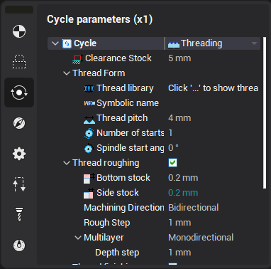
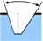
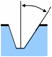
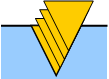
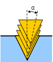

# Standard form thread

The Properties window for the job assignment item of the standard form threading operations has the following parameters.

Thread profile is specified by tool form and parameters in the <strong>Thread form</strong> group.

Value in <strong>Depth</strong> field defines thread profile height (difference between outer and inner diameters). This value must have positive value. Direction of this value calculates automatically and depends from contour <strong>Machining side</strong> parameter.

If plunge mode is <strong>Flank</strong> or <strong>Alternate Flank</strong>, then <strong>Thread angle</strong> and <strong>Inclination angle</strong> parameters defines angle of tool plunge at each pass.

| Thread angle | Inclination angle |
|---|---|
|  |  |

Parameters in <strong>Sequence</strong> group defines numbers of starts and plunge mode for each pass.

Value in <strong>Sequence</strong> combobox defines plunge mode. The following types of strategies are available:

- <strong>Radial</strong>. The direction of plunge is perpendicular to the axis of rotation.

- <strong>Flank</strong>. The plunge is made along one side of the ledge.

- <strong>Alternate flank</strong>. Plunge is made alternately along the two lateral sides of the ledge.

- <strong>Modified flank</strong>. Plunge with angle, specified at <strong>Angle</strong> parameter.

Practically thread is processed by several passes. It allows to improve surface quality and reduce tool loading.

It is possible to specify the number of passes by setting a count directly or by setting the first pass depth. In the last case the number of starts calculates automatically from the thread profile depth.

If cutting depth is constant, then the plunge to the next layer leads to increasing machining area and tool loading. It is possible to calculate cutting depth to provides constant machining area and tool loading. The <strong>Determine cut depth from</strong> parameter can accept two values: equal area and equal depth.

| Equal area | Equal depth |
|---|---|
|  |  |

In <strong>Equal area</strong> mode cutting depth decreases at each level. It is possible to set <strong>Minimal cut depth</strong>. If calculated depth becomes less than this value, then the minimal cut depth will be used.

To ensure the cleanliness of the surface last pass is performed with very small stock, and then the smoothering of the finished profile is performed several times without any stock. <strong>Finish pass depth</strong> parameter defines finish pass stock, <strong>Finish pass count</strong> parameter defines count of passes along the ready profile, taking with finishing pass.
