# Profile Threading

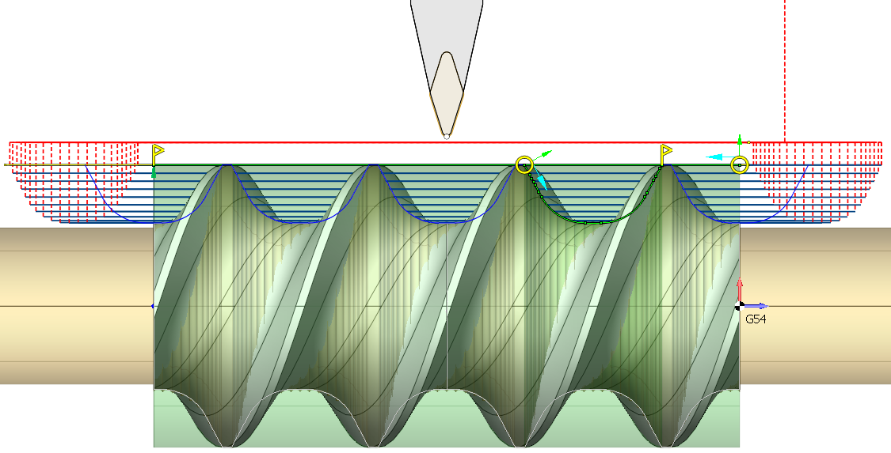

## Application Area:

The profile threading operation allows you to make threads with a profile shape different from the tool's profile. This is achieved by removing material inside the entire thread groove with a series of consecutive passes, the mutual arrangement of which is calculated taking into account both the shape of the tool and the shape of the threaded groove itself. You must define two items in the Job Assignment: an item that determines the position of the beginning and end of the thread on the part and an item that defines the shape of the thread groove. Depending on the orientation of the given profiles, you can get a cylindrical, conical or face thread (archimedean spiral).

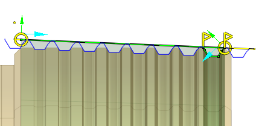

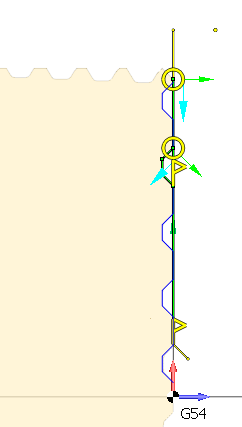

### Job Assignment:

<strong>Threading</strong>. This option determines the location of the threaded section on the part. When you select this item, the system automatically generates the thread line on the part profile. You can interactively modify this line in the graphical window by moving the start and end points, changing the thread direction arrow, adjusting the threaded groove side arrow, and shifting the line to alter the external or internal diameter of the thread. Thread type - inner or outer - is specified by contour machining side (Perpendicular arrow near contour start point). Thread type - left or right - is specified by contour machining direction (Parallel arrow near contour start point) and spindle rotation direction. Contour approach and retract areas allows to set prolongation or chamfer for tool output. Each operation considers only one item from the Job Assignment. To process multiple threads, even with identical parameters, create as many operations as needed. This feature activates continuous cylindrical, taper or face threading mode (G23/G33) with constant step. In this mode synchronization between tool movement and spindle rotation is enabled. All tool movements will processed in thread mode until the interpolation switching or rapid toolpath command will be detected. If tool moves parallel to the spindle rotation axis, cylindric thread will be formed. If tool moves both parallel and perpendicular to spindle rotation axis simultaneously, taper thread will be formed. It is possible to form special face thread, if tool moves perpendicular to spindle rotation axis. In this case groove looks like spiral of Archimedes will be formed at face. G32/G33 command does not generate any moves, so all working tool moves, approaches, retracts, transitions to the next passes should be specified separate parameters in the <strong>Strategy</strong> and <strong>Links</strong> tabs.

<strong>Single thread cycle</strong>. This option also serves to define the position of the threaded section on the part. The system will output the G92 cycle to the NC program. It generates closed set of moves for one threading pass. Picture below shows processing schema. Before calling this cycle tool is in Start point. Cycle is called by one frame of NC-program, defines thread start point, step, taper size, chamfer size and others. As a result of this frame the tool goes from Start to TSP point, thread to TEP point and returns to Start point. Usually threading is processed by several passes, so NC-program consists several cycle calls with various thread diameters. Therefore, it can be used for both standard-shaped threads and free-form threads.

<strong>Threaded</strong> <strong>groove</strong>. This feature identifies the contour that determines the thread groove profile. The system will repeat this contour along the <strong>Threading</strong> or the <strong>Single pass thread</strong> at intervals equal to the <strong>Thread Pitch</strong> specified in the <strong>Cycle Parameters</strong> tab. You can interacively input the <strong>Thread Pitch</strong> in the graphical window. It is important to check that the groove's direction and side correspond to the <strong>Threading's</strong> or the <strong>Single pass thread's</strong> similar parameters. In the figure, the green curve marks the start (point S) and end points of the thread. The blue curve outlines the shape of the threaded groove. The point marked in red (point H) on this contour aligns vertically with the start of the thread at point S. Since the profile-defining curve can be anywhere relative to the start point of the thread, it is essential to correctly position point H.

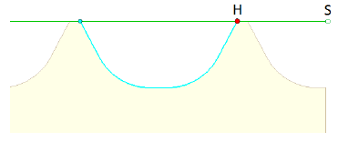

### Cycle Prarameters:

#### Cycle.

You can select one of the available turning cycles described in the <strong>Job Assignment</strong>. When you switch a cycle in this section, the corresponding element in the <strong>Job Assignment</strong> automatically changes. The set of parameters varies for each turning cycle.

Click here to expand..

<strong>Clearance Stock</strong>. Specifies the distance from the thread to the transitions level. The cycle goes through this level while moving from the end of the previous pass to the start of the next one.

<strong>Thread Form.</strong> The group configures the geometric parameters of the thread.

Click here to expand..

<strong>Thread Libray</strong>. Select thread parameters from the database if the parameters for the thread conform to standard ones. There is no need to enter all parameters manually. Just establish the type of thread and select its designation from the dropdown list. The database will automatically complete the remaining parameters with standard values.

<strong>Symbolic Name</strong>. It's just an optional symbolic designation of the thread type and size, M10 for example. You can use it to quick search the thread in the threads' table. You can enter your own designation for non-standard threads.

<strong>Thread Pitch</strong>. Specify the thread pitch either in length units or as the number of threads per length unit.

<strong>Number of starts.</strong> Specifying two or more starts results in the cutting of a multi-start thread. Various cycle types use Number of starts differently. In ISO G76 numbers of starts send to cycle as a parameter. But some machines have not this parameter in cycle. In this case it is possible to create multistart threads by making the same cycle with another <strong>Spindle start angle</strong> parameter value. Another way is using ISO G92 or ISO G32/33. In this case operation automatically generates passes with different spindle start angles.

<strong>Spindle Start Angle</strong>. Specifies the angle from the X-axis where the thread's helical line cutting starts.

<strong>Thread Roughing</strong>. When setting the flag, the tool removes material from the thread grooves over several passes. This is essential for achieving a quality surface and reducing tool load. The system performs roughing passes by moving the tool sequentially with a fixed step along the rotational axis, dividing the process into multiple layers.

<strong>Bottom Stock</strong>. This is the stock left at the bottom of the thread groove for removal by subsequent finishing passes.

<strong>Side Stock</strong>. This is the stock left at the sides of the thread groove for removal by subsequent finishing passes.

<strong>Machining Direction</strong>. Defines the order of rough cuts.

<strong>Bidirectional</strong>. The Bidirectional machining is performed from the groove center to the groove flanks at first moving to the right end then to the left one.

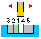

<strong>Alternate</strong>. The Alternate machining starts from the groove center, then advances to the flanks by alternating the forward and backward tool strokes

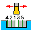

<strong>Forward</strong>. The Forward mode machines a groove from front to back. B y default it is direction from right to left.

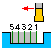

<strong>Backward</strong>. The Backward mode machines a groove from back to front. B y default it is direction from left to right.

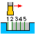

<strong>Rough Step</strong>. It is the distance between two adjacent rough cuts along a thread. Specify either the distance between tool travels or the number of tool travels. The smaller the step between the tool travels is the smaller the tool load is but machining time grows.

<strong>Multilayer</strong>. This feature allows to remove a rough material by several layers.

<strong>Off</strong>. This value corresponds to the single-layer machining.

<strong>Monodirectional</strong>. This feature activates multilayer machining, p ass directions are identical on each layer.

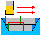

<strong>Zigzag</strong>. This feature activates multilayer machining, a root pass direction correspond the <strong>Machining D</strong><strong>irection</strong>, at the each following layer the pass direction is opposite to the previous layer.

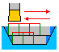

<strong>Depth Step</strong>. Defines the maximal distance to plunge the tool on each layer. It can be defined either by depth directly, or by number of layers.

<strong>Thread Finishing</strong>. Upon flag installation, the system creates finishing passes along the profile contour defined in the <strong>Job Assignment</strong>.

<strong>Finish step.</strong> It is the distance between two adjacent passes, calculated by the profile length. The step can be defined by count of passes or by distance directly.

<strong>Machining Direction</strong>. Defines the order of finish cuts.

<strong>Forward</strong>. Finishing is conducted heading towards the spindle.

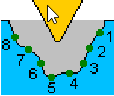

<strong>Backward</strong>. Finishing is conducted away from the spindle.

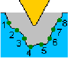

<strong>Bidirectional</strong>. Finishing passes are arranged from the periphery of the thread groove to the center

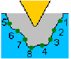

<strong>Compensation.</strong> This parameter controls the method of outputting cutter width compensation.

<strong>Length corrector.</strong> Controls the output to the program of tool offset numbers that are specified in the <strong>Tools – Tool Properties – Numbers.</strong>

<strong>First</strong>. If the <strong>First</strong> parameter is selected, the system outputs the <strong>1st corrector's</strong> number to the NC program.

<strong>Second.</strong> If the <strong>Second</strong> parameter is selected, the system outputs the <strong>2nd corrector's</strong> number to the NC program.

#### Roll by arcs.

The system rounds the external corners of the toolpath by arcs with a radius equal to the tool nose radius. The parameters group works similarly to the <strong>OD Roughing and ID Roughing operations.</strong> [Details](316.md).

### Feeds/Speeds:

Using this dialogue the user can define the spindle rotation speed; the rapid feed value and the feed values for different areas of the toolpath. Spindle rotation speed can be defined as either the rotations per minute or the cutting speed. The defining value will be underlined. The second value will be recalculated relative to the defining value, with regard to the tool diameter. [Details](100142.md)

### Transformations:

Parameter's kit of operation, which allow to execute converting of coordinates for calculated within operation the trajectory of the tool. [Details](10168.md)

### Part:

A Part is a group of geometrical elements that defines the space to check for gouges. [Details](330.md)

### Workpiece:

A workpiece model of an operation defines the material to be machined. [Details](738.md)

### Fixtures:

As the Fixtures the fixing aids such as chucks, grips, clamps, etc., and the restriction areas of any other nature are usually specified. [Details](10283.md)
