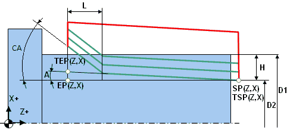

# Threading cycle types

The toolpath of threading operations can be generated using various output formats. We consider each of them separately.

Multipass thread cycle (ISO G76) allows you to use a single frame of the NC-program to set all parameters necessary for machine to make a standard form thread. Required depth is reached automatically by generating several passes. Among the parameters of the cycle there are start and finish point coordinates, taper angle (for taper threads), size of chamfer for tool out, profile angles, thread depth, passes count, plunge strategy and others. See NC control documentation for more information.



```
                    Example of NC program
G01 X70 Z5.0 F1.0 M08            (Approach to start point)
G01 X70 Z5.0 F1.0 M08            (Approach to start point)
G76 P010060 
G76 X57.4 Z-24.0 P1.3 Q0.35 F2.0 (Calling G76 multipass thread cycle) 
G00 X200.0 Z150.0 M09            (Retract)
```

Single pass thread cycle ISO G92 (can be G92, G78, G21 and others in different NC controls) generates closed set of moves for one threading pass. Picture below shows processing schema. Before calling this cycle tool is in Start point. Cycle is called by one frame of NC-program, defines thread start point, step, taper size, chamfer size and others. As a result of this frame the tool goes from Start to TSP point, thread to TEP point and returns to Start point. Usually threading is processed by several passes, so NC-program consists several cycle calls with various thread diameters. Therefore, it can be used for both standard-shaped threads and free-form threads.


```
                    Example of NC-program
X60.0 Z20.0 M08 
G01 Z10.0 F1.0        (Approach to Start point)
G92 X29.4 Z-52.0 F2.0 (Calling cycle for one threading pass)
X28.9                 (Modal calling G92 cycle with another diameter value)
X28.5                 (Modal calling G92 cycle with another diameter value) 
X28.1                 (Modal calling G92 cycle with another diameter value)
X27.8                 (Modal calling G92 cycle with another diameter value)
X27.56                (Modal calling G92 cycle with another diameter value)
X27.36                (Modal calling G92 cycle with another diameter value)
X27.26                (Modal calling G92 cycle with another diameter value)
G00 X200.0Z150.0M09   (Retract)
```

Advanced (expanded) thread machining is processed by using ISO G32/G33 (can be different in various machines). This command activates continuous cylindrical, taper or face threading mode with constant step. In this mode synchronization between tool movement and spindle rotation is enabled. All tool movements will processed in thread mode until the interpolation switching or rapid toolpath command will be detected. If tool moves parallel to the spindle rotation axis, cylindric thread will be formed. If tool moves both parallel and perpendicular to spindle rotation axis simultaneously, taper thread will be formed. It is possible to form special face thread, if tool moves perpendicular to spindle rotation axis. In this case groove looks like spiral of Archimedes will be formed at face.

G32/G33 command does not generate any moves, so all working tool moves, approaches, retracts, transitions to the next passes must be programmed in NC program directly. It can be used for both standard-shaped threads and free-form threads.

```
                    Example of NC program
G00 X60.0 Z10.0 M08 (Approach to Start point) 
G00 X29.4           (Approach to start of pass 1)
G32 Z-52.0 F2.0     (Threading synchronized with spindle)
G00 X60.0           (Return to Start)
Z10.0 
X28.9               (Approach to start of pass 2)
G32 Z-52.0          (Threading synchronized with spindle)
G00 X60.0           (Return to Start)
Z10.0 
X28.5               (Approach to start of pass 3)
G32 Z-52.0          (Threading synchronized with spindle)
G00 X60.0           (Return to Start)
Z10.0 
X28.1               (Approach to start of pass 4)
G32 Z-52.0          (Threading synchronized with spindle)
G00 X60.0           (Return to Start)
Z10.0 
X27.8               (Approach to start of pass 5)
G32 Z-52.0          (Threading synchronized with spindle)
G00 X60.0           (Return to Start)
Z10.0 
X27.56              (Approach to start of pass 6) 
G32 Z-52.0          (Threading synchronized with spindle)
G00 X60.0           (Return to Start)
Z10.0 
X27.36              (Approach to start of pass 7)
G32 Z-52.0          (Threading synchronized with spindle)
G00 X60.0           (Return to Start)
Z10.0 
X27.26              (Approach to start of pass 8)
G32 Z-52.0          (Threading synchronized with spindle)
G00 X60.0           (Return to Start)
Z10.0
X200.0 Z150.0 M09   (Retract)
```
