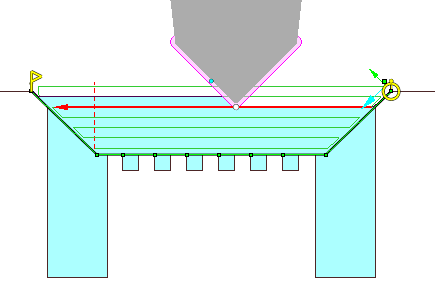
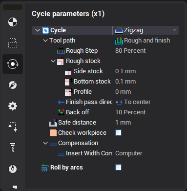
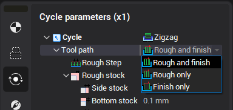
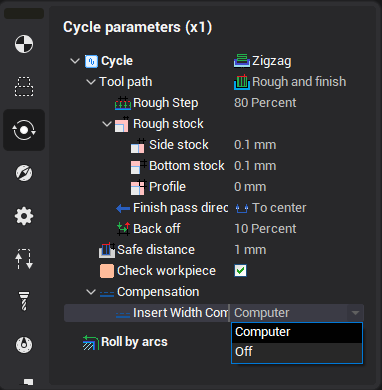

# Zigzag cycle

Zigzag lathe cycle generates toolpath useful for machining areas which are closed from both sides with neutral tool. The tool is lowered down layer by layer, and performs horizontal moves with changing direction for each layer.

Common parameter of the cycle

Zigzag cycle generates rough and finish passes. Tool path parameter defines what passes must be generated.

If Finish only is selected then finish pass only will be generated and the dialog will show only the parameters for the finish path. If Rough only is selected then the rough path will be generated and the parameter for the rough pass only is shown in the dialog. If Rough and finish is selected then all parameters are shown.

Safe distance parameter defines the distance from the groove top to the level of the rapid motions. To edit the safe distance it is possible to drag the point in the graphical window or input the value in the dialog.

<strong>Parameters of the finish path</strong>

Insert width compensation defines the correctors using.

- Computer mode generates the tool path for the first corrector only.

<strong>Parameters of the rough path</strong>

Rough step defines the distance between the rough passes. It can be defined in the percents of the tool width or in the units of the length.

Rough stock defines the additional stock for the rough passes.

Check workpiece option removes all idle parts of the working motions that really do not cut the workpiece.
