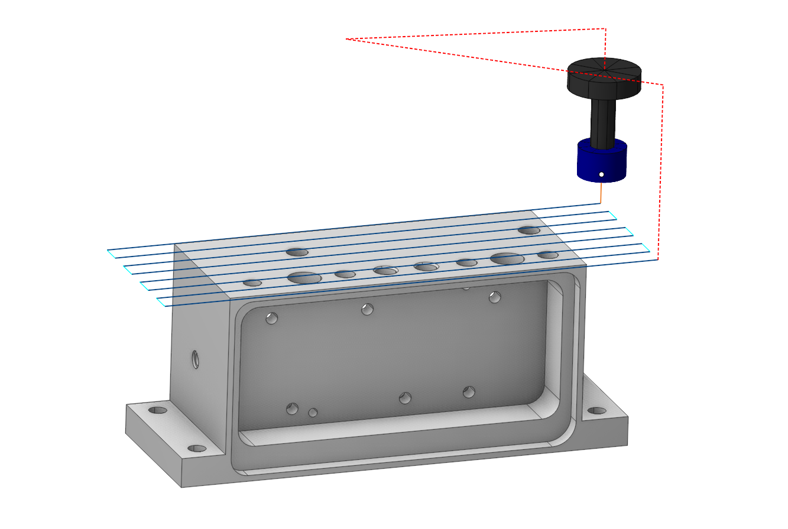
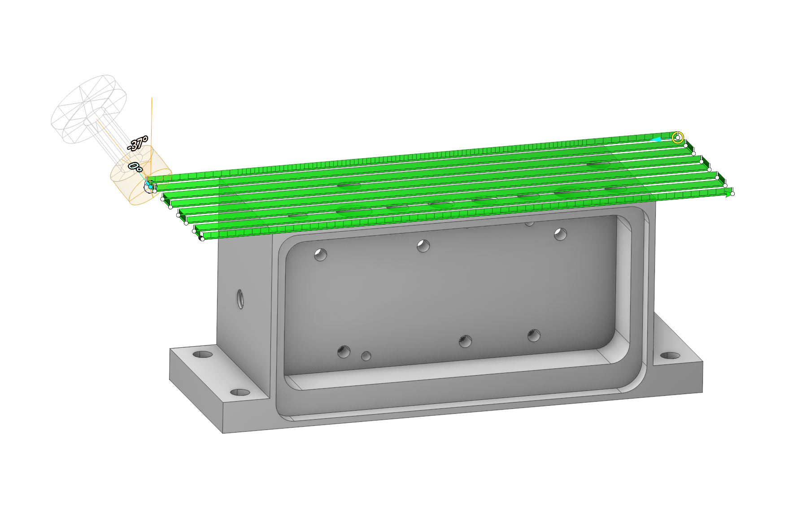
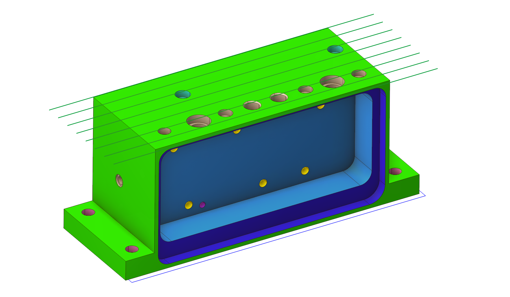

# Conversion of arbitrary toolpath to 6D Contour operation

 

## Application area:

it's possible to take (almost) any operation, and convert its toolpath to "6D Contour" operation, which has this toolpath as job assignment. This allows you to make slight modifications to the original toolpath, such as altering tool normals, before post-processing.

To activate, you need to right-click on a specific operation, select in the dialog box that appears <strong>Convert toolpath to 6D Contour operation.</strong>

In this case, a group of <strong>splines</strong> is created on the <strong>Model</strong> tab.

