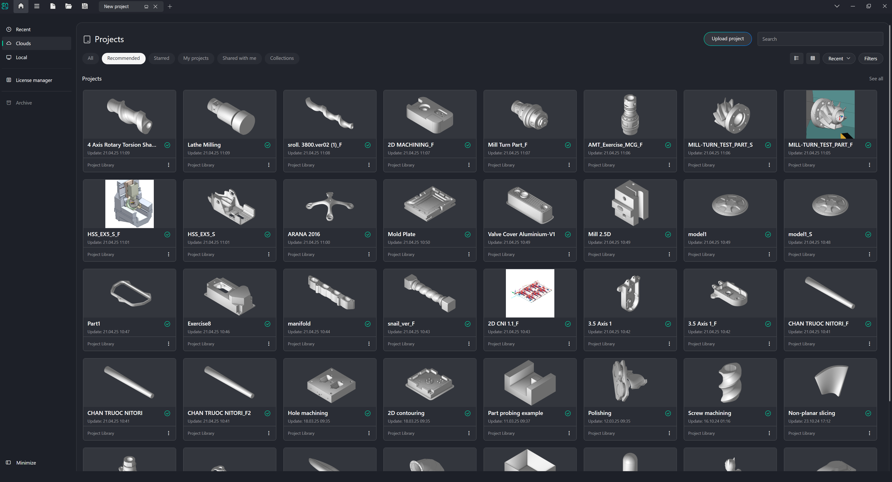
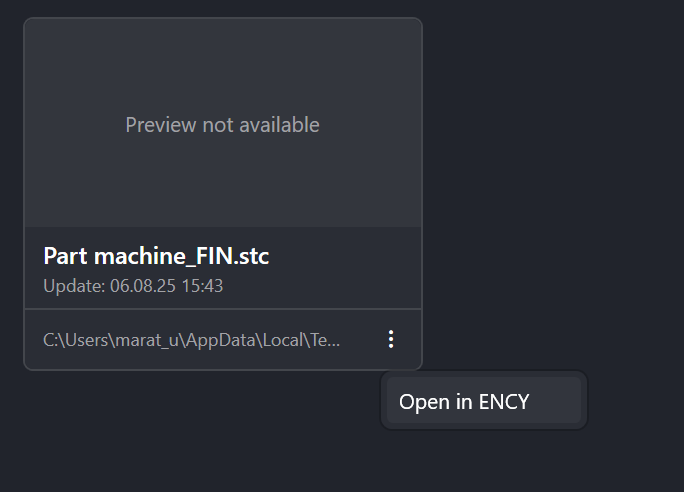
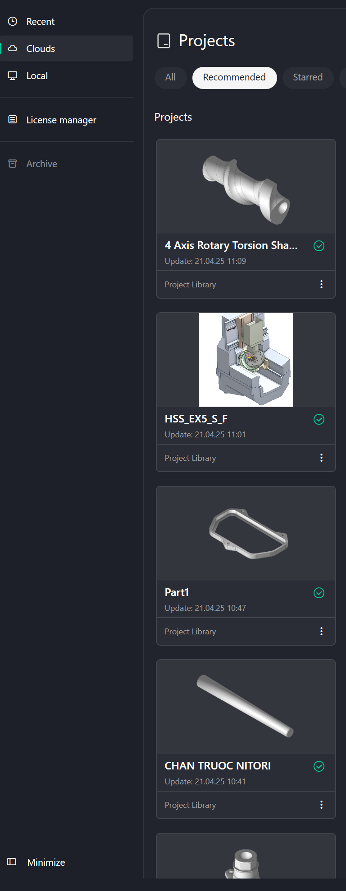
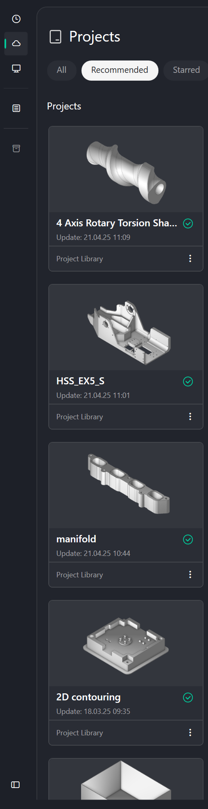
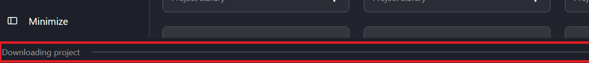

# Home Page

## Application Area:

The <strong>Home Page</strong> allows you to quickly and conveniently browse previously opened projects and use the project library, accelerating the start-up process and increasing developer productivity.

### Recent.

The <strong>Recent</strong> tab allows you to see recently opened projects for quick access to them. Clicking on the three dots allows you to open the project in the last active window of the system.

### Cloud.

The Project Library allows you to find and open example projects from our online library. [Details](1020141.md)

### Local.

It acts as a file explorer. Now there's no need to search for a project through Windows Explorer. You can do it on the system's Home Page, which greatly simplifies and speeds up project navigation.

Through the three dots, you can also open the project in the CAM system or open its location in File Explorer.

### License manager.

The license manager contains functions for working with licenses for CAM system and licenses for its modules. [Details](10025.md)

### Minimize.

It allows you to hide the tab labels, which increases the workspace.

 

### Progress bar.

At the bottom of the screen, you can find a progress bar that displays the download and opening status of projects.

