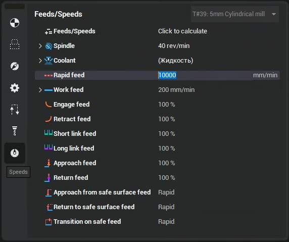

# Rapid feed

When calculating operations based on the G-code in robots, it is necessary to set the rapid feed rate, which is specified in the "Feeds/Speed" -> "Rapid Feed" (the default value is set to 10,000 mm/min).

Note: Usually, robotic control programs do not have a specific rapid feed command, as implemented in lathes or milling machines with the G00 command. All movement commands are specified with a feed value. To ensure correct calculation and rendering of the robot's movement trajectory, please set the rapid feed value.
