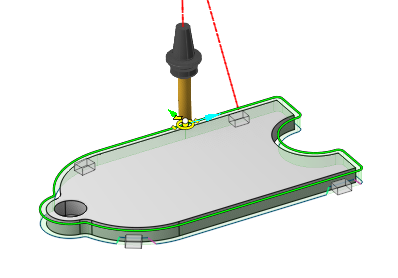
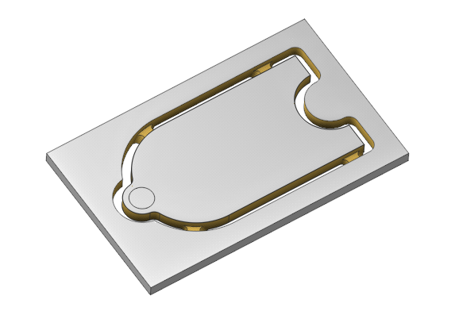
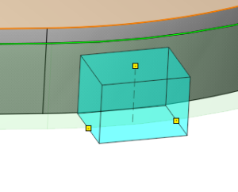
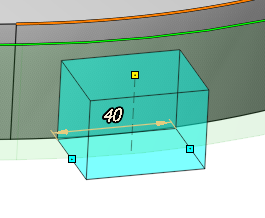
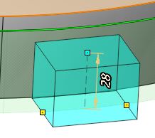

# Tabs

 

## Application Area:

Tabs are needed to hold the part or fragments of the workpiece from falling out at the final stage of processing, which can lead to tool breakage or defective parts. The tabs window in the Job Assigment only describes its geometry and methods of reproduction along the contours. In this window, you can perform the initial addition of tabs with automatic placement according to a certain rule. Then you can edit the position and size of each tab directly in the graphic window.

  

### Add tabs.

Necessary for the formation of the geometry of the tabs and their relative positioning.

Click here to expand..

**Scope**

Necessary to determine the types of contour to which the tabs are applied.

<strong>Closed and unclosed.</strong> Tabs will be created in both open and closed contours.

<strong>Closed only.</strong> Tabs will be created in closed contours.

<strong>Unclosed only.</strong> Tabs will be created in open contours.

<strong>Selected countours only.</strong> We define the rule for which contours to add tabs to - all or only the selected ones. By default, if no contours were selected in the work order - all contours, if at least one was selected - selected contours only.

<strong>Replace existing tabs.</strong> Whether to recreate tabs for those contours where tabs were created earlier. Defaults to true.

**Dimensions**

Determines the dimensions of thetabs.

<strong>Tab size.</strong> Defines the length of the tabs. "By default", in mm or in % of the tool diameter.

<strong>Tab height.</strong> Defines the height of the tabs. "By default", in mm or in % of the tool diameter, FullHeight (the full height of an element or operation).

**Default dimensions**

By default is defined in Default dimensions.

<strong>Default tab size.</strong> Specifies the values for the defaulttab sizes.

<strong>Default tab height.</strong> Specifies the values for the defaulttab sizes.

**Placement strategy**

Defines the tabs placement strategy.

<strong>Quantity per countour.</strong> A specified number of tabs is automatically created for each contour. Thetabs are distributed evenly along the length of the contour.

<strong>Desired tab count.</strong> Number of tabs.

<strong>Linear density.</strong> One tab is automatically created for each section of the specified length <strong>Linear density</strong> on each curve.

<strong>Linear density.</strong> Density by length in mm, or as a % of the tool diameter. Default is 500%.

<strong>Minimal tab count.</strong> Minimum number oftabs per circuit. Default is 0.

<strong>Area density.</strong> Оne tab is automatically created for each <strong>Planar density</strong> elementary area on each closed curve.

<strong>Area density.</strong> Area density in mm^2, or in % of the tool diameter. Default is 1000%.

<strong>Minimal tab count.</strong> Minimum number oftabs per circuit. Default is 0.

<strong>Avoid corners.</strong> When the Avoid corners option is enabled, the algorithm starts checking whether the given tab falls into a corner. If it does, it tries to shift it a small amount to one side, then to the other, until it finds a place outside the corner. If it fails, it leaves the tabs in its original place.

<strong>Merge tabs of neighbor curves.</strong> This parameter removes tabs from adjacent contours that affect this contour.

