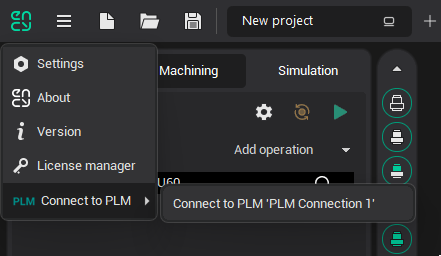
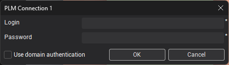
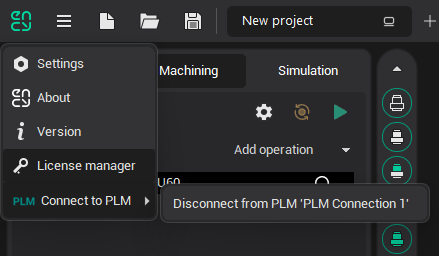

# Authorizing an External System in the CAM Main Window

To authorize an external PLM system, go to the main menu and hover over the <strong><strong>Connect to PLM</strong></strong> option. <em>This option appears in the menu only if at least one PLM connection is configured.</em>

A submenu will appear, displaying all available PLM connections. Select the desired PLM connection to open the authorization window.

Enter your account credentials or select the <strong>Use domain authentication</strong> checkbox to proceed.

To disconnect from the PLM system, return to the main menu, hover over <strong>Connect to PLM</strong>, and click <strong>Disconnect from</strong> <strong><em>[connection name]</em></strong>.

