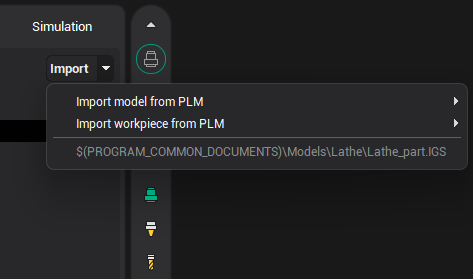
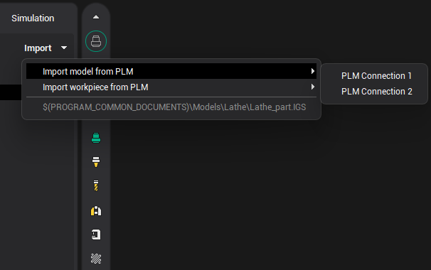
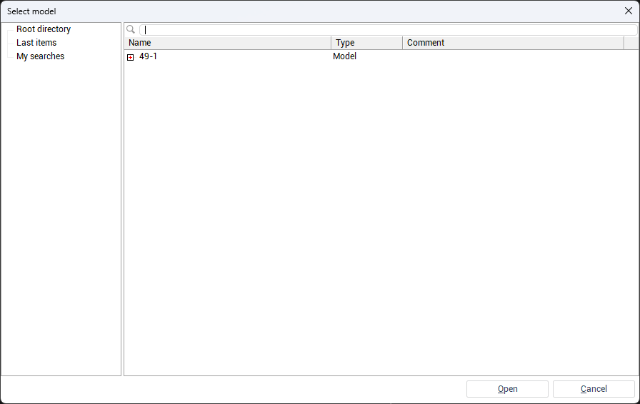
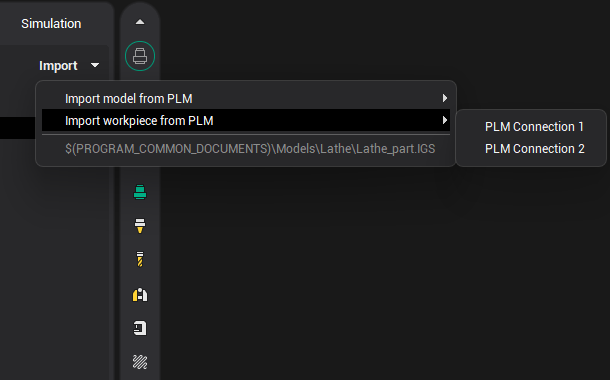
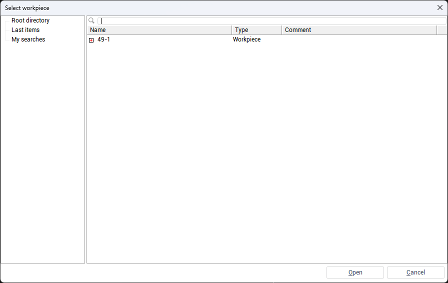

# Importing a Geometry Model from an External System

Geometry models of parts and workpieces can be imported directly from a PLM system using the <strong>Import</strong> button in the <strong>main window</strong> toolbar. This button includes a small arrow that opens a drop-down menu with additional import options:

- <strong>Import model from PLM</strong>
- <strong>Import workpiece from PLM</strong>

Each option includes a submenu where you can select a configured PLM connection.

<strong>Note:</strong> The <strong>PLM-</strong><strong>related</strong> <strong>option</strong><strong>s</strong> appears only if at least one PLM connection is configured.

## Importing a Geometry Model from an External System

Click the arrow next to the <strong>Import</strong> button, then select <strong>Import model from PLM</strong> → <em>[connection name]</em>.

 A window will open with a tree view of available geometry models in the external system. Select the desired model and click <strong>Open</strong>. The model will be imported into the current project.

## Importing a Workpiece from an External System

Click the arrow next to the <strong>Import</strong> button, then select <strong>Import workpiece from PLM</strong> → <em>[connection name]</em>.

 Browse the external system's object structure to find the required workpiece, then click <strong>Open</strong>. The selected workpiece will be imported into the current project.

