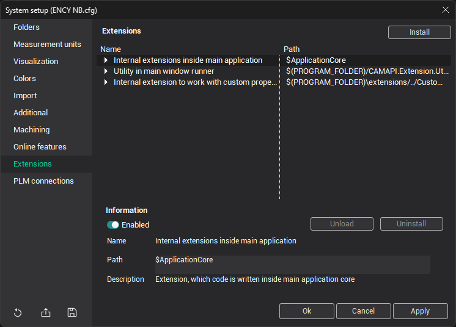
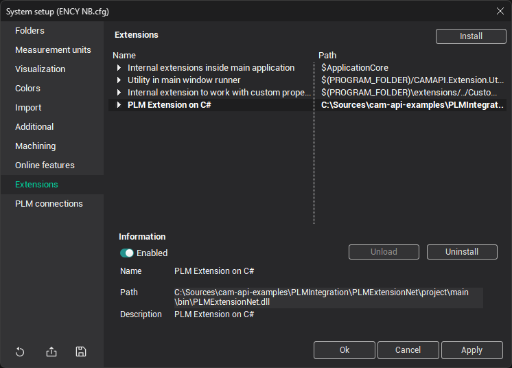
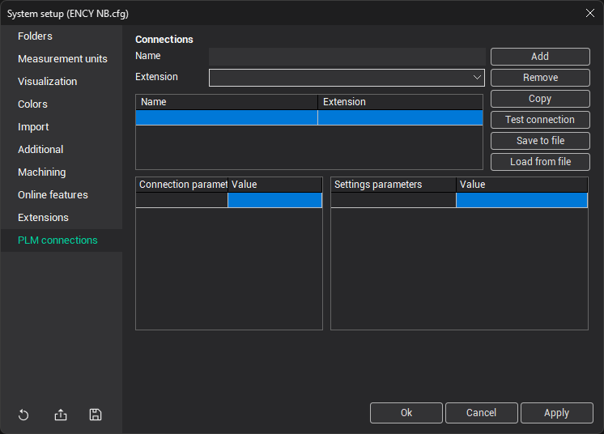
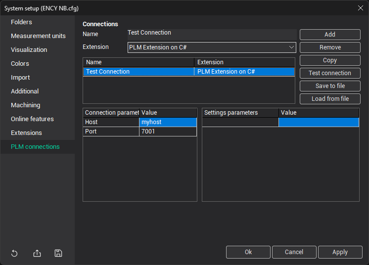

# Installing and Configuring PLM Integration Modules

## Setting Up the Integration Extension

To setup PLM system integration module, open <strong>System Settings</strong> window and go to <strong>Extensions</strong> tab.

Click the <strong>Install</strong> button. In opened <strong>File Explorer</strong> window choose extension's json-file or dext-file and open it. Successful installation example:

You can also disable extension or uninstall it, select it in list of extensions and switch toggle on <strong>Enabled</strong> or click the <strong>Uninstall</strong> button.

The extension can also be installed via the command-line interface (CLI, ExtensionManagerCLI.exe could be found at the program installation folder). To do so, open the Windows Command Prompt and enter the command:

<strong>ExtensionManagerCLI.exe register-library --path "</strong><em>[path to the extension]</em><strong>"</strong> <strong>--storage stAllUsers</strong>

## Configuring PLM Connections

To create and configure connection, open the <strong>System Settings</strong> window and go to the <strong>PLM connections</strong> tab.

Write connection name in the <strong>Name</strong> text field and choose installed PLM extension in drop-down menu. Then click <strong>Add</strong> button.

You can configure selected connection changing values of suggested connection parameters or settings parameters in tables below.

Also you can save settings to file, click the <strong>Save to file</strong> button. This file can be used to load settings, click <strong>Load from file</strong> button.

You can remove connection. Select it in list of connections and click the <strong>Remove</strong> button.

To check connection, click the <strong>Test connection</strong> button and enter your account credentials.

Click the <strong>Apply</strong> or <strong>Ok</strong> buttons to apply changes.
