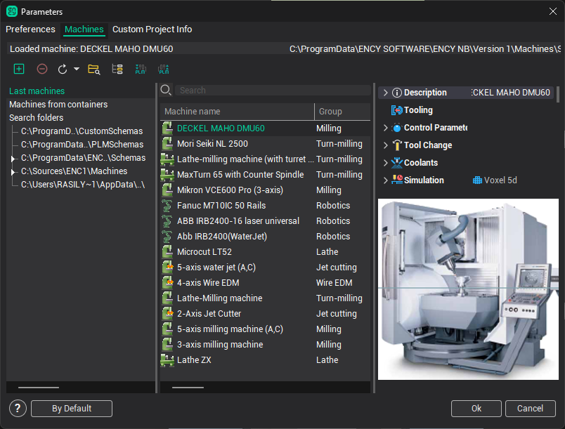
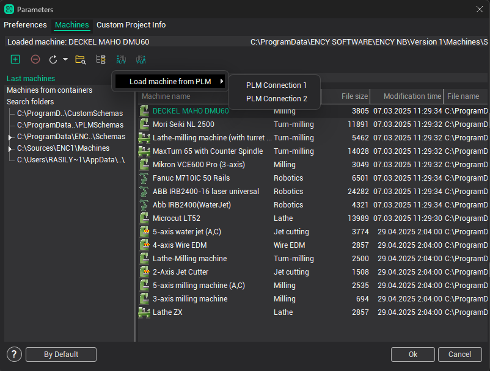
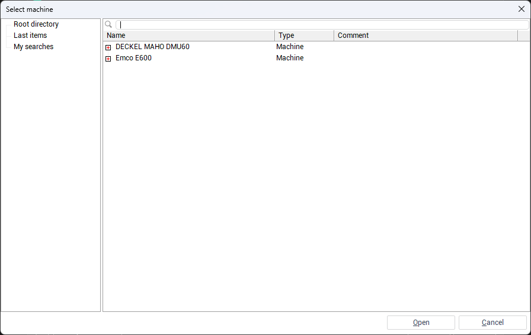
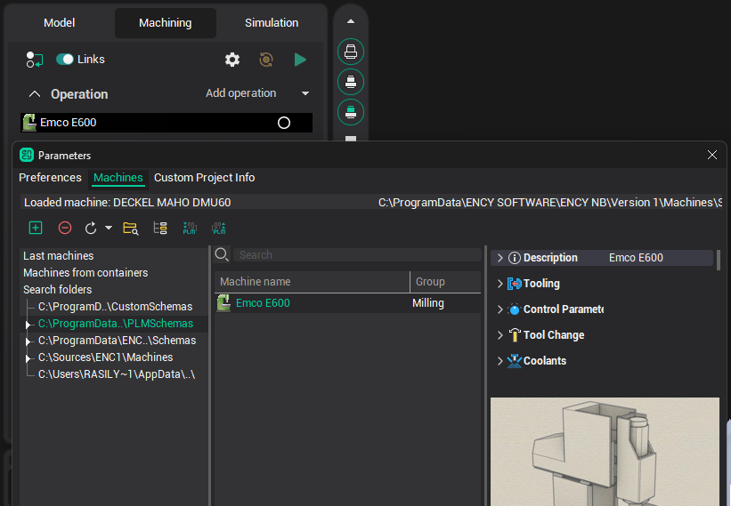
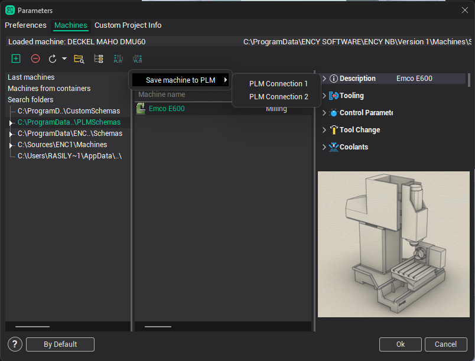
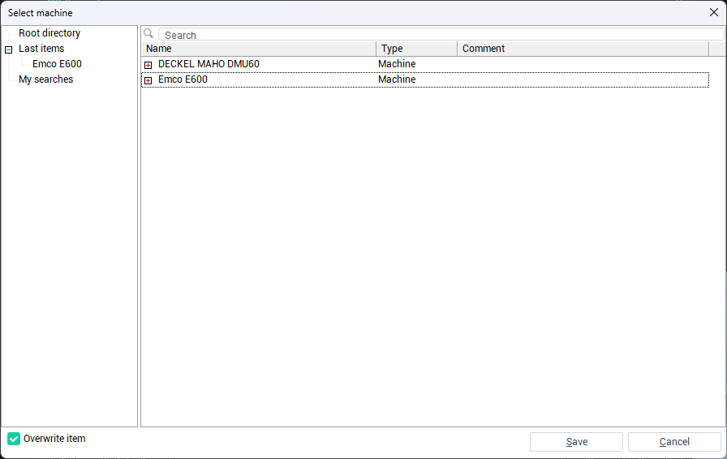
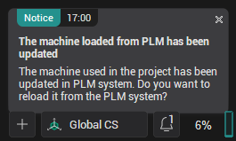
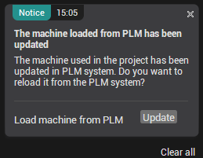

# Loading and Saving Machines to an External System

To manage machines with an external system, open the <strong>Parameters</strong> window and navigate to the <strong>Machines</strong> tab. In the upper panel of this tab, you will see the buttons <strong>Load machine from PLM</strong> and <strong>Save machine to PLM</strong>, which allow interaction with the external system.

## Loading a Machine from an External System

To load a machine from an external system, click the <strong>Load from PLM</strong> button. In the drop-down menu, select <em>[connection name]</em> to open a window displaying a tree of available objects from the external system.

Locate the desired CAM machine by expanding the nested objects in the tree or by using the name search. Then click the <strong>Open</strong> button.

The selected machine will be loaded and set as the active machine in the main window.

## Saving a Machine to an External System

To save a machine to an external system, select the machine you want to save, then click the <strong>Save to PLM</strong> button and choose <em>[connection name]</em> from the drop-down menu to open a window displaying a tree of available objects from the external system.

Select the destination element where the machine files should be saved. To overwrite existing files, check the <strong>Overwrite item</strong> checkbox, then click the <strong>Save</strong> button.

If a machine element has been modified in the external system, a notification will appear in the main window.

Expand the notification and click the <strong>Update</strong> button to load the updated version of the machine.

You can check for updates in the <strong>Parameters</strong> window by right-clicking the machine and selecting <strong>Check for updates in PLM</strong> from the context menu.
