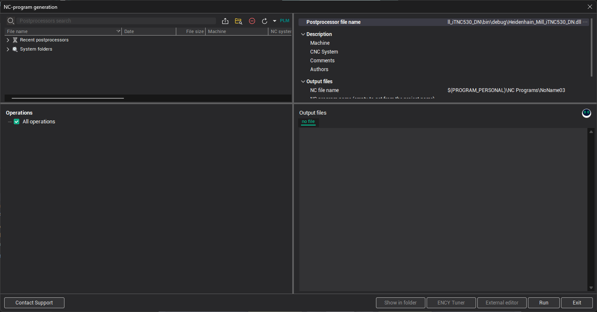
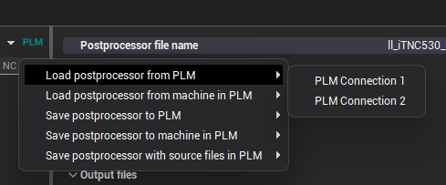
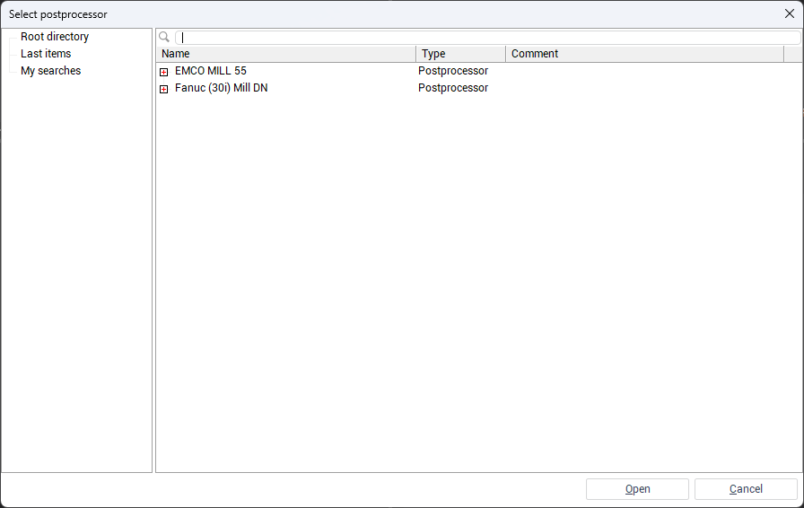
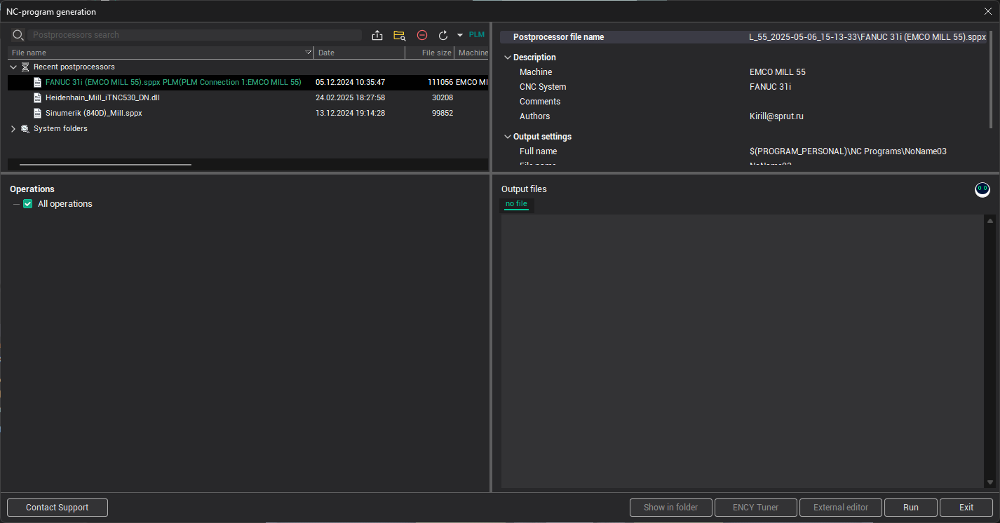
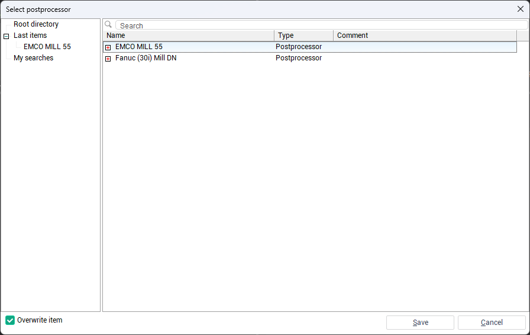
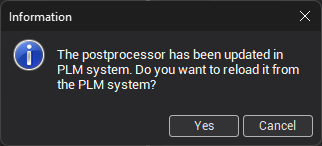

# Loading and Saving Postprocessors to an External System

To manage postprocessors with an external system, open the <strong>N</strong><strong>C-program generation</strong> window.

In the upper panel of this window, there is a <strong>PLM</strong> button. Clicking this button opens a drop-down menu with the following options:

- <strong>Load postprocessor from PLM</strong>
- <strong>Load postprocessor from machine in PLM</strong>
- <strong>Save postprocessor to PLM</strong>
- <strong>Save postprocessor to machine in PLM</strong>
- <strong>Save postprocessor with source file</strong><strong>s</strong> <strong>to PLM</strong>

Each of these options includes a submenu for selecting a PLM connection <em>only if more than one connection is configured</em>.

## Loading a Postprocessor from an External System

To load a postprocessor from an external system, click <strong>PLM</strong> → <strong>Load postprocessor from PLM</strong>→ <em>[connection name]</em>. A window will appear displaying a tree of available objects from the external system.

Locate the required postprocessor by navigating the object tree or using the name search, then click <strong>Open</strong>. The selected postprocessor will be loaded and displayed in the <strong>Recent p</strong><strong>ostprocessors</strong> list with a name that reflects its origin from the external system.

To load a postprocessor associated with a specific machine in the external system, click <strong>PLM</strong> → <strong>Load postprocessor from machine in PLM</strong> → <em>[connection name]</em>. In the opened window, browse to the machine that contains the postprocessor, then select it and click <strong>Open</strong> to load it into the application.

## Saving a Postprocessor to an External System

To save a machine to an external system, select the postprocessor you want to save, then click <strong>PLM</strong> → <strong>Save postprocessor to PLM</strong> → <em>[connection name]</em>.

A window will open displaying the object tree from the external system. Select the destination element where the postprocessor should be saved. To overwrite existing files, enable the <strong>Overwrite item</strong> checkbox, then click <strong>Save</strong>.

To save both the compiled postprocessor and its source files, select <strong>PLM</strong> → <strong>Save postprocessor with source file</strong><strong>s</strong> <strong>to PLM</strong> → <em>[connection name]</em>. This option is available only if the postprocessor has a <strong>.dll</strong> extension and associated source files. The source files will be saved as an archive along with the compiled file.

To associate a postprocessor with a specific machine in the external system, click <strong>PLM</strong> → <strong>Save postprocessor to machine in PLM</strong> → <em>[connection name]</em>.

Then, follow the same steps as in the standard saving process — select the destination location, enable <strong>Overwrite item</strong> if necessary, and click <strong>Save</strong>.

If a postprocessor has been updated in the external system since it was last loaded, an informational dialog box will appear when you attempt to run it. The dialog notifies you that a newer version is available. You can choose one of the following actions:

- Click <strong>Yes</strong> to download and apply the updated version of the postprocessor.
- Click <strong>Cancel</strong> to continue using the currently loaded version without updating.

