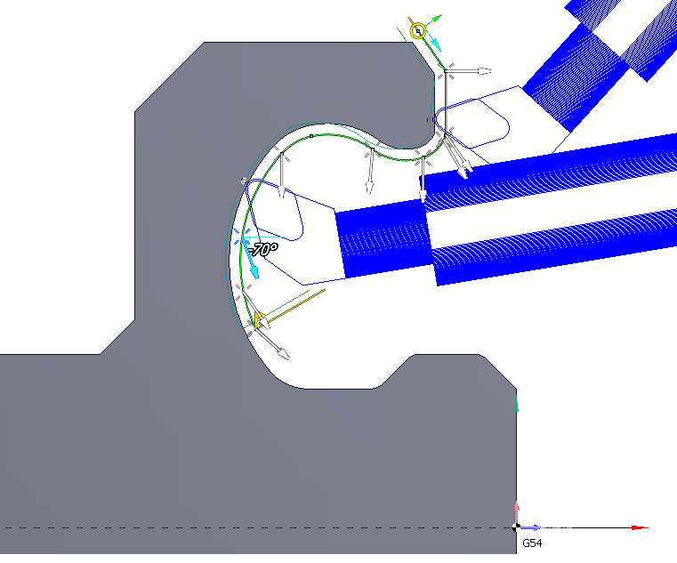
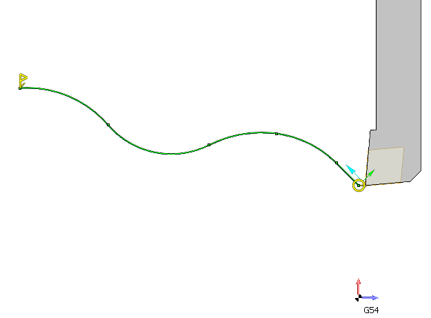
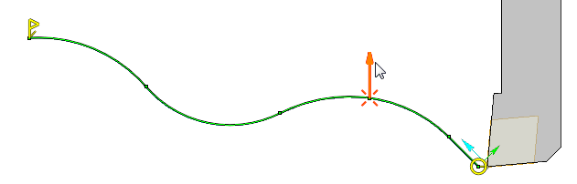
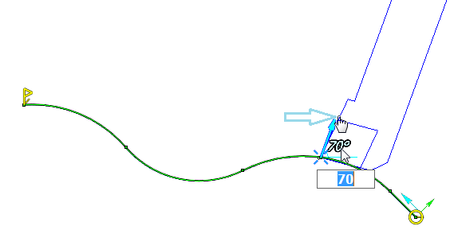
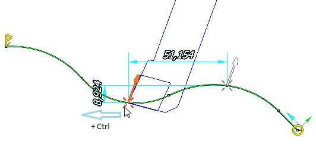
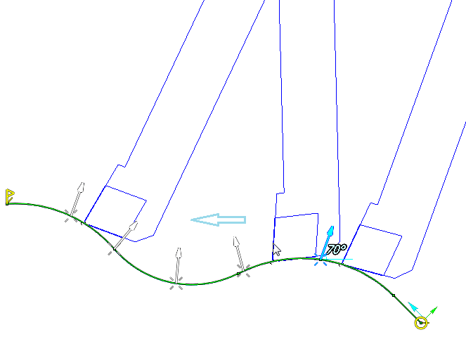
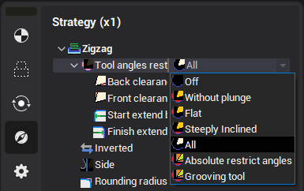

# 4-axis turning

4-axis turning cycle allows to machine hard-to-reach areas of a part with just one operation by continuously changing of the tool inclination angle in the process of moving along a contour (using the 4-th axis of the machine, if available). This reduces the number of tool changes, thus increasing productivity. In addition to the defined contour geometry to calculate the toolpath information about the tool inclination angles in some points of the contour also is used. The user can specify any number of angles of the tool, which can be set at an arbitrary point of the contour.

Almost all of the parameters for this type of machining can be specified interactively in a graphical window. Immediately after adding the "4-axis turning" item with some contour just the specified contour with start and end markers will appear. There will be no of additional visible tool inclination vectors. In this case, after calculating the toolpath angle of the tool will remain the same, so what, he specified in the operation's initial state properties inspector.

However, if you move the mouse cursor in the area of the nodal points of the contour then tool inclination vectors will be highlighted. By default, they are invisible, because the angle of the tool in these points is already corresponds to these vectors.

If you want to change the tool angle in the highlighted point, you can clutch and drag the vector. In this case the display will show angular dimension, which determines the angle of the tool relative to the axis of rotation, as well as the profile of the tool. Desired angle of the tool at a point can be achieved either directly by dragging with the mouse or by entering a specific value of the angle in the field that appears when you click at dimension's digits.

Now if you click anywhere on the screen then this vector becomes unselected and will remain visible. This way you can add new vectors. To define the inclination vector in the intermediate not nodal point of the contour you can clutch the cross at the bottom of vector and drag it. Vector will move behind the mouse pointer along the contour. If hold down Ctrl at this time, then the copy of the original vector will be changed.

The slope between two given vectors vary continuously from the first vector to the second. It can be checked by clutching the tool profile, that appears when you select a vector, and drag it along the contour. The tool will move following the mouse pointer along the whole contour. The slope of the tool, will also vary continuously, and will conform to the slope of vector at the current point. Thus, If you turn on the visibility of part or workpiece, you can easily control the position of the tool for the presence of collisions, as well as to achieve optimal cutting angle.

To delete unwanted inclination vectors of the tool you can select them on the screen and press the Del key on your keyboard.

The remaining [machining parameters](10208.md) for the "4-axis turning" item have no differences from other job assigment items of the [lathe operations](10207.md). They can be edited in the properties window of the job assignment item.

