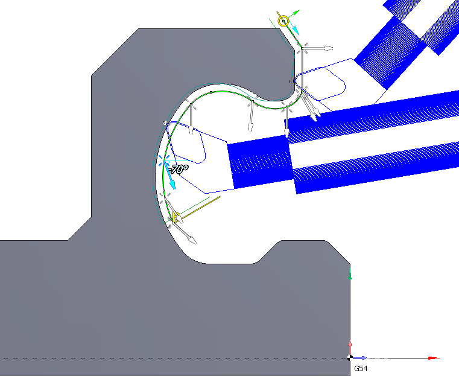
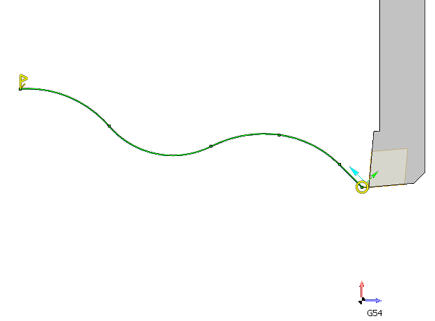
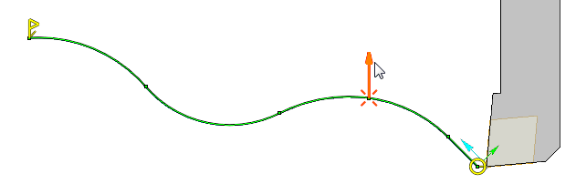
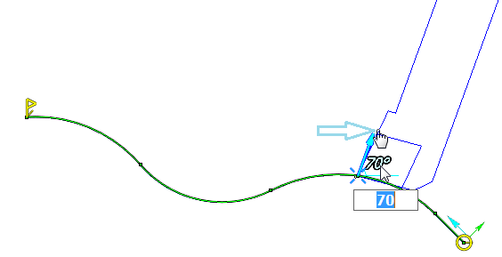
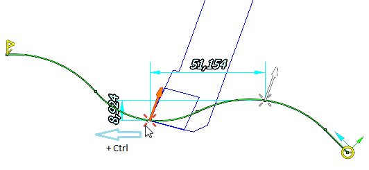
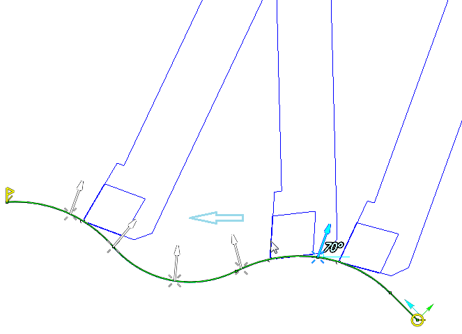
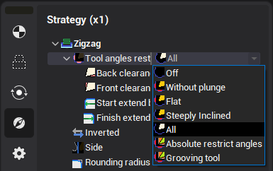

# 4軸旋削

4軸旋削サイクルは、輪郭に沿って移動する際に工具の傾斜角を連続的に変化させることで（使用可能な場合はマシンの第4軸を使用）、加工が難しい領域を1つのオペレーションで加工できます。これにより工具交換の回数が減少し、生産性が向上します。ツールパスの計算には、指定した輪郭形状に加えて、輪郭上のいくつかの点における工具傾斜角の情報も使用されます。ユーザーは、任意の数の工具角度を指定でき、輪郭上の任意の点に設定できます。

この加工のほぼすべてのパラメータは、グラフィックウィンドウでインタラクティブに設定できます。輪郭を指定して「4軸旋削」要素を追加した直後は、輪郭と開始・終了のマーカーだけが表示され、追加の工具傾斜ベクトルは表示されません。この状態でツールパスを計算すると、工具角度は、オペレーションの初期状態のプロパティインスペクターで指定した角度のままになります。

輪郭のノード付近にマウスカーソルを移動すると、工具傾斜ベクトルがハイライト表示されます。これらの点での工具角度がすでにベクトルと一致しているため、既定では非表示です。

ハイライトされた点で工具角度を変更するには、ベクトルをつかんでドラッグします。回転軸に対する工具角度を示す角度寸法と、工具のプロファイルが表示されます。マウスで直接ドラッグするか、寸法の数値をクリックして表示されるフィールドに角度を入力し、目的の工具角度に設定します。

画面上の任意の場所をクリックすると、そのベクトルの選択は解除されますが、そのまま表示された状態になります。これにより、新しいベクトルを追加することができます。輪郭の中間点（ノードでない点）に傾斜ベクトルを設定する場合は、ベクトル下部の十字マークを掴んでドラッグします。ベクトルは、輪郭に沿ってマウスカーソルに追従して移動します。このとき、Ctrlキーを押しながら操作すると、元のベクトルのコピーが変更されます。

2 つのベクトル間の傾斜は、最初のベクトルから次のベクトルまで連続的に変化します。この動作は、ベクトルを選択すると表示される工具輪郭を掴んで輪郭に沿ってドラッグすることで確認できます。工具は、マウスカーソルに追従して輪郭全体に沿って移動します。工具の傾斜も連続的に変化し、現在位置のベクトル傾斜に一致します。したがって、パーツまたはワークの表示を有効にしておけば、衝突の有無をチェックしながら工具の位置を簡単に調整でき、最適な切削角度を実現することが可能です。

不要な工具傾斜ベクトルを削除するには、画面上で対象のベクトルを選択し、キーボードのDelキーを押します。

『4軸旋削』項目のその他の[加工パラメータ](10208.md)は、[旋盤加工](10207.md)における他のジョブ割り当て項目と変わりません。これらは、ジョブ割り当て項目のプロパティウィンドウで編集できます。

