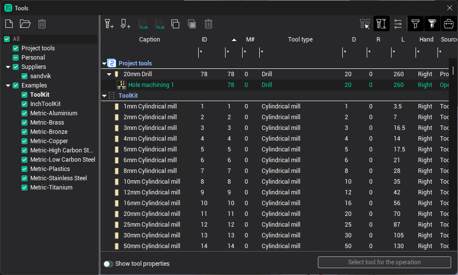
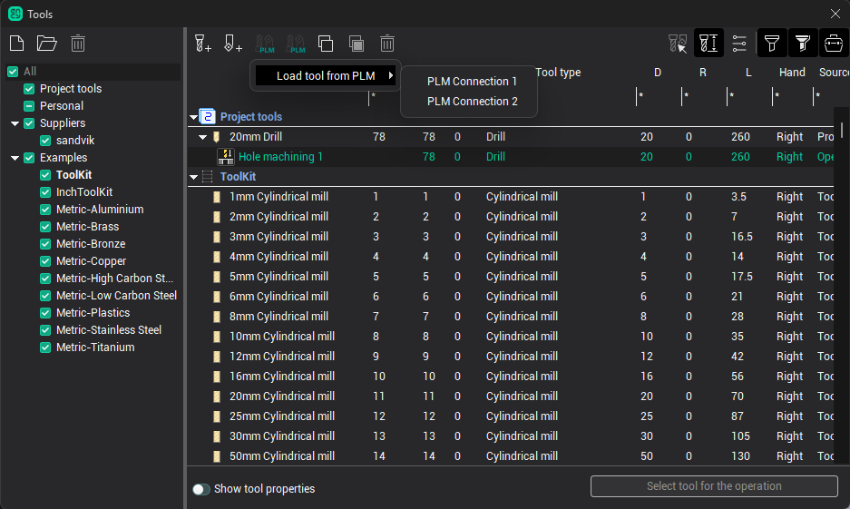
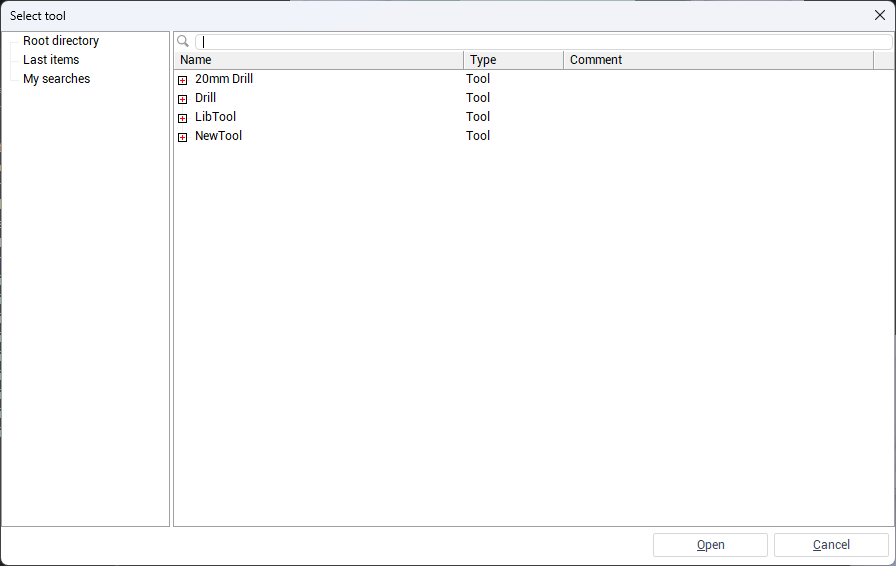
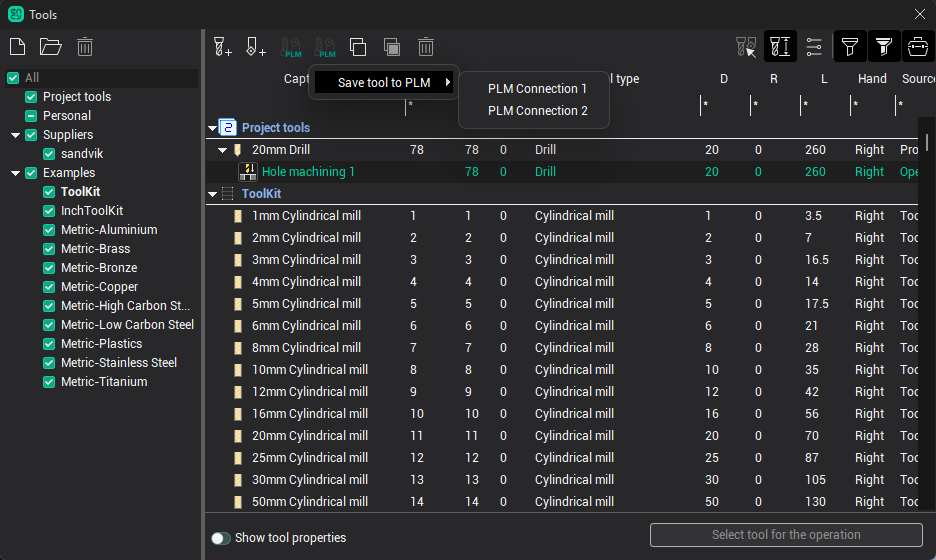
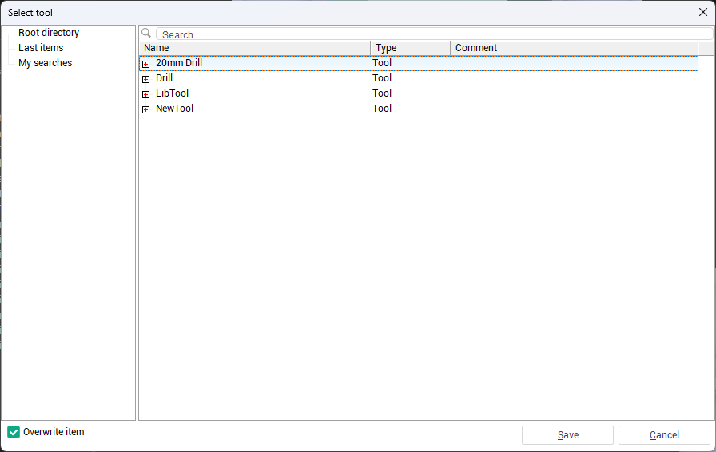

# Loading and Saving Tools to an External System

To manage tools with an external system, open the <strong>Tools</strong> window. In the upper panel, you will find the <strong>Load</strong> <strong>tool</strong> <strong>from PLM</strong> and <strong>Save</strong> <strong>tool</strong> <strong>to PLM</strong> buttons.

## Loading Tools from an External System

Click <strong>Load</strong> <strong>tool</strong> <strong>from PLM</strong>, then choose the required connection.

 A window will appear showing a tree of available objects. Select the tool set you want to load and click <strong>Open</strong>. The tools will be imported and displayed in the <strong>Tools</strong> window.

## Saving Tools to an External System

Select a tool, click <strong>Save</strong> <strong>tool</strong> <strong>to PLM</strong>, select the desired connection, and choose the destination in the external system's structure.

To overwrite existing files, enable the <strong>Overwrite item</strong> checkbox. Then click <strong>Save</strong> to complete the operation.

