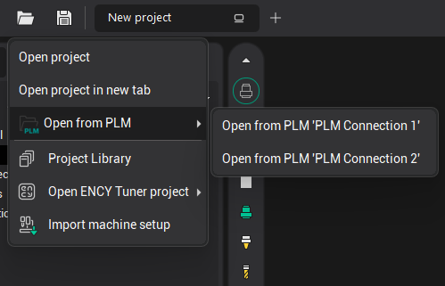
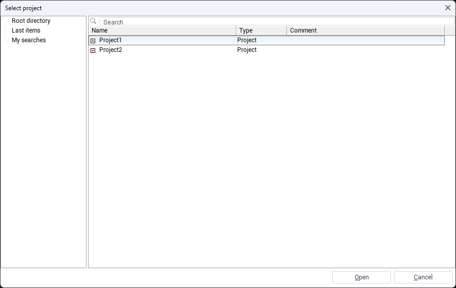
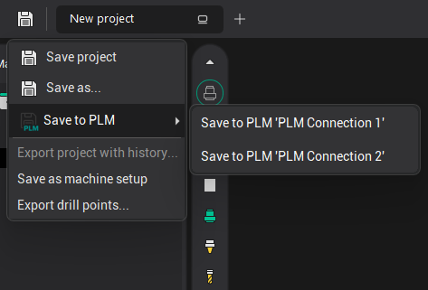
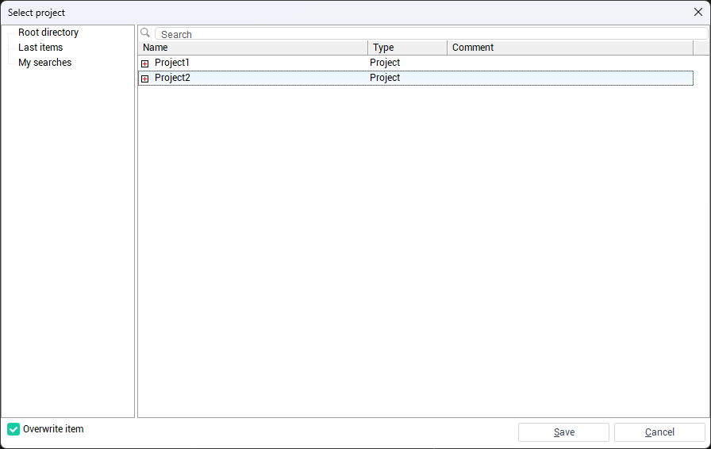

# Opening and Saving Projects to an External System

To manage projects with an external system, use the <strong>Open Project</strong> and <strong>Save Project</strong> buttons in the <strong>main window</strong> toolbar. When hovering over these buttons, a drop-down menu appears with additional options, including <strong>PLM-</strong><strong>related</strong> <strong>option</strong>. Selecting this item reveals a submenu with all available PLM connections.

<strong>Note:</strong> The <strong>PLM-</strong><strong>related</strong> <strong>option</strong> appears only if at least one PLM connection is configured.

## Opening a Project from an External System

Hover over the <strong>Open Project</strong> button, select <strong>Open from</strong> <strong><strong>PLM</strong></strong> → <strong>Open from</strong> <strong><strong>PLM</strong></strong> <em>[connection name]</em>.

 A window will open displaying the object tree from the external system. Locate and select the desired project, then click <strong>Open</strong>. The project will be opened.

## Saving a Project to an External System

Hover over the <strong>Save Project</strong> button, select <strong>Save Project</strong> <strong>to</strong> <strong>PLM</strong> → <strong>Save Project</strong> <strong>to</strong> <strong>PLM</strong> <em>[connection name]</em>.

 A window will open displaying the object tree from the external system. Choose the location to save the project, optionally enable the <strong>Overwrite item</strong> checkbox, and click <strong>Save</strong>.

