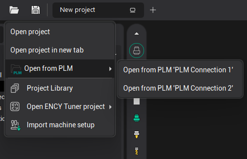
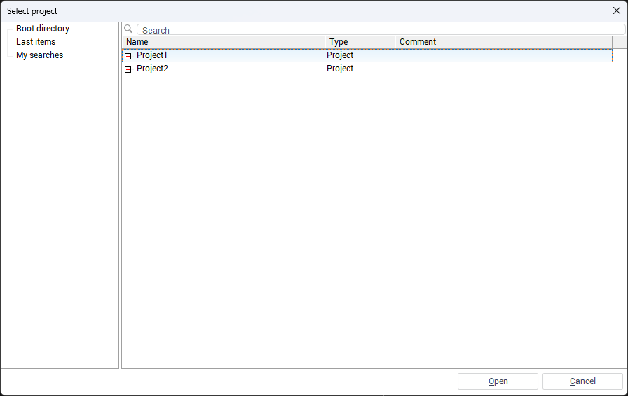
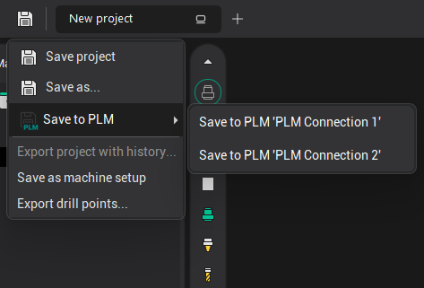
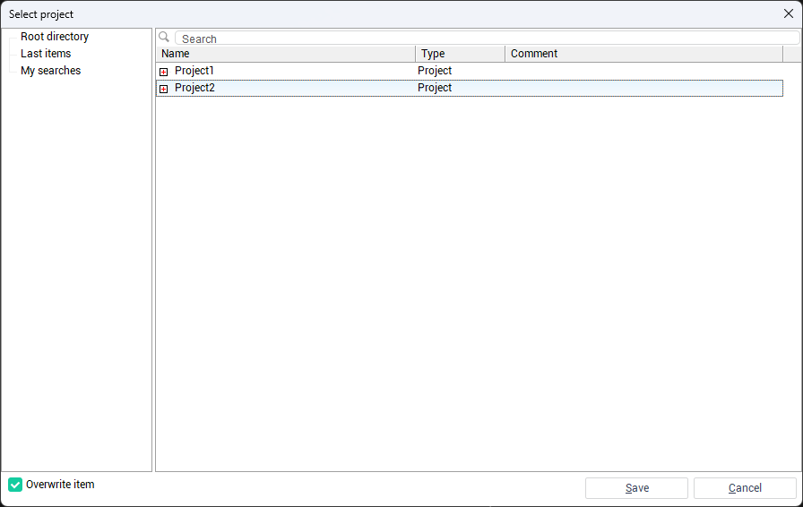

# 外部システムへのプロジェクトの読み込みと保存

外部システムでプロジェクトを管理するには、メインウィンドウのツールバーにある<strong>プロジェクトを開く</strong>および<strong>プロジェクトを保存</strong>ボタンを使用します。

これらのボタンにカーソルを合わせると、<strong>PLM関連のオプション</strong>を含む追加オプションのドロップダウンメニューが表示されます。この項目を選択すると、利用可能なすべてのPLM接続を含むサブメニューが表示されます。

<strong>注意：PLM関連のオプション</strong>は、少なくとも1つのPLM接続が設定されている場合にのみ表示されます。

## 外部システムからプロジェクトを開く

外部システムからプロジェクトを開くには、プロジェクトを開くボタンにカーソルを合わせ、<strong>PLMから開く</strong> → <strong>PLMから開く</strong> [接続名]を選択します。

外部システムのオブジェクトツリーを表示したウィンドウが開きます。目的のプロジェクトを探して選択し、<strong>開く</strong>をクリックします。選択したプロジェクトが開きます。

## 外部システムへのプロジェクトの保存

<strong>プロジェクトを保存</strong>ボタンにカーソルを合わせ、<strong>PLM に保存</strong> → <strong>PLM に保存</strong> [接続名]を選択します。

外部システムのオブジェクトツリーを表示したウィンドウが開きます。プロジェクトの保存先を選択し、必要に応じて<strong>アイテムを上書き</strong>チェックボックスをオンにしてから、<strong>保存</strong>をクリックします。

