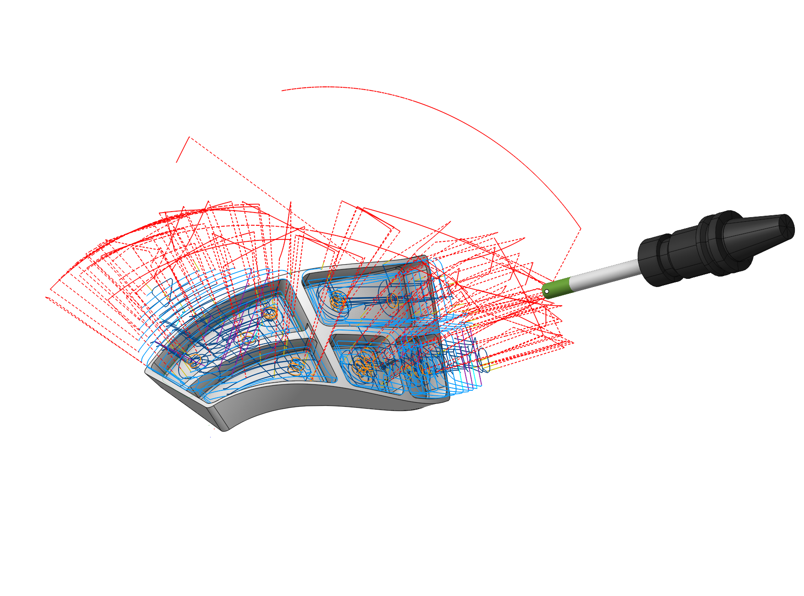

# 5D Roughing waterline

## Application area:

Specialized processing for pockets with curved bottoms, based on the <strong>Waterline operation</strong>.

### Job assignment:

<strong>Floor surfaces.</strong> Control surface. Typically defined by the pocket bottom.

<strong>Job Zone curve.</strong> Job zones are used to define the part areas that have to be machined by roughing and finishing milling operations. In this operation, only a <strong>closed</strong> work zone is applicable. [Details](10151.md)

<strong>Properties.</strong> Displays the properties of an element. It is possible to add the stock. You can also call this menu by double clicking on an item in the list.

<strong>Delete.</strong> Removes an item from the list.

<strong>Restrictions.</strong> It allows you to restrict areas that should not be machined. [Details](101231.md)

### Strategy:

#### Strategy.

This parameter allows the user to achieve a toolpath that appears adaptive or equidistant when performing pocketing operations. This parameter group works similarly to the <strong>Waterline roughing operation</strong>. [Details](736.md)

#### Machining levels.

It defines the range along tool axis for the machining.

Click here to expand..

<strong>Auto top level.</strong> If the flag is set, the upper level is automatically calculated based on the blank.

5D.png)

Some parameter group works similarly to the <strong>Waterline roughing operation</strong>. [Details](736.md)

#### Face side.

Determines the machining direction from the bottom surface of the pocket.

Click here to expand..

<strong>Front.</strong> The tool can only process from the side with the positive direction of the surface normal vector.

.png)

<strong>Back.</strong> The tool can only perform processing from the side opposite to the surface normal vector.

.png)

#### Depth Step.

Material removed in one pass along the tool axis between the <strong>Top</strong> and <strong>Bottom</strong> levels.

Click here to expand..

#### Milling type.

Сan be assigned in almost all operations, except for the curve machining operations. This allows the user to control the required milling type (climb or conventional) during the toolpath calculation process. This parameter group works similarly to the <strong>Waterline roughing operation</strong>. [Details](736.md)

### Parameters:

This tab contains the main parameters for controlling the part, workpiece, fixture and other items, which allow you to change the trajectory. [Details](100112.md)

### Links/Leads:

In the Links/Leads tab, you define the parameters for rapid movements. These movements include tool approach from the tool change position, engage to the start of the working stroke, retraction after the final cutting motion, transitions between working passes, and return to the tool change point. You can configure the sequence of movements along the coordinates, the trajectory of these motions, and the magnitude of displacements.

Click here to expand..

<strong>Сonsists of:</strong>

<strong>Approach/Return.</strong> This group of parameters manages the tool movements from the tool change position to the start of the engage toolpathes, and back. [Details](100116.md).

<strong>Safe motions.</strong> Defines the type of Safety Surface and the distance from the workpiece to it. This surface facilitates transitions between the processed surfaces or tool paths, and the first stage of approach or return occurs toward it. [Details](100117.md).

<strong>Links.</strong> Defines the rules governing Entry/Exit links and links between work moves. [Details](100120.md).

<strong>Allow plunges.</strong> Enabling plunges allows machining of closed pockets. When CAM software encounters a closed pocket that can not be machined from the outside, it forms a Plunge move [Details](744.md).

<strong>Distances.</strong> Distances required to switch feeds [Details](100139.md).

### Feeds/Speeds:

Using this dialogue the user can define the spindle rotation speed; the rapid feed value and the feed values for different areas of the toolpath. Spindle rotation speed can be defined as either the rotations per minute or the cutting speed. The defining value will be underlined. The second value will be recalculated relative to the defining value, with regard to the tool diameter. [Details](100142.md)

### Transformations:

Parameter's kit of operation, which allow to execute converting of coordinates for calculated within operation the trajectory of the tool. [Details](10168.md)

### Part:

A Part is a group of geometrical elements that defines the space to check for gouges. [Details](330.md)

### Workpiece:

A workpiece model of an operation defines the material to be machined. [Details](738.md)

### Fixtures:

As the Fixtures the fixing aids such as chucks, grips, clamps, etc., and the restriction areas of any other nature are usually specified. [Details](10283.md)
