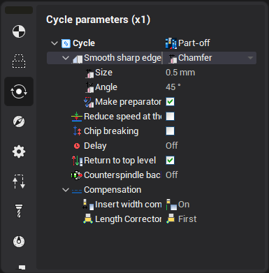

# Parting-off cycle

.png)

The Lathe part-off cycle designed to make possible simply separate ready machined part from the remaining workpiece with the simultaneous finishing of the opposite face of a part. The working contour determined automatically as maximal (left or right) side of the part from highest to lowest point of the workpiece.

You can define parameters of the chamfer or rounding to get smooth edge at the finished face of a ready part. It is also possible to enable chip breaking while parting off and delay at the bottom or every peak.

Return to the top level can be disabled if you want to use current tool as a stopper for the bar ejected from a feeder.

If insert width compensation is enabled, it can automatically add tool width to the axial coordinate of machining face. Actual tool length corrector left or right can be simply switched.

Counterspindle back off parameter allows to define distance which counterspindle must move back after finishing the cut. Axis name that makes axial moves of the counterspindle must be determined here.
