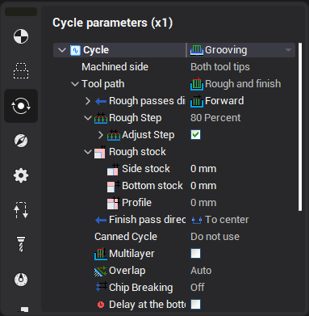
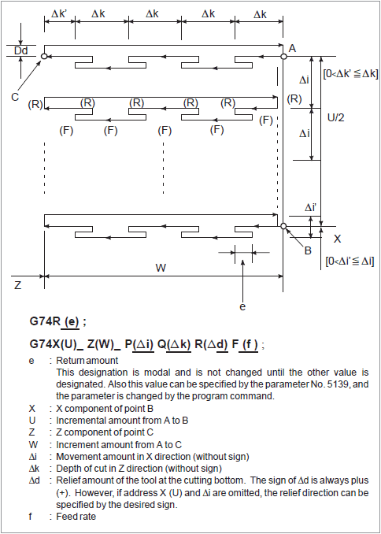
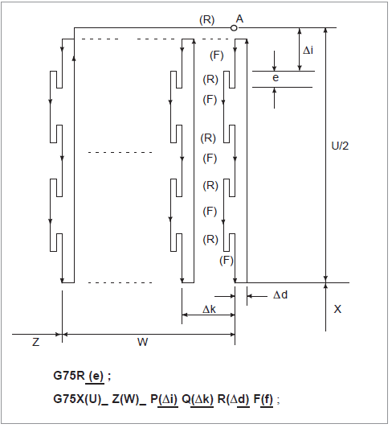

# Peck groving/drillling cycle

The grooving cycle generates one from both canned cycles ISO G74 or ISO G75 based on the box of the defined profile. The cycle parameters can be defined in the properties window. Direction property switch between G74 and G75.

The extract from the Fanuc Operator's manual about cycles G74/G75 is shown below.

The following program generates the cutting path shown in the picture below. Chip breaking is possible in this cycle as shown below. if X(u) and P are omitted, operation only in the Z axis results, to be used for drilling.

