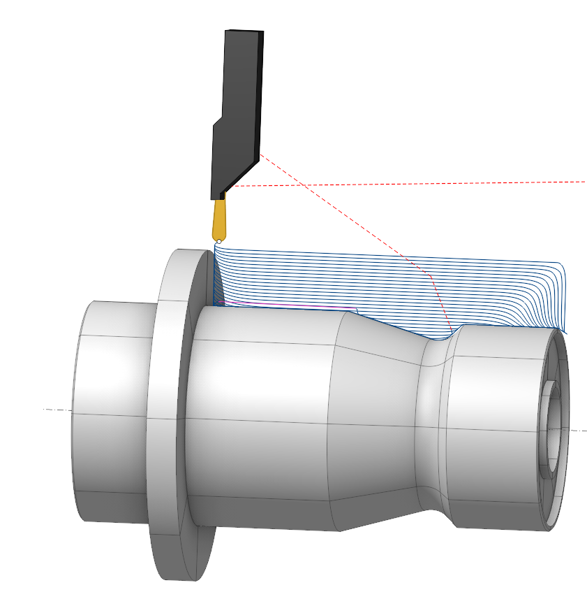
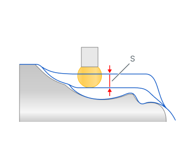
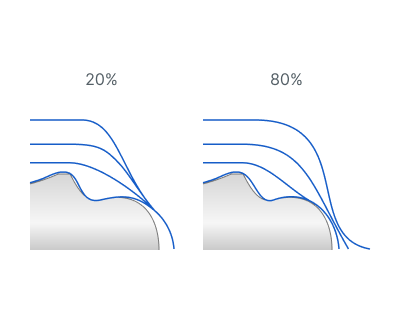
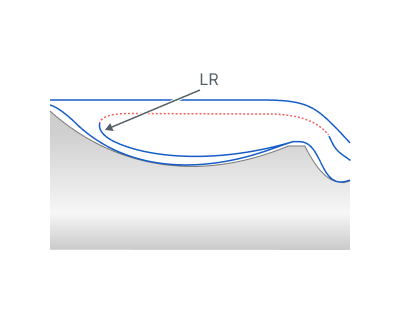
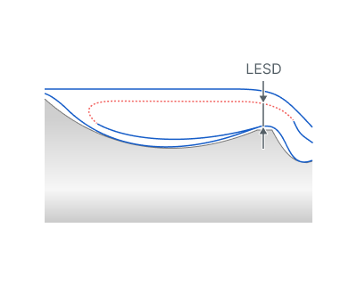
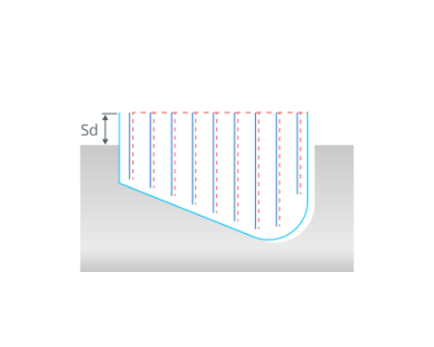
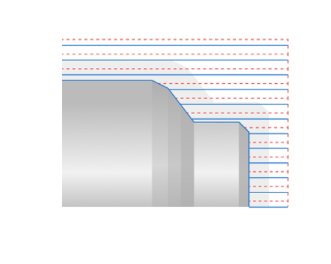
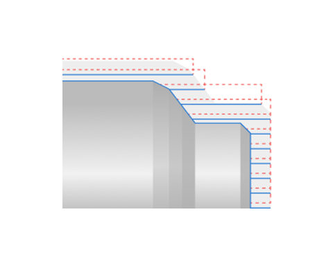
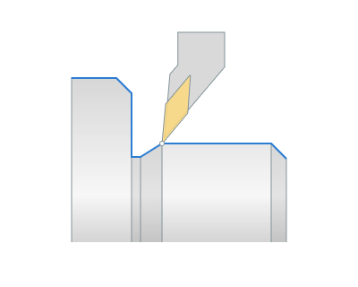

# OD Adaptive turning

## Application Area:

The operation generates an optimized smooth trajectory that maintains constant tool load, extending tool life and significantly increasing processing speed through higher cutting feed rates. The turning process executes more than twice as fast compared to the traditional <strong>Grooving</strong> cycle. This cycle adopts the <strong>Adaptive</strong> strategy from the [Waterline Roughing operation](736.md), with all parameters mirroring this strategy. It uses tool with round insert.

### Setup:

The <strong>Setup</strong> tab is used to configure the primary parameters of the project. This can involve the positioning of the part on the equipment, the coordinate system of the part, and more. [Details](1022.md)

### Job Assignment:

<strong>Adaptive.</strong> The process uses high feed rates with a small step, rounded passes, and avoids sharp edges in the toolpath. It incorporates a roll-in technique for entering the tool, which is less stressful on the tool. The method supports processing in both forward and backward directions.

<strong>Properties.</strong> Displays the properties of an element. It is possible to add the stock. You can also call this menu by double clicking on an item in the list.

<strong>Delete.</strong> Removes an item from the list.

<strong>Restrictions.</strong> It allows you to restrict areas that should not be machined. [Details](101231.md)

### CycleParams:

#### Cycle.

Only an <strong>Adaptive</strong> cycle is available for this operation.

Click here to expand..

##### Tool Path.

Here are the key parameters, the set of which may vary depending on the chosen strategy in the <strong>Cycle</strong> section:

Click here to expand..

<strong>Step.</strong> The distance between tool passes is equal to the cutting depth.

<strong>S</strong> - step

<strong>Backward Stepover</strong>. When <strong>Bidirectional</strong> turning mode is active, you can set the backward direction step as a percentage of the forward direction <strong>Step</strong>.

<strong>Finish pass.</strong> The contour specified in the <strong>Job Assignment</strong> becomes finishing. An additional roughing pass is added to it at a distance specified in the parameter..

.png) .png)

<strong>Rough rounding radius.</strong> Specifies the radii for rounding off the entry and exit zones during rough passes.

<strong><strong>Linking radius.</strong></strong> Linking radius t hat smooths the transitions between work passes.

<strong>LR -</strong> Linking radius

<strong>Lead Safe Distance.</strong> Specifies the minimal distance from unprocessed parts of the workpiece for rapid tool movement between machining areas.

<strong>LESD</strong> - Lead Safe Distance

<strong>Safe distance.</strong> The distance from the top level of the groove to the level of rapid movements. You can edit the safety distance by dragging a point on the graphical screen or by directly input in the options window.

<strong>Check workpiece.</strong> When the flag is set, the system takes into account the current state of the workpiece and removes all toolpath segments that really do not cut the workpiece. This significantly reduces machining time, especially if the shape of the allowance is complex.

 

<strong>Compensation.</strong> Controls the method of outputting cutter insert parameters.

<strong>Insert Width Compensation.</strong> This parameter controls the method of outputting the tool nose radius correction. [Details](350.md)

<strong>Off.</strong> The contour of the toolpath corresponds to the contour of the part and is output to the NC program without considering the tool nose radius. When using this mode on complex contours, the undercuts or incomplete machining are possible, so it is necessary to be carefully when machining simulation.

<strong><strong>Computer.</strong></strong> The system takes into account the width and the tip radius of the cutter insert, and builds the toolpath according to the first <strong>Tooling Point</strong> of the cutter.

#### Direction.

Defines direction of work passes.

Click here to expand..

<strong>Bidirectional</strong>. Operation performs work passes in forward and backward directions relative to the starting point of the <strong>Job Assignment</strong>.

<strong>Forward</strong>. Work passes proceed towards the spindle.

<strong>Backward</strong>. Work passes proceed away from the spindle.

#### Roll by arcs.

The system rounds the external corners of the toolpath by arcs with a radius equal to the tool nose radius. The parameters group works similarly to the <strong>OD Roughing and ID Roughing operations.</strong> [Details](316.md)

### Feeds/Speeds:

Using this dialogue the user can define the spindle rotation speed; the rapid feed value and the feed values for different areas of the toolpath. Spindle rotation speed can be defined as either the rotations per minute or the cutting speed. The defining value will be underlined. The second value will be recalculated relative to the defining value, with regard to the tool diameter. [Details](100142.md)

### Transformations:

Parameter's kit of operation, which allow to execute converting of coordinates for calculated within operation the trajectory of the tool. [Details](10168.md).

### Part:

A Part is a group of geometrical elements that defines the space to check for gouges. [Details](330.md)

### Workpiece:

A workpiece model of an operation defines the material to be machined. [Details](738.md)

### Fixtures:

As the Fixtures the fixing aids such as chucks, grips, clamps, etc., and the restriction areas of any other nature are usually specified. [Details](10283.md)
