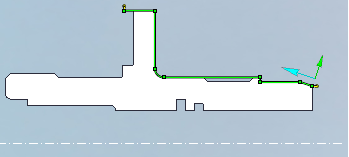
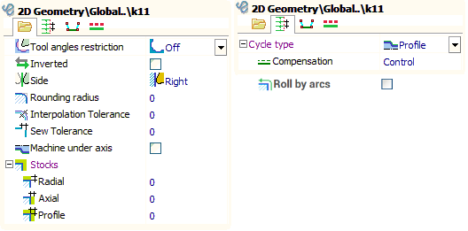
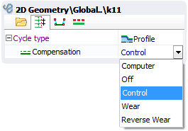
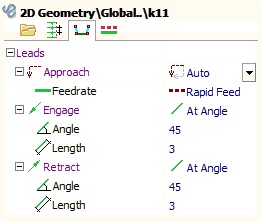
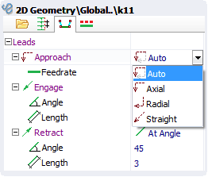
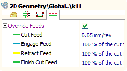
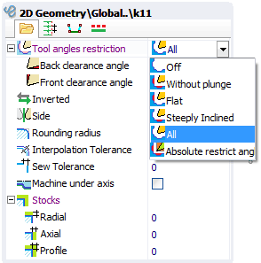
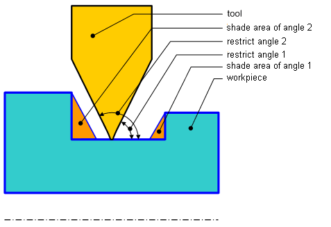
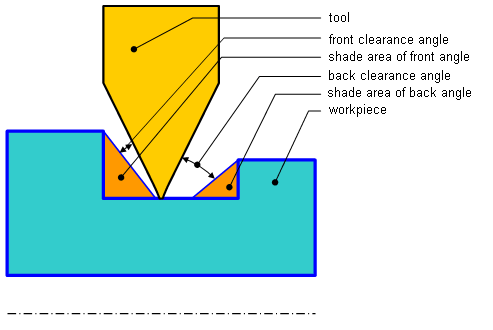

# Job assignment element parameters

Basic Parameters:

After adding contour to the job assignment elements list it displays in a graphical window. Arrows defines machining direction and machining side are displayed opposite to a contour start point. It is possible to change machining direction by clicking left mouse button to blue arrow. It is possible to change machining side by clicking left mouse button on to yellow arrow.

Contour parameters window is available by clicking right mouse button to any of this arrows or by clicking elements 'Parameters' button.

[Cycle type](10188.md) defines the way of forming toolpath based on specified contour.

Rounding radius defines arc radius, with which all outer sharp corners of the contour will be rounded. If this value is zero corners will not be rounded.

Interpolation tolerance allows to change contour by uniting set of its segments by arcs or lines. In this case, the resulting contour will be different from the original by not more than the specified value. This function is very convenient for splain curve processing.

Stocks allows to move contour at the radial, axial and equidistant direction. Stocks positive (+) direction is defined by contours machining side.

Sew tolerance is used when create the turn generatrix from the set of curves and surfaces.

<strong>Roll by arcs</strong> allows to more accurately determine the toolpath along the contour by adding arcs to the outer corners of the toolpath. This function is convenient for a tool with a large radius.

Tool radius compensation modes:

If correction is turned off (Off) NC program uses original contour without any transformations. Using this mode at complex contours can appear lines or defects, so it is necessary to be carefully when machining simulation.

If the correction mode is " Computer " then equidistant based on tool nose radius will be built to the original contour, and then it shifts to tooling point. Usually this leads to shift in the inclined segments, increasing external radiuses and decreasing internal radiuses of contour circle arcs by the tool nose radius.The starting points are also shifted by the tool nose radius.

If correction mode is "Control" NC program uses original contour without any transformations. Correction commands are included before approach and retract frames (ISO G41/42/40).

In the Wear and Reverse wear modes contours geometry transforms like in " Computer " mode. But correction commands are included before approach and retract frames too, like in the "Control" mode. Reverse wear mode differs from wear mode by correction direction.

"Machine under axis" parameter allows to create toolpath below rotation axis. So, all radial coordinates becomes negative.

If "Rounding radius" parameter enabled and compensation mode is "Wear" or "Computer" then in outer corners of a contour the arcs with radius equal to tool nose radius will be formed. Sometimes it helps reduce the vibration of the machine from the abrupt change in direction of movement of the tool.

Engage, retract and transition between the elements.

Before the beginning and in the end of each contour one special element is added. These elements are called respectively the engage and retract. When tool nose radius compensation is used, engage is compensation switch on cut, retract is compensation switch off cut. Engage and retract geometrical parameters can be set in a graphical field. Both an end point and length of a cut can be set here. Engage/retract can be processed by the line or by the arc. Click to the selected engage one more time on the screen for switching arc/cut. Engage and retract geometrical parameters also can be set in the next window.

If there are several elements in operation transitions between them will be processed by rapid feed. The way of the approach to the first point of a contour from last point of the previous element is defined by an approach mode.

In axial mode approach is processed by axial direction first, and then by radial direction. In radial mode approach is processed by radial direction first, and then by axial direction. "Straight" mode generates transition by straight line. "Auto" mode chooses the radial or axial approach depending on last point of the previous contour and the side of a processed contour. Transition processing feed can be specified also.

Feed control

By default each contour machining is processed by feed specified at operation parameters. To specify feed for each element of job assignment use element parameters window.

If "Override feeds" checkbox is not checked then contour feed is specified by operation parameters, else contour feed is specified in this window.

Tool angles restrictions

It is necessary to consider tool angles restrictions at grooving to prevent overlines and tool breakages. This angles can be set at parameters window. There are 6 tool angles restrictions mode.

Tool angles restrictions is turn off by default for simple contours. Contour correction by tool angles is not processed in this case. If contour have grooves, overlines becomes very possible.

Absolute restrict angles mode allows to correct contour independently of tools real angles. These angles are measured from the horizontal line and are shown in the following figure.

"Without plunge" mode allows to prevent tool plunge to face and cylindrical grooves. When the outer groove is processed in the left spindle this mode is equal to set first angle to 0 and second angle to 90 degrees.

"All" mode allows to plunge to face and side grooves so far as tool allows. Back clearance angle and front clearance angle define absolute angles relative to tool real angles.

"Flat" mode allows tool to plunge to cylindrical grooves, but not to face grooves. When the outer groove is processed in the left spindle this mode is equal to set second absolute angle to 90 degrees and back clearance angle is used.

"Steeply inclined" mode allows tool to plunge to face grooves, but not to cylindrical grooves. When the outer groove is processed in the left spindle this mode is equal to set first absolute angle to 0 and front clearance angle is used.
