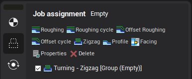
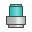
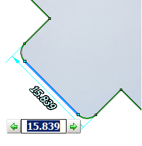
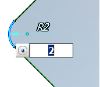

# Contour editing modes

Activation of contour editing mode

To activate the contour edit mode, you need to switch to the job assignment, and add an element of the job assignment, if necessary.

Checkbox to the left of the elements allow to hide elements that do not require editing. If the window has at least one visible item and the job assignment visibility button is pressed , then the contour editing toolbar will appear in graphic window .

Contour elements selecting methods

Mouse click allows to select segment or contour vertex. Selected objects are marked by color. Rectangle selection (mouse down in first vertex of rectangle and mouse up in second) marks all elements entering in this rectangle. Double click to line selects all lines lies at the same straight. Double click to arc selects all arcs with same radius. Double click to chamfer selects all chamfers with same size. If "Ctrl" is pressed all elements connects selected element with previous selected element will be marked.

Contour editing operations

1. It is possible to drag vertexes.

2. It is possible to drag selected items by equidistant. It is necessary to select elements, not vertexes.

3. There are 2 ways to change arc radius. To change arc radius by the first way drag marked arc to the new position. Arc center moves so that its sibling elements don't change their position. To change arc radius by the second way mark arc by clicking them. Arc center will be shown. After that you can change sibling elements, but arc center will be constant.

4. It is possible to delete selected items by 'Del' key or  button

5. It is possible to delete constructive element by  button or "Shift+Del". Selected elements will be deleted, sibling elements will be connected.

6. To add chamfer select vertex and press corresponding button at the panel.

7. It is possible to undo and redo actions by clicking corresponding buttons at the panel.

Assignment of exact dimensions

After selecting item dimension lines becomes visible. Click to dimension to set exact value. It is possible to use mouse wheel. If element has been changed, dimensions relative to elements original position are shown too.

System tries to recognize grooves automatically at selecting element. If groove is recognized its width shows. It is possible to select shifting groove side by clicking to green arrows.

On arc radius editing it is possible to set changed object (center coordinates or sibling elements) mode by clicking button in value editing field

