# Machine setup panel

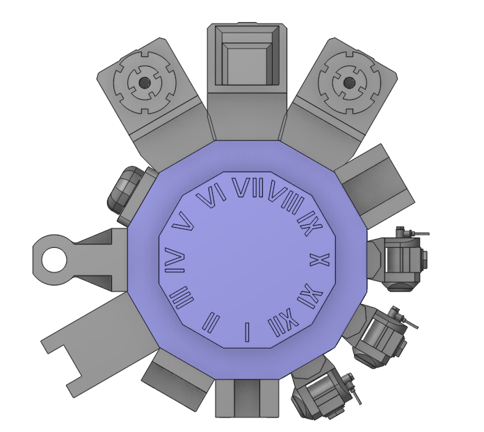

## Application area:

This tab is necessary for configuring the fundamental project parameters, primarily related to the kinematic scheme of the equipment.

### Description.

Machine name. Must be unique.

Click here to expand..

<strong>Comment.</strong> Description of the equipment used

<strong>Group.</strong> Machine group is used only for sorting in a machine library. Seven values are available: - Jet cutting - Wire EDM - Milling - Lathe - Turn-milling - Robotics - Other

<strong>Developer.</strong> Developer of this machine. It can be xml schema author or cnc machine manufacturer.

<strong>NC System name.</strong> Name of NC-system.

<strong>Postprocessor file</strong>. Path to postprocessor file.

<strong>Interpreter file.</strong> Path to interpreter file (*.snci)

<strong>Measurements.</strong> Parameters of measurements

### Tooling.

Tooling parameters

Click here to expand..

<strong>Position for tool block.</strong> Configures the contents and parameters of tool blocks in the tool positions of the machine. You can put a tool block wherever you want, or hide it by making it empty.

<strong>Visible</strong>. Configures the visualization parameters of the tool block. When the flag is active, the tool block is visible, and its color can be altered in this state. The parameters of this group are the same as in the <strong>Frame</strong> group.

### Control Parameters.

Machine control parameters.

Click here to expand..

<strong>Arcs.</strong> The parameters related to arcs.

<strong>Use arcs.</strong> The parameter determines whether arcs will be displayed in CLData (e.g., circular interpolation). When the option is disabled, arcs are not displayed, and the trajectory is represented by line segments.

<strong>Use arcs in XY plane.</strong> The parameter determines whether arcs will be displayed in a specific plane.

<strong>Use arcs in YZ plane.</strong> The parameter determines whether arcs will be displayed in a specific plane.

<strong>Use arcs in ZX plane.</strong> The parameter determines whether arcs will be displayed in a specific plane.

<strong>Circles division.</strong> The parameter allows you to divide circles into segments (Do not divide, by quarters, by halves). It is necessary for generating certain interpolations (e.g., generating circular interpolation using R).

<strong>Do not break.</strong> The circles do not split into arcs.

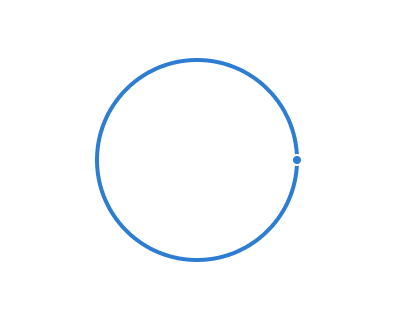

<strong>Into quadrants.</strong> The circles are divided into quarters

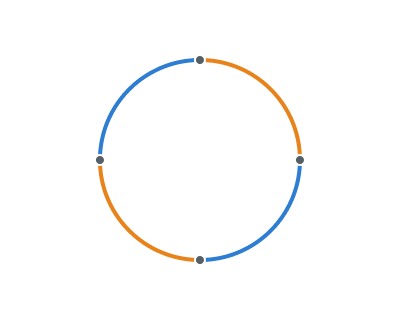

<strong>Into halves.</strong> The circles are divided into halves

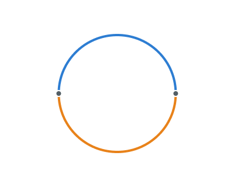

<strong>Minimal Arc Length.</strong> If the length of the arc is less than the value set in this parameter, the arc will be displayed as line segments.

<strong>Maximal Arc Radius.</strong> If the radius of the arc is greater than the value specified in this parameter, the arc will be displayed as line segments.

<strong>Spatial arcs.</strong> The arcs do not lie in planes. The parameter usually is used for <strong>robots</strong> to generate <strong>MULTIARC</strong> outputs. <strong>MULTIARC</strong> movement command defines a circular arc passing through three points with a predetermined orientation of the tool in space for each of these points.

<strong>Minimal distance between start and end points.</strong> If the distance between the start and end points of a spatial arc is less than a specified value, line segments are generated between these two points.

<strong>Reorientation mode.</strong> The law of interpolation at an intermediate point can refer to either <strong>relative to path</strong> or <strong>relative to base CS.</strong>

<strong>Consider middle point orientation.</strong> The parameter controls whether orientation is considered at the midpoint.

<strong>Singularities.</strong> This parameter group defines the system's ability to automatically prevent singularities. <strong>Red — singularity zone</strong>. It occurs when the rotary table rotates and the tool axis stays in line with the rotation axis.

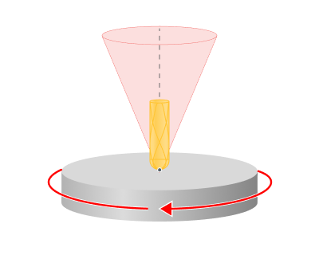

<strong>Allowed axis deviation.</strong> This parameter specifies the angle by which machine's or robot's nodes can deviate from the nominal calculated position to bypass the singularity zone.

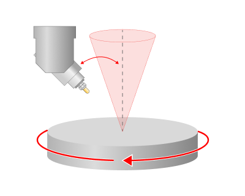

Robots operate with additional singularity parameters specifying permissible deviations for axes in their components: <strong>Wrist</strong>, <strong>Elbow</strong>, <strong>Base</strong>. Each component supports individual singularity avoidance angle configuration.

<strong>Default machine(robot) configuration.</strong> The state of flip status equipment elements as indicated on the kinematic equipment shema.

<strong>Origin list parameters.</strong> The parameters related to displaying the local coordinate system.

<strong>Origin prefix.</strong> The parameter determines the prefix used for displaying the local coordinate system (LCS).

<strong>Initial number.</strong> The parameter sets the initial value for displaying the local coordinate system (LCS).

<strong>Increment value.</strong> The parameter determines the step size for calculating the number of the next local coordinate system (LCS).

<strong>Create new origin for part group.</strong> The parameter determines whether automatic creation of a new Local Coordinate System (LCS) is required for the next group of parts of a certain type.

<strong>Radius Compensation Parameters.</strong> Defines the toolpath construction features considering the tool radius compensation.

<strong>Sharp Corner.</strong> When considering the tool radius compensation at contour sections containing sharp angles, the system applies special algorithms to construct the tool path. This parameter defines the maximum angle that the system will consider as sharp.

<strong>Rotary Transformations.</strong> Defines the availability of rotational transformation parameters in the <strong>Transformation</strong> tab.

<strong>Polar interpolation is available.</strong> When the flag is active. one can change a linear axis to the rotary one in the simple 3-axes milling process, using the <strong>Rotary Transformation</strong> parameter on the <strong>Transformations</strong> tab. Usually it is necessary on the lathes that has the drive mill tool. or for the rotary operations at the four- or five-axis machines.

<strong>CNC supports polar interpolation.</strong> When the flag is active, then CNC interpolation tick on the <strong>Transformations</strong> tab in the <strong>Rotary Transformation</strong> group is available. If this parameter is on, then one can generate the G-code with the commands to switch on/off the polar interpolation.

<strong>Cylindrical interpolation is available.</strong> When the flag is active, one can utilize the cylindical interpolation function, using the <strong>Rotary Transformation</strong> parameter on the <strong>Transformations</strong> tab. It gives the possibility to mill the side surface of cylindrical parts by programming the unrolled curves. The system programms the unrolled curves in the [X,Y,Z] coordinates, but most of the turn-milling machines can process only in [X,C,Z] coordinates. So the cylindrical interpolation makes the transformation [X,Y,Z] => [X,C,Z].

<strong>CNC supports cylindrical interpolation.</strong> When the flag is active, then CNC interpolation tick on the <strong>Transformations</strong> tab in the <strong>Rotary Transformation</strong> group is available. If this parameter is on, then one can generate the G-code with the commands to switch on/off the cylinrical interpolation.

<strong>Start from C=0.</strong> When the flag is set, then the parameter Start from C=0 on the <strong>Transformations</strong> tab in the <strong>Rotary Transformation</strong> group is active by default. It sets rotary axis to zero position before switch on the polar or cylindrical interpolation.

<strong>Tool frame output.</strong> Defines the format for outputting the tool orientation parameters in CLDATA commands containing five-axis movements.

<strong>Additional transformation.</strong> `*Base coordinate system*` defines the coordinate system with respect to which the transformation will be performed. It can be: Tool CS, Workpiece CS, Global CS or any other geometrical CS you have created before. Also additional translation and rotation of this CS can be defined inside Additional transformation group of parameters.

<strong>Set machine state flags.</strong> When programming robots, their physical coordinates relative to Cartesian coordinates are also determined by the flip position of their joints. This parameter specifies whether to output flags in CLData indicating the flip position of the joints.

<strong>Swap Tool and Workpiece frames.</strong> In some situations, the robot's tool block holds the workpiece instead of the tool. In such cases, swap the tool and workpiece coordinate systems. Set the flag if the robot controller does not support this transformation.

<strong>Set tool contact surface normal vectors.</strong> For five-axis tool radius compensation, the tool must offset along the normal to the surface from their contact point. When setting the flag, CLData outputs an additional TLContact command before each movement, specifying the parameters of the normal to the surface at the tool-workpiece contact point. [Details](102266.md)

<strong>Prefer GOTO for linear movements</strong>. Prefer to form a GOTO command in CLData for movements instead of MULTIGOTO, if it contains only movements along three geometric linear coordinates X, Y, Z.

<strong>Indexed 5-axis machining.</strong> Specifies the accessible parameters and coordinate transformation modes for indexed five-axis machining.

<strong>Indexed 5Axis compensation mode.</strong> Enables coordinate rotary transformation in the indexed five-axis processing mode (for inc‍lined plane functions). When these options are activated, the <strong>coordinate system is automatically rotated</strong> <strong>(recalculated) to follow any rotary-axis movement</strong> of the machine, so that programming stays aligned with the inc‍lined working plane. These compensation modes are used when the machine control system does not support built-in tilted-working-plane functions (such as <strong>Siemens CYCLE800, Heidenhain PLANE/Cycle 19, or Fanuc G68.2</strong>), nor rotational tool-center-point control (<strong>TCPM/RTCP</strong>). In such cases the coordinate transformation cannot be performed by the CNC and must be calculated by the CAM system and embedded into the output program by the postprocessor. If the control already provides these functions, the transformation is handled by the machine and these options are not required.

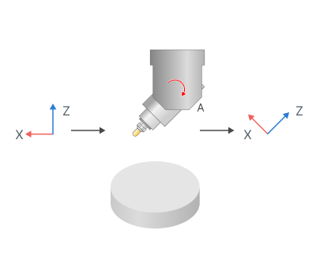

<strong>5 Axis tooling point compensation.</strong> Option is responsible for rotation of the tool center point together with the rotary head.

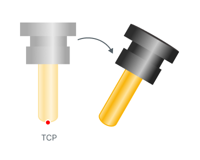 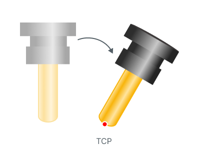

<strong>5 Axis workpiece zero point compensation.</strong> Workpiece zero point is rotated together with rotary table. Only origin position follows table, while axes orientation stays aligned with machine (MCS).

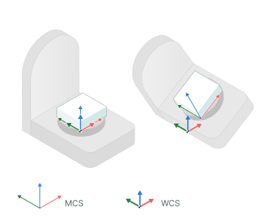 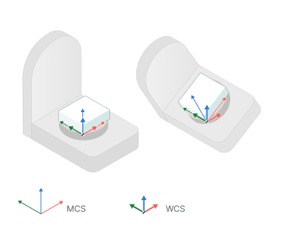

<strong>MCS</strong> - Machine Coordinate System

<strong>WCS</strong> - Work Coordinate System

<strong>5 Axis coordinate system compensation.</strong> Сoordinate system orientation is rotated together with rotary table. Origin stays in place, only axes orientation follows table rotation.

 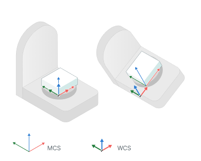

<strong>MCS</strong> - Machine Coordinate System

<strong>WCS</strong> - Work Coordinate System

<strong>Local coordinate system (ORIGIN).</strong> Defines the display mode of the <strong>Local CS</strong> parameter in each operation's <strong>Setup</strong> tab.

<strong>Unavailable</strong>. The <strong>Local CS</strong> parameter does not display.

.Unavailable.png)

<strong>Off</strong>. The <strong>Local CS</strong> parameter displays but defaults to <strong>Off</strong>.

.off.png)

<strong>Auto</strong>: The <strong>Local CS</strong> parameter displays and defaults to <strong>Auto</strong>. In this mode, rotational transformations align the WCS so that the Z-axis matches the tool axis, and its origin remains fixed to the user-selected part point.

.Auto.png)

<strong>Local CS positioning mode.</strong> Defines the behavior of the machine's physical axes during rotational transformations.

<strong>Stay</strong>. Rotates the coordinate system without moving the machine's physical axes.

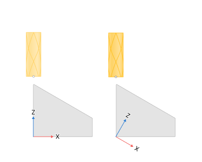

<strong>Turn</strong>. Rotates the coordinate system and the physical axes of the machine accordingly, without compensating for the misalignment of the tool's set point and the coordinate system origin with linear axes movement.

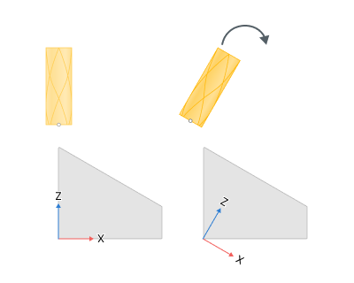

<strong>Move</strong>. Rotates the coordinate system and the physical axes of the machine accordingly, and compensates for the misalignment of the tool's set point and the coordinate system origin with linear axes movement.

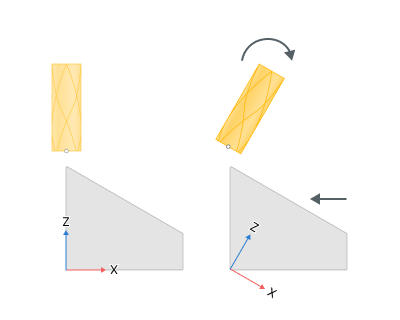

<strong>Is spatial.</strong> Defines whether to perform coordinate system transformations using spatial angles or the machine's rotational axes. When the flag is set, the transformation uses spatial angles.

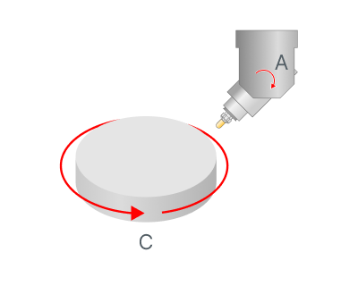 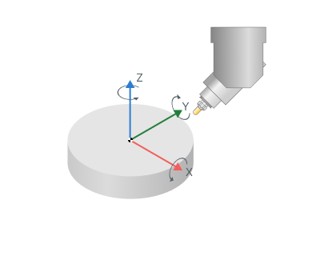

<strong>Euler angles type (rotation sequence).</strong> Specifies the sequence of rotations when performing rotational transformations using spatial angles.

<strong>Rotations around movable axes.</strong> Determines whether to perform rotations around fixed axes or previously rotated axes. When the flag is set, each subsequent rotation uses the previously rotated coordinate system axes.

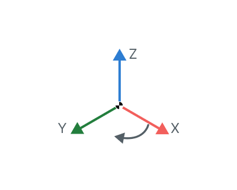 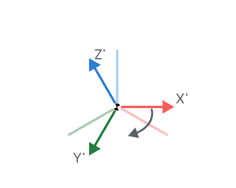

<strong>Angles in degrees.</strong> Specifies the unit of measurement for rotation angles. When the flag is set, the system measures angles in degrees; otherwise, it measures in radians.

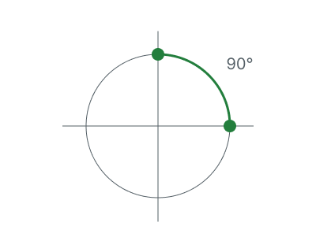 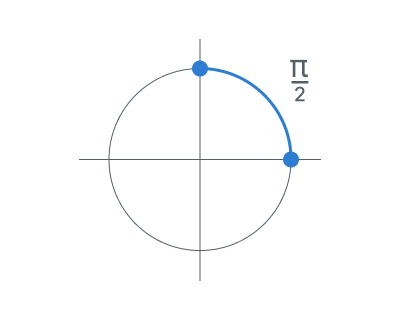

<strong>Move auto LCS with table.</strong> Determines the position of the WCS during rotational transformations in <strong>Auto Local CS</strong> mode. When the flag is set, the WCS attaches to the part during rotational transformations, aligning the Z-axis of the WCS with the tool axis. When the flag is disabled, the WCS remains in its original position and does not move with the workpiece.

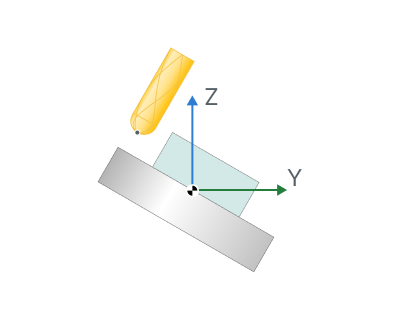 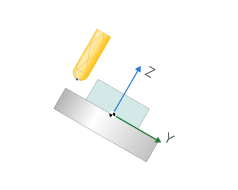

<strong>Auto LCS rotation law.</strong> Defines the rule how to locate the Local CS when <strong>Local CS</strong> option has the value <strong>Auto</strong> for mill operations.

<strong>Snap to Tool CS</strong>. Use it in machines where rotational axes are realized through tool rotations. In this case, the axes rotate in conjunction with the tool..

<strong>Snap to Machine CS</strong>. The axes direction connects to the fixed global coordinate system of the machine.

<strong>Snap to Workpiece CS.</strong> Use it in machines where rotational axes are realized through workpiece rotations. In this case the axes rotate in conjunction with the workpiece.

<strong>Exclude Spatial Angle A</strong>. In rotational transformations, the work coordinate system's X-axis remains parallel to the machine coordinate system's X-axis.

<strong>Exclude Spatial Angle B</strong>. In rotational transformations, the work coordinate system's Y-axis remains parallel to the machine coordinate system's Y-axis.

<strong>Exclude Spatial Angle C</strong>. In rotational transformations, the work coordinate system's Z-axis remains parallel to the machine coordinate system's Z-axis.

<strong>Turn Auto LCS rotation law.</strong> Defines the rule how to locate the Local CS when <strong>Local CS</strong> option has the value <strong>Auto</strong> for turning operations.

<strong>Z along turn axis, X along tool</strong>. The Z axis of the local coordinate system is located along the turning axis of rotation. The X axis is directed toward the tool..

<strong>Z along turn axis, -X along tool</strong>. The Z axis of the local coordinate system is located along the turning axis of rotation. The minus X axis is directed toward the tool.

<strong>Z along tool, X by snap rule.</strong> The Z axis of the local coordinate system is located along the main direction of tool (along its axis). The X and Y axes are located according to the <strong>Auto LCS rotation law</strong> rule.

<strong>Rotatable Workpiece CS.</strong> When the flag is set, you can both shift and rotate the workpice coordinate system in the <strong>WCS</strong> parameter in the <strong>Setup</strong> tab.

<strong>Continuous 5-axis machining.</strong> Specifies the accessible parameters and coordinate transformation modes for continuous five-axis machining.

<strong>TCPM mode is available.</strong> Enables the <strong>Tool center point management</strong> parameter in the <strong>Setup</strong> tab when the flag is active. Use it only when the CNC system supports this function. When the flag is disabled, the system uses coordinate transformation parameters from the <strong>Indexed 5Axis compensation mode</strong>.

<strong>TCPM mode default state.</strong> Activates the <strong>Tool center point management</strong> parameter by default in the <strong>Setup</strong> tab when the flag is enabled. When the flag is disabled, this parameter is inactive by default.

<strong>Disable TCPM when rotate back.</strong> When the flag is set, you can access the option to disable TCPM mode during links while rotating the workpiece back to its original position.

<strong>TCPM 5Axis compensation mode.</strong> Defines coordinate transformation parameters for each block of the NC program in continuous 5-axis machining mode.

<strong>5 Axis tooling point compensation</strong>. Option is responsible for rotation of the tool center point together with the rotary head.

<strong>5 Axis workpiece zero point compensation.</strong> Option is responsible for rotation of the workpiece zero point rotation tothether with the rotary table.

<strong>5 Axis coordinate system compensation.</strong> Option is responsible for rotation the workpiece coordinate system together with the rotary table.

<strong>Tool Change.</strong> Tool change system behavior configuration parameters.

Click here to expand..

<strong>Go to tool change position.</strong> The setting defines the necessity of retracting to the tool change location.

<strong>Only if tool change is needed</strong>. The system retracts to the tool change location only if the next operation requires a different tool. No retraction occurs at operation end if the same tool is used.

<strong>Always in the end of operation</strong>. Retraction to the tool change station occurs irrespective of the tool used in the subsequent operation — whether it's a new tool or the same one.

<strong>Never</strong>. Tool change position retractions will be omitted

<strong>Output mode.</strong> The address configuration parameter specifies how tool change retraction will be output in the control program.

<strong>Tool tip coordinates.</strong> The defined tool tip coordinates in relation to the workpiece coordinate system will be included in the NC program as the tool change point.

<strong>Reference point (ISO G28).</strong> The tool change retraction is performed by specifying a movement to the reference point (G28 command).

<strong>Machine coordinates (ISO G53).</strong> G53 function is used to perform retraction movements to the tool change position in the machine coordinate system.

<strong>Tool change position.</strong> Tool change position coordinates are defined here.

<strong>Heavy axes.</strong> Addresses of axes to be avoided during tool change approach/retraction are defined. The parameter is utilized for automatic approach/retraction calculation to the tool change position under "Collision Avoidance" rule. When enabled, the CAM system optimizes movements to prevent collisions using different machine axes. Heavy axes (those undesirable to move) are listed in this section.

<strong>Tool change time calculation.</strong> This setting defines the method for calculating tool change duration in the CAM system:

<strong>Default law.</strong> Project's default calculation methodology rule.

<strong>Undefined</strong>. The CAM system's tool change time is preset in the algorithm and not subject to modification.

<strong>Constant time</strong>. The tool change duration is set manually via the Constant Time parameter value.

<strong>Advanced laws.</strong> Multiple calculation rules can be activated via this parameter, appearing as a dropdown menu. The specified number determines how many rules will be enabled, and each list entry can utilize any of the previously described rules.

<strong>Rapid movements time calculation method.</strong> Method for calculating the time of rapid (non-cutting) tool movements.

<strong>Maximum axis movement time (default).</strong> The system calculates the travel time for each machine axis (X, Y, Z, and rotary axes if applicable). The rapid move time is determined by the axis that takes the longest time to complete its motion.

<strong>Time of tool tip movement.</strong> Calculates the rapid movement time based on the actual path of the tool tip, considering the vector sum of speeds across all axes (X, Y, Z).

### Coolants.

Set of parameters managing the usage of coolants in the project

Click here to expand..

The following parameters are available for all types of coolants:

<strong>ID</strong>. Symbolic representation of coolant delivery mode.

<strong>Tube name</strong>. Title of cutting fluid delivery system.

<strong>Icon file</strong>. Link to the pipeline model file.

<strong>Switch time</strong>. Time necessary to activate the coolant delivery system.

### Simulation.

Set of parameters managing system performance in project simulation.

Click here to expand..

Some parameter group works similarly to the <strong>[Setup](1022.md)</strong> panel.

<strong>Simulation Method</strong>. Determines visualization mode in simulation environment.

<strong>Solid</strong>. Solid modeling technique utilizing mesh representation for 3D model visualization. Characterized by higher computational demands but provides enhanced quality in rendering machined surfaces.

<strong>Voxel5d</strong>. Point voxels are used, improving rendering of complex volumes but requiring significant resources. They are applicable for both 3-axis operations and turning operations, as well as operations with a large number of axes.

<strong>Voxel3d</strong>. Column voxels are used. They accelerate the modeling process but can only be applied to 3-axis operations.

<strong>Model resolution.</strong> Rendering resolution for model simulation. It defines the number of voxels used to divide the workpiece model in simulation. Higher resolution results in improved model rendering quality.

<strong>Gouge detection tolerance.</strong> Minimum penetration value for a gouge classification. Penetrations less than this threshold are disregarded and no overcut warnings are generated.

<strong>Revolution bodies simulation.</strong> This parameter is used in turning projects and is responsible for rendering, for example, lathe chuck jaws as a single rotating body. When enabled, the chuck jaws form a single rotating body during simulation. Collisions with other machine components are checked against this body. Note that using this parameter slows down the simulation process.

<strong>Check inappropriate tool and spindle direction.</strong> This setting controls the validation of spindle rotation direction. It ensures that the spindle's rotational direction is compatible with the cutting action of the milling tool (such as matching a right-hand cutter with clockwise spindle rotation) and verifies proper alignment in turning processes regarding the tool placement..

<strong>Collisions to ignore.</strong> The setting specifies machine component pairs that will be excluded from collision detection during simulation modeling. Adding these components to the ignore list helps avoid false collision alerts from the system. How to add through Machine Maker you can read, for example, for Robot [Details](https://docs.encycam.com/MachineMaker/1/robots/en/46.html).

<strong>Show active part only.</strong> By enabling this option, you will only see the current part. In a project with multiple parts, the current part is determined by the focus in the tree, i.e., on a specific part or operation intended for processing that part.This allows reducing the load on your PC when working in different modes (such as <strong>Technology</strong> or <strong>Modeling</strong>).

### System settings.

Click here to expand..

Rotation angles (rotation sequence). This parameter defines the method for executing coordinate axis rotation angles when applying local coordinate systems.

<strong>Rotations sequence</strong>. The setting determines the order of executing rotations about the coordinate axes.

<strong>Rotations around movable axes</strong>. This parameter specifies whether rotations through spatial angles will occur around fixed axes or pre-rotated axes. With the flag activated, every successive rotation will take place around the axis of the previously rotated coordinate system.

<strong>Angles in degrees</strong>. This setting configures the angular measurement unit to degrees.

### Machine state parameters.

This section contains groups that define the values of individual axis parameters. The checkbox in the axis designation determines whether it will be displayed in the list of axes on the operations <strong>Setup</strong> tab.

Click here to expand..

<strong>Address. The axis address that is output to the NC program.</strong>

<strong>Axis Control.</strong> Specifies the motion control mode for this axis.

<strong>Countinuous</strong>. This axis operates in continuous mode.

<strong>Indexed</strong>. This axis performs movement through incremental steps.

<strong>Manual</strong>. Modification of this axis's coordinate is allowed only via manual operation.

<strong>Force control with map</strong>. Path determination for this axis movement may be processed through the Axes map. [Details](1022.md).

<strong>Group</strong>. Axis affiliation to the motion type group. There are <strong>Rotary axes</strong>, <strong>Linear axes</strong>, and <strong>Others</strong>.

<strong>Increment</strong>. The least movable increment along this axis which the machine drive system can handle.

<strong>Min</strong>. Lowest coordinate limit for this axis.

<strong>Max</strong>. Highest coordinate limit for this axis.

<strong>Initial value</strong>. The default coordinate location for the component.

<strong>Design time value</strong>. The shift amount that adjusts the <strong>Min-Max</strong> travel range of this axis.

<strong>Axis has brake</strong>. This parameter, when activated, triggers the inclusion of brake control commands in CLDATA.

<strong>Priority</strong>. This number affects the ordering of the axis in the axes list under <strong>Machine State Parameters</strong>. The smaller the number, the higher the axis appears in the list.

<strong>Order</strong>. This is the ordinal number that identifies the axis position within the <strong>Machine State Parameters</strong> list.

<strong>Support shortest path rotation.</strong> This parameter defines whether the rotary axis supports rotation using the shortest path between initial and final positions in 3D space.

### Frame.

This subsection describes the machine components tree, detailing the order in which machine components are connected to each other. Each component includes the name and axis identifier for the movable component's movement.

Click here to expand..

<strong>Visible.</strong> This controls the visualization parameters of the node. When the flag is enabled, the node becomes visible, allowing its color to be changed in this state.

<strong>Metallic</strong>. Setting the flag gives the surfaces of the tool block a metallic gloss.

<strong>Transparent</strong>. With the flag set, the tool block becomes transparent. You can adjust the transparency level.

<strong>Display mode.</strong> The parameter manages the rendering of the tool block's 3D model. The default mode uses the display mode set for the system's graphical window. You can also set a unique display mode for this specific tool block. [Details.](169.md)

<strong>Channel</strong>. The channel within the NC system that controls the axis connected to this particular movable component.

<strong>Workpiece index</strong>. This axis is assigned to work only with the workpiece indicated by the designated number.

<strong>Rapid feed</strong>. This parameter defines the rapid traverse speed for this axis: mm/min for linear axes and degrees/min for rotary axes.

<strong>Scale</strong>. This option sets the relative size or scale for visualizing the component.

<strong>Inverse rotation direction</strong>. Reverse spindle rotation direction to the opposite.

<strong>ID of rotary axis that is used as spindle</strong>. This designation marks the rotary axis configured to operate as the spindle in workpiece or tool mounting units.

<strong>Default clamp ID</strong>. This unit reference marks the specific mounting station used for workpiece or tool clamping.

<strong>Supported applications</strong>. Available tool categories for this specific mounting unit.

### Sub machines.

Submachine is a list of parameters for the `tool holder, workpiece holder` pair. This is especially topical for complex machines with multiple spindles, multiple places for the workpiece, etc. [Details](10410.md).

### Default reordering mode.

The parameters of this group define the capability to reorder the operation list sequence.[Details](1029.md).

Click here to expand..

<strong>No reordering</strong>. Reordering functionality for the operation list is disabled.

<strong>Minimize tool changes</strong>. If the project includes more than one part, the actual machining sequence can be redefined to minimize tool changes.

<strong>Swiss lathe (takeover last)</strong>. If this mode is activated then the operations of the second part are placed in the beginning of the reordered list.

### Machine dimensions.

This set of parameters establishes dimensional links in machine nodes and between components of the robotic manufacturing system (offsets, etc.). Initial values are set in MachineMaker, with redefinition allowed in the kinematic configuration file.
