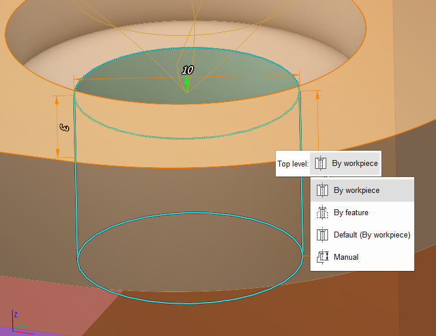
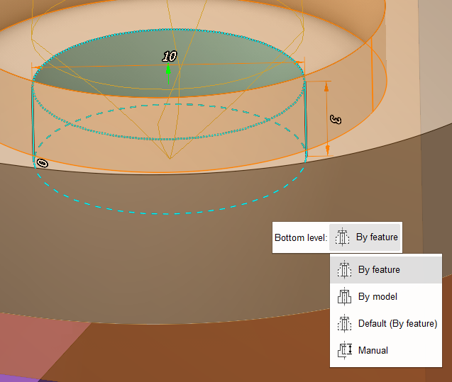

# Defining holes by coordinates

The window that opens is designed for parameter assignment of new or existing holes. To edit the parameters of an existing hole, double click the required hole in the list.

To create a hole the user should define the values of its parameters (position, diameter, depth) and press the **Ok** button. The created hole will be automatically added to the list.

When hole's parameters are being altered, the changes are displayed in the graphic window.

**Z max** - top level mode:

- **By workpiece** - the top level is defined as the highest coordinate of the workpiece edge along the tool travel path;
- **By feature** -the top level is defined as the highest coordinate of the geometric element selected as the <strong>Job Assignment</strong> along the tool travel path;
- **Default** – parentheses will indicate the default value selected in the **Default settings** window;
- **Manual** – user set value manually.

**Z min** - bottom level mode:

- **By feature** -the bottom level is defined as the most remote coordinate of the geometric element selected as the <strong>Job Assignment</strong> along the tool travel path;
- **By model** - the bottom level is determined by the most remote coordinate of the hole position on the part in the tool travel direction;
- **Default** – parentheses will indicate the default value selected in the **Default settings** window;
- **Manual** – user set value manually.

**Drill tip compensation** - choose the way the hole depth is specified:

- **Off** – last tool path point matches the drill tooling point;
- **Drill tip** – last tool path point matches the drill tip point;
- **Length** – same as **Off** but the drill travels the specified value down from the drill tooling point;
- **Auto** – hole depth is defined by the system based on whether the hole is blind or through.

**Default settings** button allows you to open window to set default values for **Z max** and **Z min**. These settings will be applied for the whole system, not just for a current project.

Also you can set **Z max** and **Z min** mode in graphics window. Click on top or bottom level and you see action menu. Each mode is displayed differently:

 
