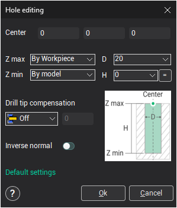

# Defining holes by using a geometrical point object

The window that opens is designed for parameter assignment of new or existing holes. To edit the parameters of an existing hole, double click the required hole in the list.

To create a hole the user should define the values of its parameters (position, diameter, depth) and press the **Ok** button. The created hole will be automatically added to the list.

When hole's parameters are being altered, the changes are displayed in the graphic window.
