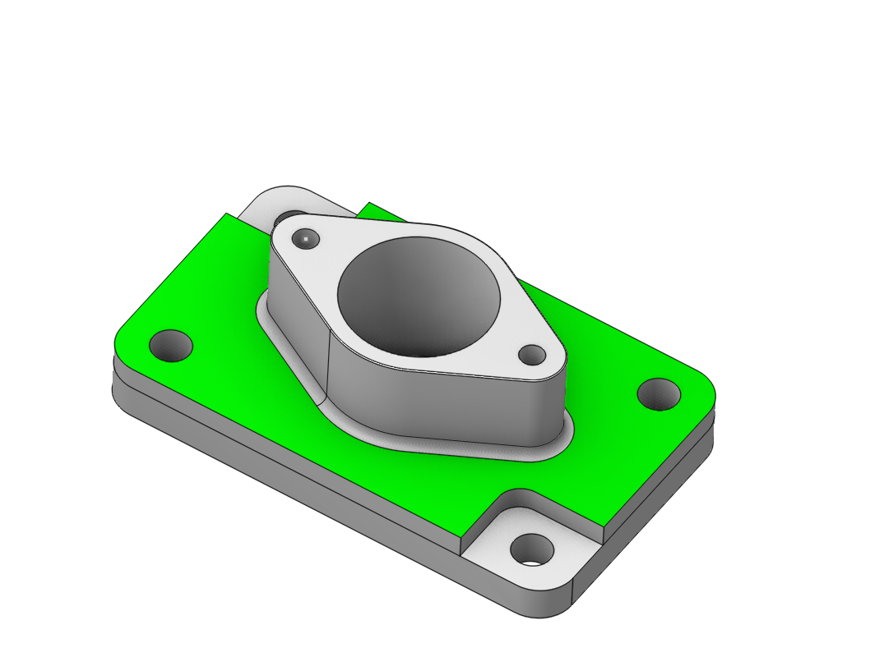
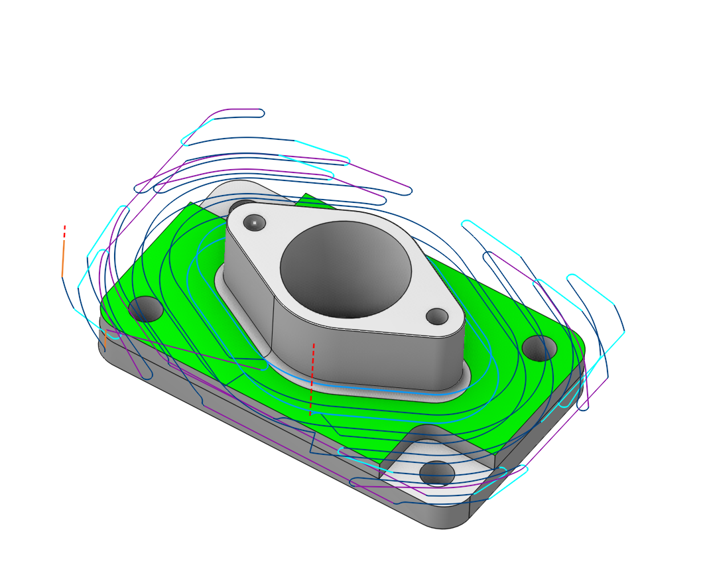
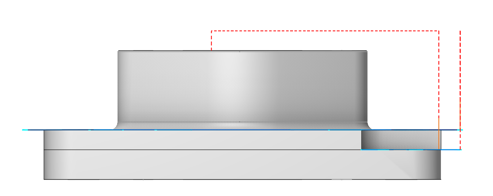
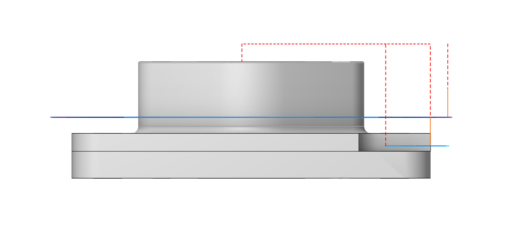

# Faces

 

## Application Area:

The button adds selected faces to the list. If no faces are selected then the dialog with the geometry model tree appears. In this dialog one should find and select the faces, the meshes and the groups to be added to the list. If a group is added then only 3D-objects of the group will be taken into account.

You can study the features of choosing faces in the corresponding section. [Details](10029.md)

### Surface stock

If you select different surfaces as a <strong>Job assignment</strong>, then in some operations you can use the surface property (double-click on the surface element in the <strong>Job assignment</strong>) to specify different <strong>stocks</strong> for different surfaces.

 

