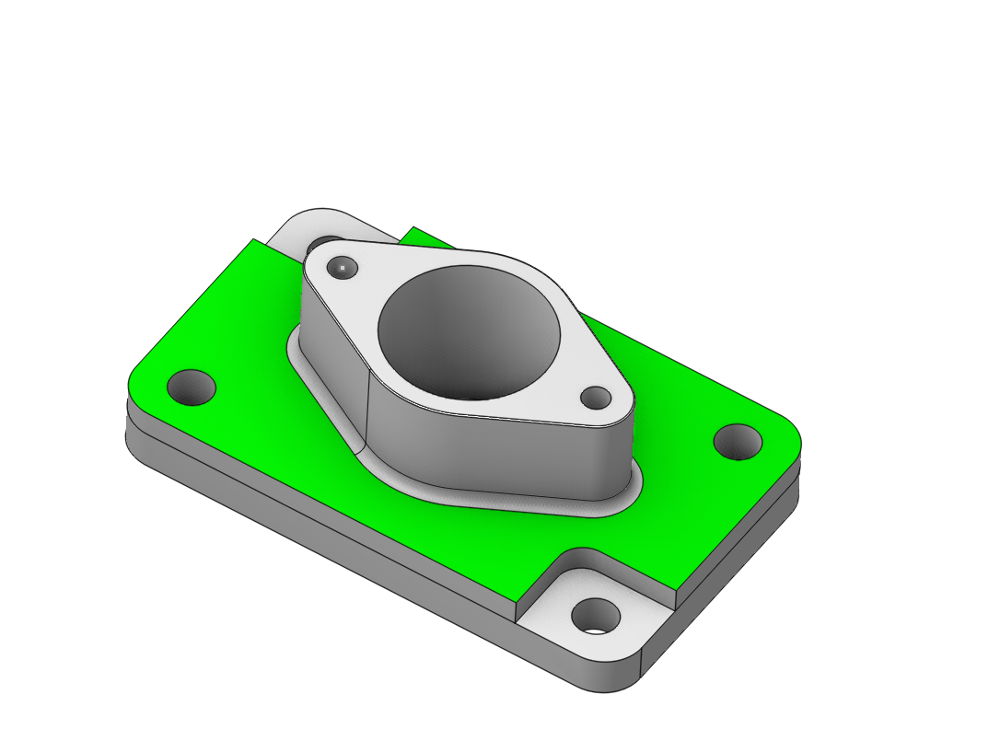
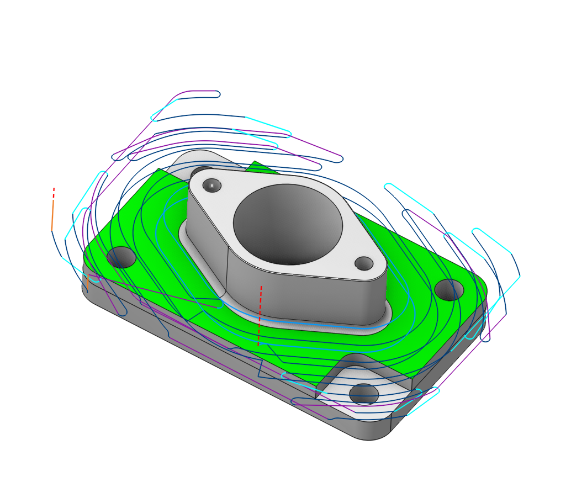
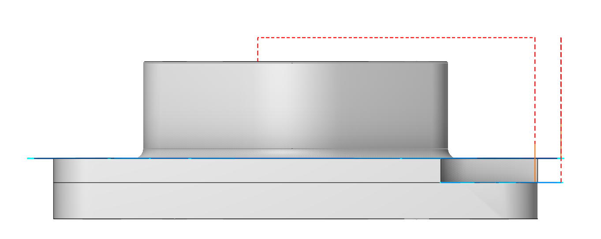
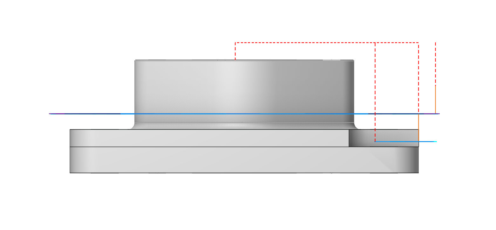

# フェイス

 

## 適用分野：

フェイスが選択されていない場合は、モデルツリーのダイアログが表示されます。このダイアログでは、リストに追加するフェイス、メッシュ、グループを検索して選択します。グループが追加された場合、そのグループの3Dオブジェクトのみが考慮されます。

<strong>面の選択方法の詳細は、対応するセクションで確認できます</strong>。[詳細を見る](10029.md)

<strong>ジョブ割り当て</strong>として異なるサーフェスを選択した場合、複数のオペレーションでサーフェスプロパティ（ <strong>ジョブ割り当て</strong>のサーフェス要素をダブルクリック）を使用して、異なるサーフェスに対して異なる<strong>ストック</strong> を指定することができます。

 
