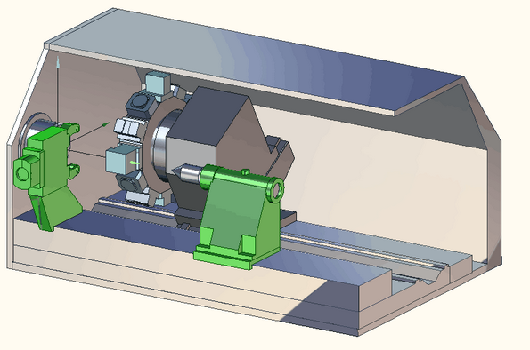
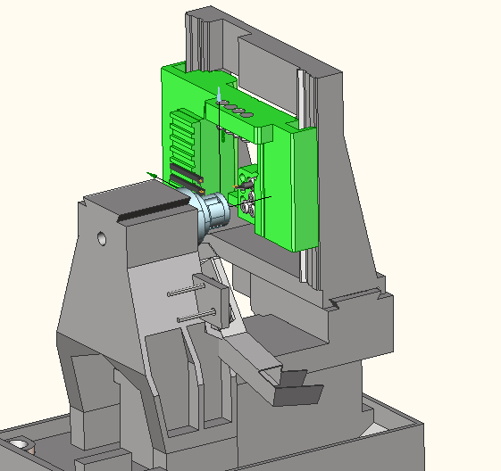

# Lathe-milling machines types

CAM system make possible to generate NC-programs for turret lathe processing centers, turning machines as "Swiss-type" and many others.

Mori Seiki NL 2500 machine's scheme:

"Swiss-Type" Po Ly gim mini-88Y machine's scheme:

Using of machines kinematics allows to realize a visual inspection of collision all executing agency such as poppethead, collar plate, tool turrent and a tool prominent from it.
