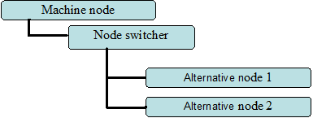
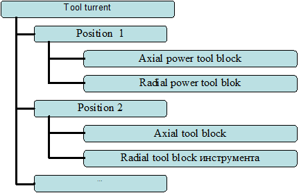
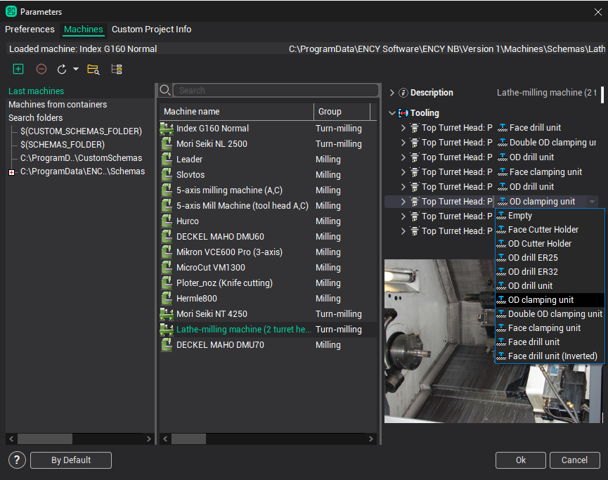

# Setting-up tooling

The kinematics of many machines may be appreciably changed by its changeover. For a possibility of quick and controlled machine changing in kinematics provided special node-switcher.

Node switcher at kinematic scheme of machine

Node – switcher make possible to join to parent node of machine one from alternatives nodes. If in scheme presents a node-switcher, it shows in tree like drop-down list, from which one of alternatives node may be chosen.

For example, on turning-revolver center in tool turrent position one from several types of blocks may be attaching. Blocks make available to set axial or radial immovable (turning) tool, and axial or radial driving tool. Moreover block may have different dimension-type.

Sample of description for tool turrent

Block settings realized in chose machine window by double click on machine or by button **Parameters**

