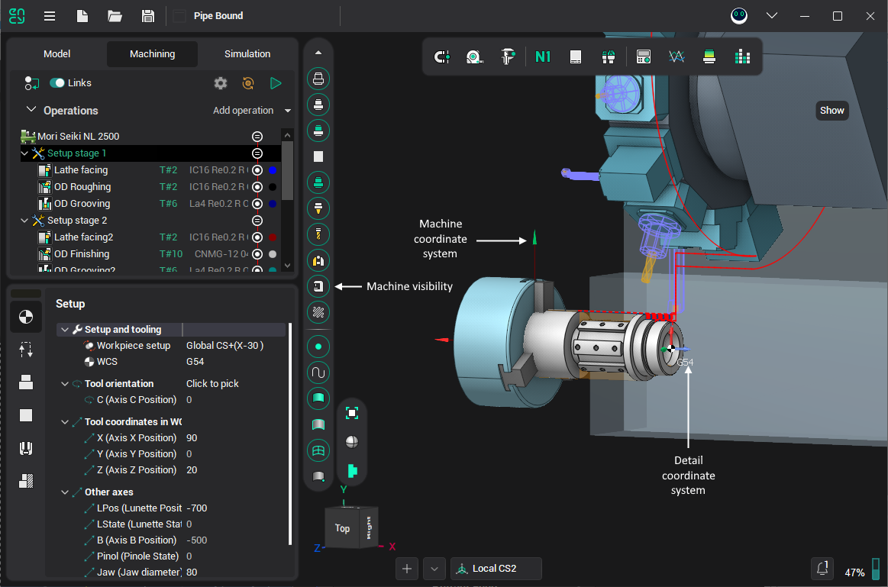
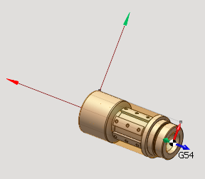
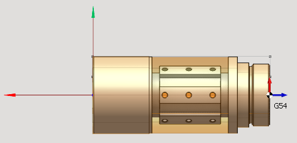
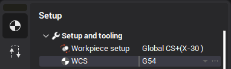

# Positioning of part

After choosing a machine and after setting a capstan on it is necessary to set up position of detail. As a rule, on lathe-milling machines bodies of revolution are processing. Detail may be imported from CAD system, or setting by generatrix, built in 2D geometry mode. If the detail is importing then its generatrix restoring on 3D model base. This process does not always work correctly. When errors exists, recommended to import generatrix as a curve and setup the detail with it.

Necessary to discriminate part coordinate system and machine coordinate system. Detail coordinate system attached to detail and e.g. rotate with the detail when a spindle was rotated. Machine coordinate system is shown in left bottom corner of the screen when the machine is visible.

When visibility of machine is OFF auxiliary axles show a part coordinate system.

At setup detail for processing on lathe machines necessary to align detail axle with X axle. There are two ways to do this: [by moving the detail](116.md) or by [creating new local coordinate system](753.md). Routine is to set an origin of coordinates on right butt of detail.

For created coordinate system become a set, necessary to indicate it in machine parameters or active operation. After this the system will superpose zero points of part and machine.

Machine zero point usually sets on a spindle nose. As result a detail will appear inside of machine. For a correct visualization necessary to set a detail zero point in machine coordinate system.
