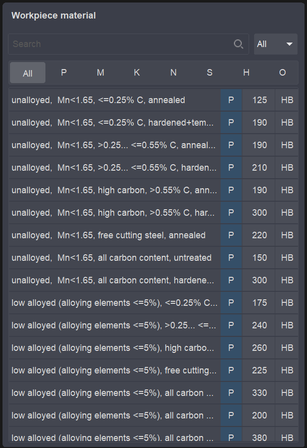
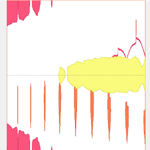
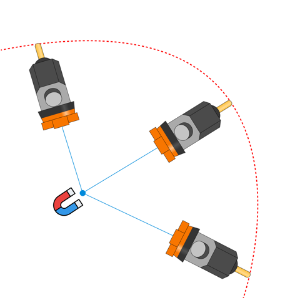
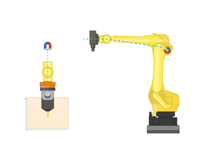
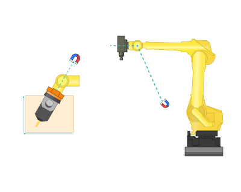
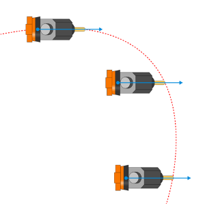
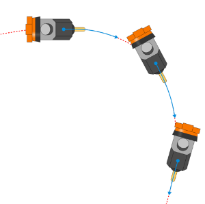
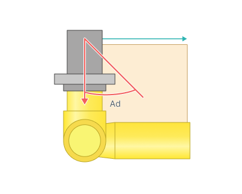

# Setup panel

## Application area:

The Setup tab is used to configure the primary parameters of the project. This can involve the positioning of the part on the equipment, the coordinate system of the part, and more.

### Part properties (available for the Part group). See more

Click here to expand..

<strong>Part number.</strong> Unique identifier assigned to a machined part (workpiece) in a CAM system.

<strong>Workpiece material.</strong> Material of the part being machined, selected from a reference catalog in the CAM system. Each entry defines the material's composition, condition (annealed, hardened, etc.), ISO machinability group (P, M, K, N, S, H, O), and hardness (e.g. HB value). The CAM system uses these properties to calculate cutting parameters — speeds, feeds, and tool engagement — for the machining operations. [Details](100128.md)

### Setup and tooling.

Click here to expand..

<strong>Workpiece connector.</strong> List of workpiece fixturing points on the machine (fixed table, rotary table, left chuck, etc.) The arrangement of the fixturing systems and their positioning is determined during the construction of the machine's kinematics.

<strong>Workpiece setup.</strong> Determines the position of the part on the equipment<strong>.</strong> [Details](10066.md)

<strong>Base setup.</strong> The same as <strong>Workpiece setup</strong> but for <strong>robots.</strong>

<strong>WCS.</strong> Workpiece coordinate system (WCS, G54 – G59) defines the NC-program "zero" on the workpiece. [Details](10068.md)

<strong>Base.</strong> The same as <strong>WCS</strong> but for <strong>robots.</strong>

<strong>Tool center point management.</strong> Involves continuous rotation mode of the workpiece coordinate system along with the workpiece itself. It is utilized for continuous 5-axis machining (provided that the CNC controller supports such a mode).

<strong>Local CS.</strong> Allows generating a trajectory within a coordinate system additionally offset and rotated concerning the workpiece coordinate system. For instance, a program for machining an inclined pocket concerning the workpiece coordinate system will be much simpler if derived in a local coordinate system aligned with the pocket's inclination. This method is used for positional 5-axis (3+2) machining. When selecting the 'Auto' value, the direction of the Z-axis in the local coordinate system is automatically set along the tool rotation axis, which is defined by parameters in the Tool Orientation group. [Details](726.md)

<strong>Tool connector.</strong> Determines the interchangeable node for installing the tool.

### Tool orientation.

It determines the orientation direction of the tool. [Details](260.md)

This group specifies the primary rotational axes.

### Machine limits.

The reduced limits are used when the <strong>toolpath</strong> and <strong>maps</strong> are calculated. They define the range within which the axis positions are considered valid, so the resulting motion is constrained to the specified envelope rather than to the full machine travel.

The limits are treated as operation limits: they describe the range acceptable for the current operation and are applied in addition to the global machine limits imported from the machine.

### Tool coordinates in WCS

This tab displays geometric coordinate systems. In parentheses, showed the name of the physical axis corresponding to movement along a specific axis.

### Linear physical axes

Coordinates values of the linear axes of the machine concerning the physical zero point of that axis (the end sensor of that axis). Here, display all the primary physical coordinates of axes not involved in the <strong>Tool coordinates in WCS.</strong>

### Other axes

This group specifies the auxiliary axes, such as the axes related to the movement of chuck jaws.

### Kinematics.

The Kinematics group defines the kinematic behavior of the equipment while the toolpath is executed — control of excessive degrees of freedom, motion optimization, and selection of the axis configuration. It is used to set up how a multi-axis machine or robot physically travels along the computed path.

Click here to expand..

<strong>Smart Motion.</strong> Smart Motion enables robot trajectory generation for 5D and 6D points without requiring a robot <strong>axes map</strong>. The resulting trajectory stays within axis limits and includes <strong>singularity</strong> and <strong>collision avoidance</strong>. Additionally, the trajectory can be fine-tuned using the robot axes map.

 

<strong>Axes map.</strong> The <strong>Axes Map</strong> allows to define manual and fine-tune automatic control laws for the excessive degrees of freedom of a robot (the 6th axis, the rails axes, the rotary table axes). The feature is available by pressing the ellipsis button next to the Axes map parameter. To optimize processing, it's possible to switch between different available axes of the equipment.

Mapping is applicable for robots( [Details](10266.md) ) and 5-axis machines ([Details](10147.md)).

<strong>Flips.</strong> Joint configuration switching. The <strong>J1, J3, and J5 buttons</strong> toggle the configuration (posture) of the corresponding joint, selecting an alternative inverse-kinematics solution. They make it possible to reach a different axis arrangement while preserving the tool position and orientation — for example, to avoid a travel limit or a collision.

### 6th axis control

To position an axial tool (mill, beam, jet), five degrees of freedom are required. A standard industrial robot has six axes. If the tool is not aligned with the rotation axis of the robot's last joint, there are infinite possibilities to position the robot precisely at a particular point by rotating the tool around its own axis. This provides additional flexibility in accessing hard-to-reach areas, helps circumvent various kinematic singularities, and avoids mechanical collisions between equipment components [Details](10263.md)

Click here to expand..

<strong>Direct to point.</strong>

In this mode you specify a 3d point which attracts the point of intersection of the 5th and 6th axes to the minimum distance during the machining.

<strong>Point.</strong>

<strong>Robot base point.</strong> In this mode, the point will be positioned at the robot's home/base point

<strong>Robot elbow point.</strong> In this mode, the point will be positioned at the robot's elbow point.

<strong>Custom.</strong> In this mode, the location of the point will be determined according to the user's instructions.

<strong>Fixed vector.</strong>

In this mode you define the desired direction of the robot flange (6th axis) in the coordinate system of the robot base.

<strong>Vector.</strong> Vector for the 6th axis of the robot.

.png)

<strong>Tool path</strong>

In this mode one axis of TCP is aligned with the tool path direction.

<strong>Angular deviation.</strong> Defines an additional angle for the 6th axis along the tool.

<strong>Tangent approximation.</strong>

<strong>Fixed lead direction.</strong> Fixes the movement of the tool at the selected angle in map (Lean angle, Lead agle) relative to the selected global coordinate system.

).png) ).png)

