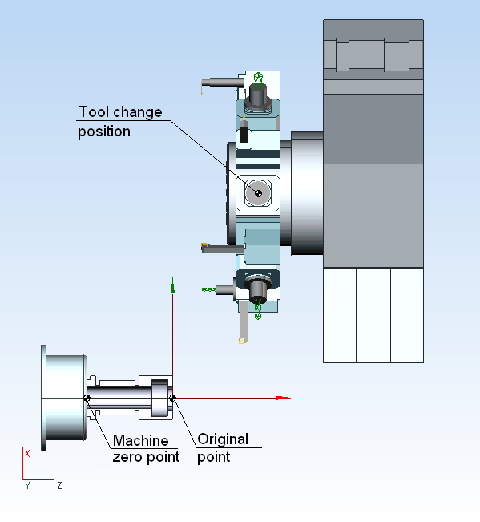

# Tool change position

The coordinates of the point of tool interchange are counted off from the 0 of the machine. In CAM system, as a rule, 0 of lathe Z-direction is located on the spindle nose. So, the coordinate of Z of the point of tool interchange may be calculated by the following formula:

<strong>Z tool interchange = length of the part + overhang of the longest axed tool + safe distance</strong>

The position of tool interchange determines the distance of the center of the turret block from the axle of spindle, so:

<strong>X tool interchange = billet radius + overhang of the longest radial tool + revolver radius + safe distance</strong>

In some schemes of the machine the point of affixment on the revolver head may be dislocated in X-direction on some distance. In this case the definition of the point of interchange are chosen experimentally.

It is necessary to note that during the forming of axled or radial relieves, the point of tool interchange influences the NC program. For example radial relief to the point of interchange is executing in two steps, the first step move the tip of the tool in X-direction so that the center of a revolver head is found in the coordinate X tool interchange. So the following coordinate will be included in the NC program.

<strong>X=X tool interchange - the tool overhang by the axle - the radius of revolver head</strong>

The following step is executing by the command <strong>**GOHOME**</strong> (G28), in other words it doesn't give coordinates.
