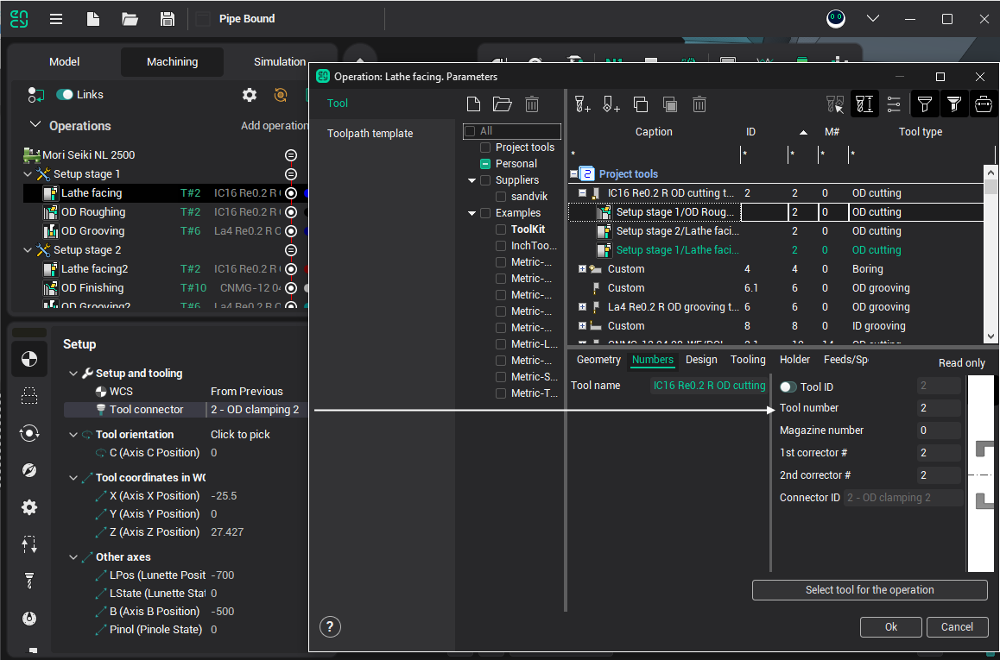
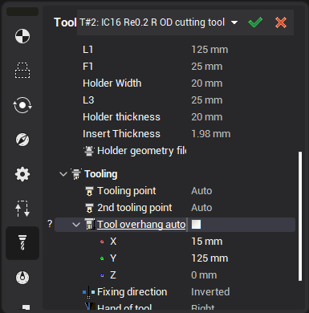

# Positioning of tool

After setup positioning of part and defining tool change point you can create new [operation](10174.md). One of main feature of operation is operation tool. For turret machine tool connector position (turret position number) define tool number for NC program output. So when you change tool connector then tool number is changed also. But otherwise when you change the tool number, tool connector number is not changed.

Tool overhang have action to NC program for move tool to tool change point. Tool overhang value influence to tool definition point at turret coordinate system. Setup tool overhang at window **Tool** at **Technology** mode.

