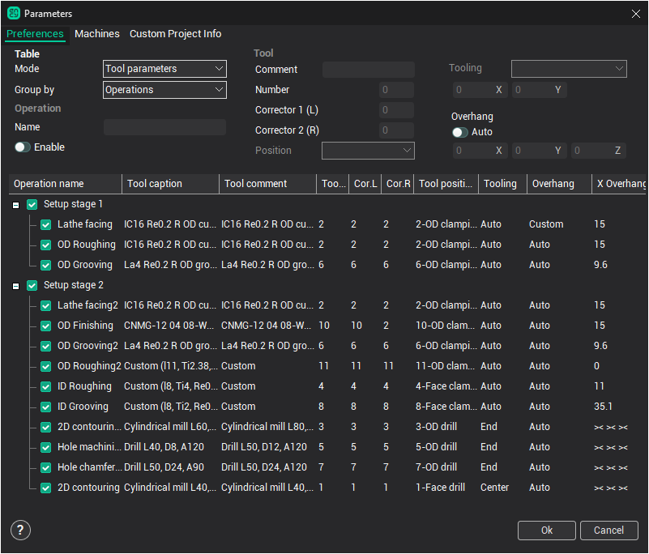

# Obligatory testings before the final generation

The final control of parameters is executed in summary window of operations. To open the window choose root operation (the machine) and press the button **Parameters**.

The window allows to edit one-type parameters of several operations at once. For that it is necessary to indicate the required operations holding down the button [Shift] or [Ctrl], after that input required values into the fields of input, located in the right part of the window. The window has two regimes: the regime of tools' editing and regime of editing of cutting regimes.

1. Check up the accuracy of installed tool numbers. The system doesn't control if in different operations under the same numbers different tools are installed.
2. It is obligatory to check up the tuning point of the tool in all the operations. If it is not correct simulation works correctly, and NC program is generating with a serious slip, such fact may lead to tool breakage or may be even the machine.
3. Switch to the regime of control of cutting conditions, check up the direction of spindle rotation, cooling and accuracy of supply values.
4. After any changes of parameters and trajectory recalculation once more model the process of working and be sure in absence of exclamation marks.
