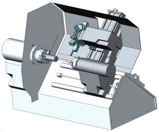
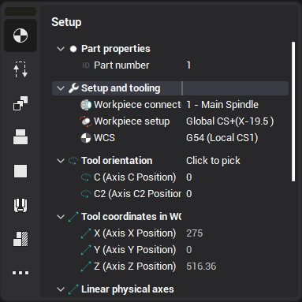
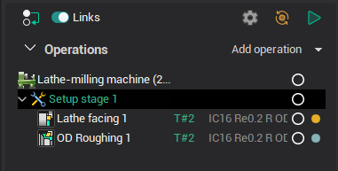
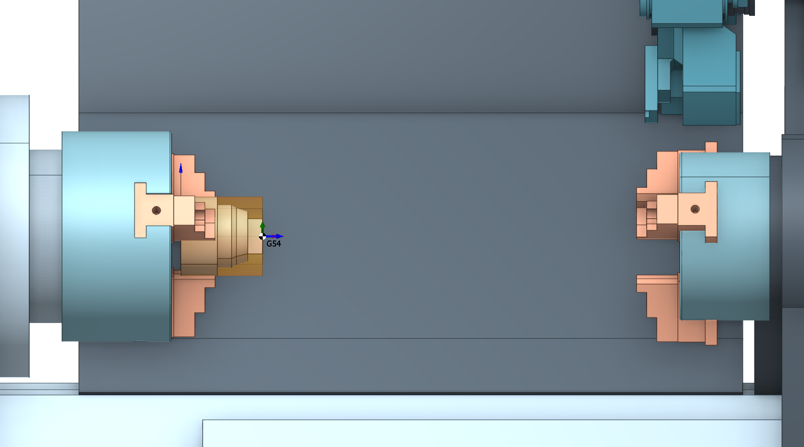
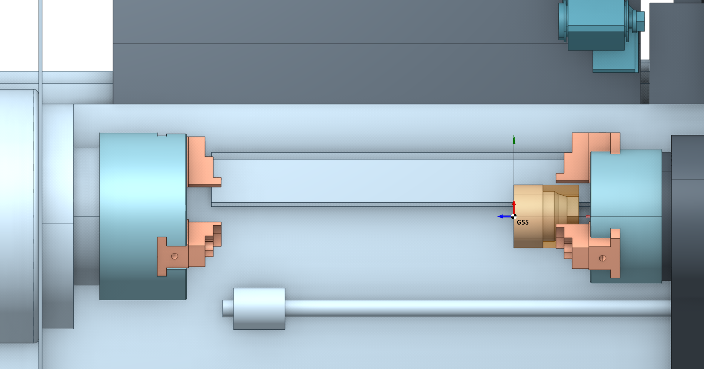
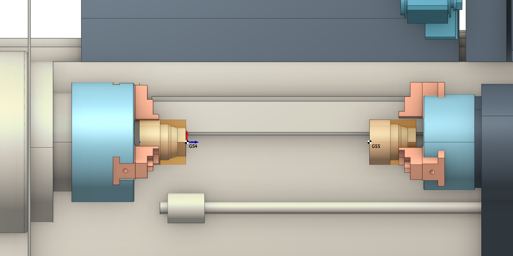
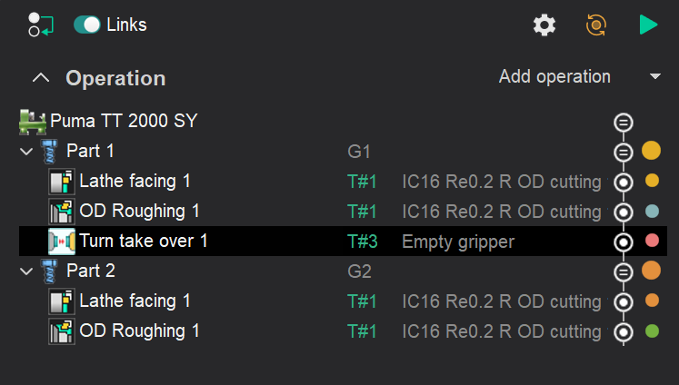
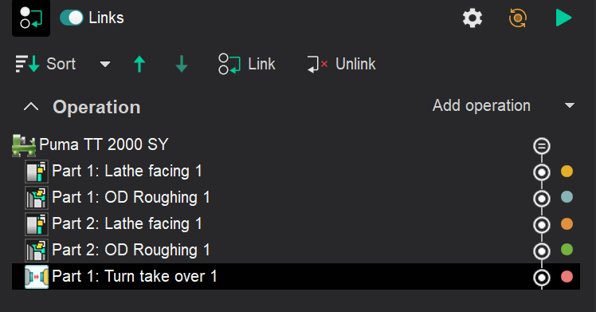

# Counter spindle machining

## Application area:

Counter spindle machines allow machining of parts in single fixing, reducing idle time and increasing machining precision. Also, counter spindle presence eliminates need for locating tools. There are machining centers with two machining turrets in addition to counter spindle. These machines optimize idle time and virtually replace two machines. CAM system can create NC-programs for counter spindle machining for both lathe and lathe-milling machining technologies.

## The peculiarities of working with machines equipped with a sub-spindle include:

### The main project settings typically include:

What is necessary to know before developing counter spindle machining process:

1. Spindle in which the machining will start.
2. Workpiece coordinate system (position in which the workpiece will be set). In the properties of this coordinate system specify it as **Machine coordinate system**, G54 for example. It is recommended to bind workpiece coordinate system to the non-fixed workpiece end.

First create the **Setup Stage** or **Part** operation which defines the initial position of the workpiece. Workpiece coordinate system and spindle where workpiece is fixed are specified on the **Setup** tab in the **Workpiece connector**, **Workpiece setup** and **WCS** fields respectively.

After defining workpiece location the exposed part elements should be machined.

<em><strong>Please note:</strong> To avoid mistaking active spindle in consequent operations specify `Frоm the previous operation` value for the **Current workpiece holder** field.</em>

### Workflow in lathe-milling projects

To refix workpiece from one spindle to another create a <strong>Stage</strong> or <strong>Part</strong> operation. For more information on the multi part projects see <strong>Multi part projects</strong>. [Details](1025.md)

For a lathe-milling project, the following scenarios are typical:

- <strong>Setup 1 - Setup 2.</strong> Transfer of the workpiece from setup 1 to setup 2 for additional machining operations such as milling or drilling.  
- <strong>Part 1 - Part 2.</strong> Machining of two different parts (Part 1 and Part 2) on the same machine, possibly with different operations and tools, to create complex or adjacent components.

<em></em>

After refixing create operations to machine the rest surfaces. Operations can be either lathe or lathe-milling. These scenarios reflect the flexibility and multifunctionality of lathe-milling machines, allowing for various machining operations to be performed on the same equipment.

### Move part.

To simulate the transfer of the part from the main to counter spindle you can use the <strong>Turn take over</strong> <strong>operation</strong>. [Details](10406.md)

If the project involves multiple parts, don't forget to use <strong>Sequencing and Links</strong> to move this operation to the end of the manufacturing process.

It is assumed that this operation, <strong>Turn take over</strong>, simulates the ejection of a part (semi-finished product) from the spindle, in which a new workpiece must be fixed. Then the process of interception of the part follows.
