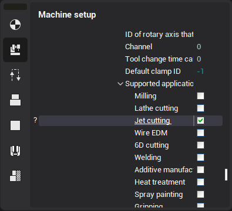

# Machining on cutting machines

The cutting machines – equipment intended for the cutting of flat parts from different types of sheet material. The equipment is divided in two groups by the way of cutting. The most widely distributed machines are based on such methods:

- **Plasmic cutting** uses compressed electric arc which is blew by gas. Blowing the arc, gas is warming and decomposing to positive and negative charged particles (ionizing). The charged particles are transformed into compact current of plasma with the temperature up to 15000 C.
- **Laser cutting** is one of the most modern technology which allows to make patterns from any shift material at contour. At the heart of this technology there is the work of in-focus laser beam. Such instrument is suitable for cutting of different types of sheet materials. The main value of in-focus laser beam – the smooth surface of the cut, and high accuracy of the cutted lines.
- **Oxygen cutting** – a method of cutting hardware, based on the properties of metals, heated till the temperature of inflammation, to burn in technically pure oxygen. At the oxygen cutting, oxygen stream burning through metal and cutting it, is directed to metal, heated up to 1200-1300 C.
- **Hydroabrasive cutting** is based on the appliance of water stream of high pressure (400 MP ) mixed with pomegranate sand. The big power of the stream support cutting, exactly speaking, destruction of solid structure on molecular level. This method allows qualitatively cut not only any kinds of metal and fusions, including intractable (non-rusting and heat-resistant steel, solid and titanic fusions) but also granite, ceramics, fire-proof and bullet-proof glass, rubber, paper, felt, composite and other materials).

Cutting operations are available in the list of operations in the "Cutting" group if the selected machine supports the appropriate type of machining only (has in its structure tool connector with enabled "Support / JetCutter" property). To make it available in the machine in which it is disabled by default, you should enable "Supported applications - Jet cutting" check box in the tool properties section of the machine parameters, as shown in the figure below.

