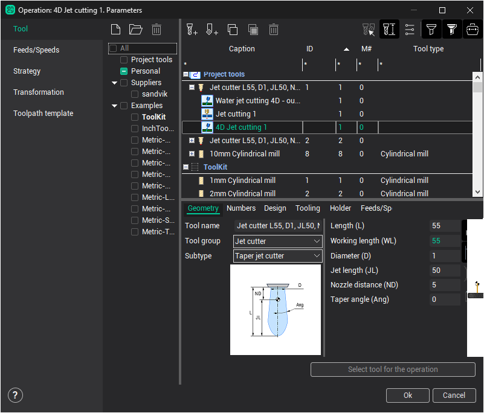

# 4D Jet cutting

Cutting 4D operation allows you to create not only purely 2D toolpath when the tool axis is oriented vertically, as well as more complex 4D toolpath when the tool axis is tilted according to the wall angle of the working geometry. At the same time, the tip of the tool is always positioned in the same plane, so the Z coordinate remains constant within the same contour. Accordingly, the processed geometry can be defined either as a flat curve (2D case), either two curves (upper and lower, 4D case), and the synchronization line also. They connect these contours and determine the tool angle in each position, as shown below. Working geometry is specified in the [Job assignment window](10229.md).

The tool of this operation by default is a Jet cutter that have properties listed below.

- Jet length - the length of the jet or beam that removes material in simulation mode.
- Diameter - jet or beam diameter at the exit point of the nozzle.
- Taper angle, if it has tapering.
- Nozzle distance - distance from the lower edge of the nozzle to the tool contact point, i.e. a point which will move on the upper level of the working contour defined in job assignment. By default, this point is the same with the tuning point of the tool, that is output to an NC code.

[Cutting conditions definition window](10237.md) allows to specify parameters of the each offset pass individually (if you need more than one pass).

- Feedrate
- Cutting condition code
- Offset distance for exact level
- Offset code or radius corrector number.

On the [Strategy tab of parameters window](10238.md) you can set parameters such as order and direction optimization, multi pass machining options, bridges etc.
