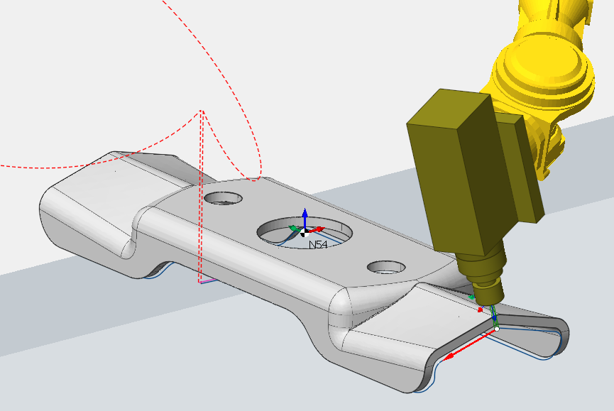
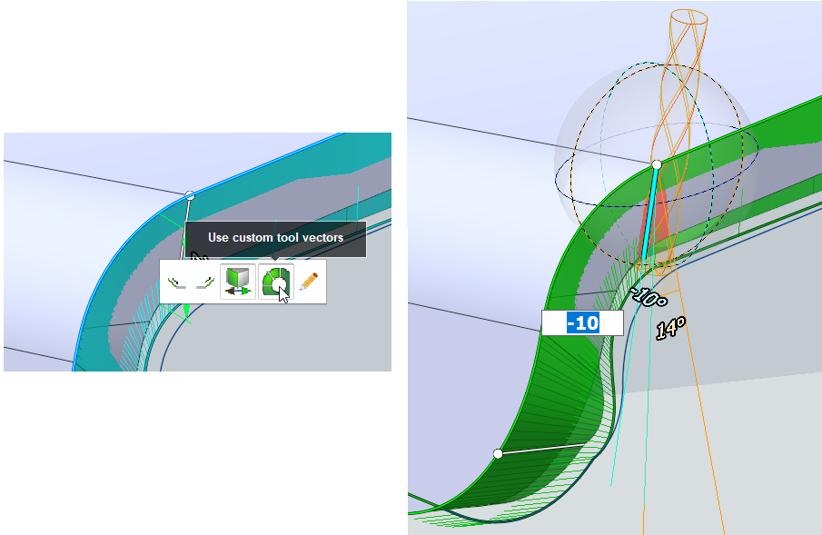
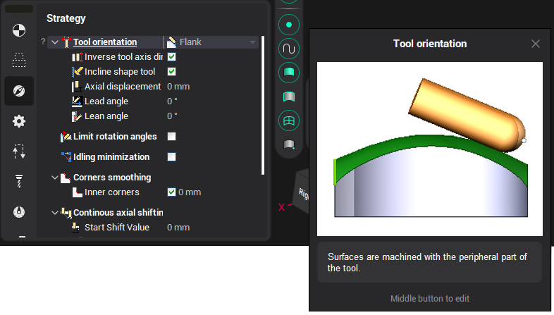
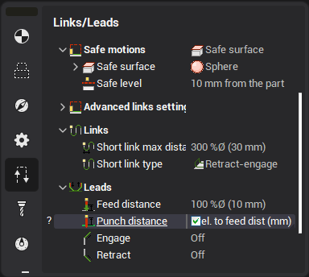

# Jet cutting 5D

Operation "Jet cutting 5D" is designed for the cutting on the shaped spatial surfaces. It is based on the operation "[5D contouring](10129.md)" excluding multipass machining feature unnecessary for this kind of application.

The "[way of definition of the machining profiles](10132.md)" and other parameters, which are not described in this chapter, is written in the description of the operation [5D contouring](10129.md).

The operation requires at least 5 degrees of freedom. So active machine must have a minimum of three linear and two-three rotary axes. Very often the industrial robots are used for the cutting. If the machine schema doesn't support all degrees of freedom, then the generated tool path will be incorrect.

In the job assignment you should define the contours along which cutting will be performed:

- edges of the model then the tool orientation vectors will be calculated from the neighboring faces of the edge,
- simple curves drawn in the CAD,
- [spatial spline curves](10157.md) drawn in the CAM directly.

In the last two cases the tool orientation angles will be calculated from the nearest faces of the part.

After the contours are set, you can switch to the [custom vector editing mode](10134.md), and adjust the exact tool angles at each of the curve points in the graphics window directly.

Also you should define the correct tool orientation law in the parameters. The operation contains a rich set of strategies. Click the smart hint button  next to the each parameter to get additional information.

Also in Links/Leads tab you can use punch distance. This distance allows the tool to be retracted to the distance required for punching.

There is two value:

1. mm ( entered value is calculated in mm )
2. rel. to feed dist ( the entered value is calculated relative to Feed distance )

This parameter is also available in Plasma Operations.
