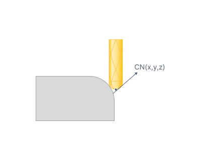
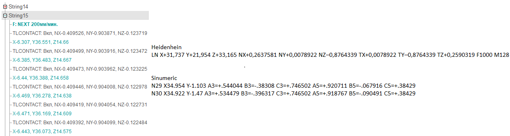

# 3D Tool Compensation

## Application area:

For surface finishing operations, the G‑code output may include the surface normal vector at the tool contact point. This enables the implementation of <strong>3D</strong> <strong>tool compensation</strong> — a controlled displacement of the cutting tool relative to the workpiece surface at each point along the toolpath.

To include surface normal vector data in the G‑code output, enable the <strong>Set tool contact surface normal vectors</strong> (on <strong>Machine setup panel</strong> [Details](1021.md)) flag in the machine schema settings. This generates a TLCONTACT (NX, NY, NZ) command in the CLData for each toolpath point. The postprocessor must then either:

- output the contact normal directly to the G‑code frame, or
- manually shift each path point along this vector by the specified correction amount, depending on the 3D compensation support of the target CNC system.

