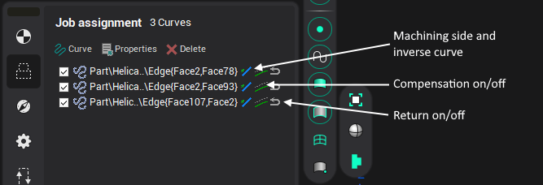
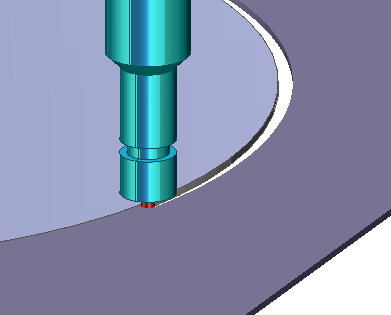
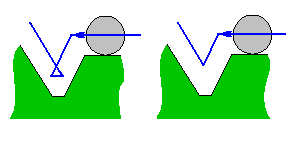
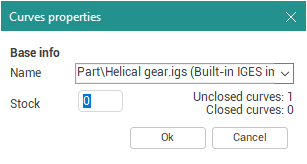
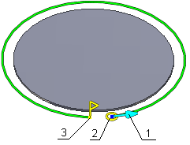

# Jet cutting job assignment

The [Jet cutting](326.md) operation allow the user to create a toolpath from a selected curve. At a very basic level, using this operation, a curve can be transformed into an NC program. Curves that are to be used for creating a toolpath should be added into operation's [Job assignment](301.md) curve list. To define a circle model element can be added as a point with a stock. To add the point (circle center) as a model element add it in the Job assignment dialog and assign it an additional stock equal to the radius of the circle.

If several curves are selected for machining and idling minimization mode is deselected on the **Strategy** page in the **Operation parameters** window, then the order of their machining will correspond to the order in the list. To change the sequence of the geometrical objects in the list use the mouse dragging.

The machining direction for a selected curve can be reversed by clicking in the **Inversion** column.

Jet cutting operation assumes plasma jet, fluid jet, or laser beam as the cutting tool. The toolpath can pass either at left to the curve or at right to the curve or along the curve.

If toolpath passes **Along the curve** then NC-program will represent the curve itself. The tool radius compensation command is output into the program if the appropriate flag is checked. This is the simplest way of converting a custom CAD-defined curve to a CNC-code.

For toolpath passing **At the left** or **At the right** of the curve the appropriate offset curve is output into the NC-program. The offset value is specified in the **Curves properties** panel. If compensation is switched off then the offset amount is an arithmetic sum of the used tool radius and the operation stock value. If the operation stock is less than zero, the offset amount will be reduced by its value.

Enabling the **Compensation** forces the generated toolpath to contain the `G41`, `G42`, `G40` commands with appropriate correctors' numbers. A typical series of actions to generate a toolpath with turned on compensation is: check the **Compensation** box in the **Curves properties** panel, than select the side of machining (left or right) in the same dialog, than enable the tool **Radius compensation** on the **Tool** tab of the operation parameters panel and set the appropriate compensation value.

The Jet cutting operation's toolpath is the movement path of the central axis of the cutter.

If a tool is required to return along an already machined contour then click in the **With return** column and the tool will travel along the selected contour, and then travel back along the contour to the original point. The picture above shows an example of machining along a contour with return. The stepover from contour to contour is performed around the workpiece at the same level as the work contours.

Modern CNC controls allow the programmer to use the actual component coordinates, and the operator enters the tool radius into the control. This allows the operator to for example, adjust for stock material for roughing/finishing operations. This can sometimes lead to situations where the offset toolpath calculated by the CNC control cannot be produced and causes error messages. An example is when using a tool that has a radius which will cause the offset contour to overlap. In the picture to the left the offset toolpath calculated by a CNC system can be seen, and to the right by a CAM system. Some older CNC's do not have the ability to calculate an offset toolpath. In these cases the task of offset toolpath calculation regarding the tool radius, the gap or the stock have to be performed in a CAM system..

The point on a curve to start machining is defined automatically by default. Where are some ways to change the start point. Open the **Curve properties** window by double click on item or from the popup menu.

This window contains the detailed information about item.

The start point can be input by coordinates or selected from the list. Along with geometry elements the list contains the following constants:

- **Auto** – the curve is being machined from the begin to the end;
- **Curve begin** – the machining will start from the curve begin;
- **Curve end** – the machining will stop in the end of curve;
- **Custom** – the point is defined by coordinates in the fields X and Y.

If the defined point does not lay on the curve then the machining will start from the point that is nearest to the defined ones.

The start point can be defined interactively by mouse from the screen. It is possible if the item contain one curve or one point only. If the machining parameters can be defined interactively then the picture below will appear near the selected item.

Where:

1. machining direction,
2. tool profile sketch,
3. end point.

The start point is shown by the tool (1) and machining direction (2).

There are two kind of the end point.  – if the curve is closed.  – if the curve is unclosed.

When you change start and end points positions point-snapping mode is activated and the end point mark looks like .

To specify the start point move the mouse pointer over the tool (2), then press and hold the left button and drag the start point to the desired position. To specify the end point use the same method on the end point sign (3).

The machining direction can be altered by clicking on the arrow (1).
