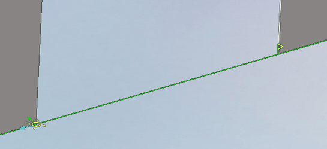

# Job assignment of EDM and Jet cutting 4D operations

Job assignment for the wire EDM machining operations have a list of job assignment items. These items are machining geometry and also technology parameters. Job items can be viewed in short or full form. Each item may be a single contour or a folder which contains several contours.

The short view is a list of job assignment items, you can see it below:

The operation `4D Contouring` allows to add 2D contour. The operation `2D Contouring` can not add 4D contour.

The following functions are available:

- `Wire EDM item 2D` – add selected item as 2D job assignment.
- `Wire EDM item 4D` – add selected item as 4D job assignment. One of contour will be taken as upper, the second one will be taken as lower contour. This button is available only for [4D Contouring](10247.md)

- [Properties](10230.md) – opens a window with full view of the job assignment item properties. Several items can be edited at one time, just use the standard Windows keys combinations to select them.
- **Delete** – deletes the selected items from the list.

For call parameters window and delete items it is possible to use buttons on the pop-up panel:

It is possible to [select several items with several parameters](10235.md).

The contour can be closed and open. Start and end points of the contour can be changed in the graphics window:

The system allows you to edit the contour directly in the graphics window. Editing principles are similar to those used in [Lathe operations](10209.md).
