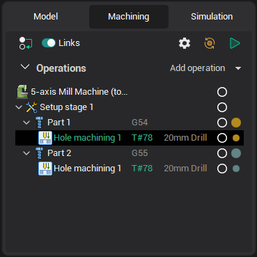
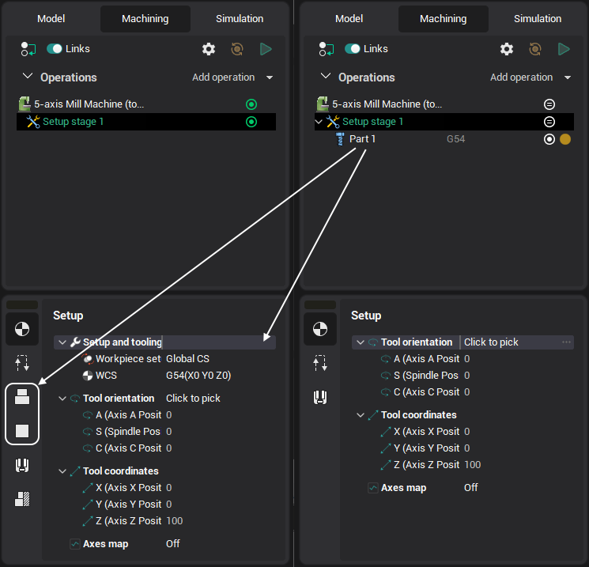

# Structure group of operations

## Application area:

The group required to build a technological process.

## The peculiarities of working:

The components included in the operation tree have a hierarchical structure similar to the sequence of technological processes. Nodes of the <strong>Part</strong> or <strong>Part Copy</strong> type are nested in the <strong>Structures group</strong> node. In turn, the <strong>Multiply Group</strong> node is nested within the <strong>Part</strong> and <strong>Part Copy</strong> nodes.

Accordingly, operations are located within these nodes.

The tabs located in the groups are similar to the element in the Equipment tree. Adding a new subgroup in the structure reduces the number of tabs in the current group, and the nested group will inherit some of the same parameters as the main group. However, these parameters are hidden in the main group.

