# 2D job assignment item properties

Each element of the job assignment has a set of properties.

To view or edit the properties of 2D job assignment item select the item and click the **Properties** button, or double-click the item.

This is the item properties dialog:

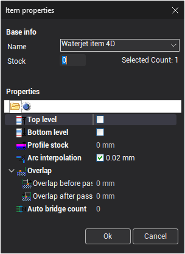

- **Top level** – plane for the top guide of the EDM-machine.To set the top guide level via the graphic window move the top level sign:

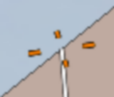

- **Bottom level** – plane for the bottom guide of the machine.To set the bottom guide level via the graphic window move the bottom level sign:

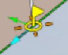 To set the exact level of the top or bottom guide click the sign of the level and input the value: 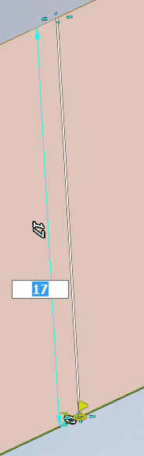

- **Profile stock** – additional stock for the resulting contour. The value of the stock can be either positive or negative.
- **Overlap before pass** – value of overlap at the beginning of the job assignment item.
- **Overlap after pass** – sets the value of overlap at the end of the job assignment item.
- **Auto bridge count** – number of bridges. Bridges properties can be set in the graphic window.
- **Taper parameters** – if turned off the wire will be positioned at normal to the XY plane and the result of the machining will be a cylindric surface. To machine a conical surface turn on the feature and set the taper angle value and direction for each contour. To set the taper angle click the synchronization line and input the value.
- 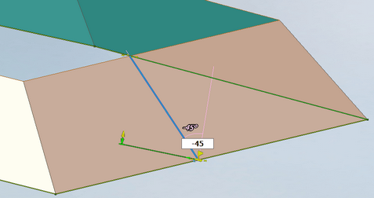 When taper is turned on the taper angle value will be output into each NC frame (for example `G01 X30 Y45 A5`). Turning the taper feature on enables additional parameters.

- **Taper application** can be one of the following values:

- **All passes** – taper will be applied for all passes of the contours.
- **Apply after pass** – taper will be applied after the pass number set in the `Pass #` field. Taper will be disabled for the N passes, passes starting with N+1 will have taper enabled.
- **Cancel after pass** – taper will be canceled after the pass number set in the `Pass #` field. Taper will be enabled for N passes, passes starting with N+1 will have taper disabled.

- **Corners rolling** – Modern EDM NC-controllers support automatic rolling of sharp corners in the wire path. CAM system can use this feature of NC-controller. **Corners rolling** panel contains properties that are used to setup corners rolling feature of the NC. When the feature is enabled the output of contour coordinates into the NC-program are the same (the contour is not changed). However, in the NC-frames where the corners rolling is required additional words defining the rolling radii are output. Rolling radii can be defined separately for the top and bottom contours. For example, `G01 X95.24 Y53.09 R1.5 R5.3` – the first **R** word defines rolling radius for the bottom contour, the second **R** word defines rolling radius for the top contour 5.3.

Remark: CAM system simulation supports visualization of the wire path modified by the NC-controller corners rolling.

CAM system supports various modes of corners rolling which can be set separately for inner(**Inner corners rolling**) and outer corners(**Outer corners rolling**). Whether the corner is inner or outer is determined by the angle value inside the part. Inner corner has the angle of 180° or more, outer has the angle less than 180°.

| **Inner corner** | **Outer corner** |
|---|---|
| 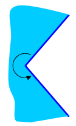 | 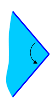 |

The following modes of rolling are supported:

- **Off** – in this mode corners rolling feature is disabled, rolling radii are not output into the NC-program.

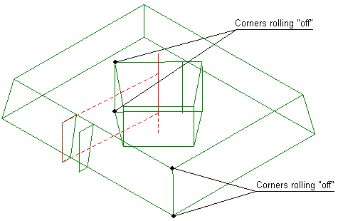

- **Sharp** – in this mode only the bottom contour corners are rolled, top level corners are not rolled. Therefore only the **Bottom radius** input field is enabled.

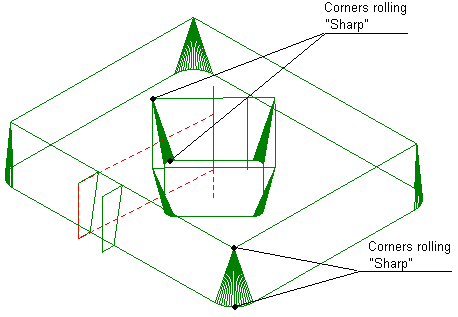

- **Conical** – in this mode the bottom contour corner rolling radius is set in the appropriate input field. Top contour rolling radius is defined a sum of bottom radius and a value depending on the taper angle and difference of top and bottom contour levels:

```
Rtop = Rbottom ± h · tg α
```

Thereby, a conical surface is machined on the part in the place of corner rolling.

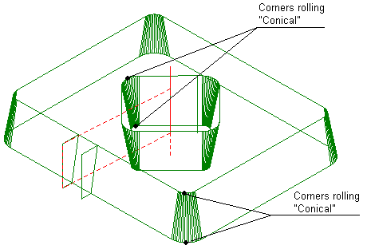

- **Cylindrical** – corner rolling radius is always equal for the top and bottom levels and is input in the **Bottom radius** field. Thereby, a cylindrical surface is machined in the place of corner rolling.

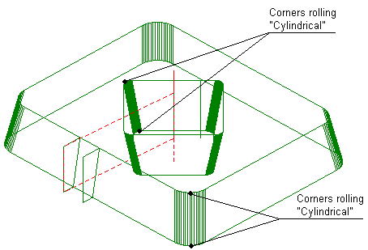

- **Fixed** – radii of rolling at top and bottom levels are defined independently in the respective fields and can be set to arbitrary positive values.

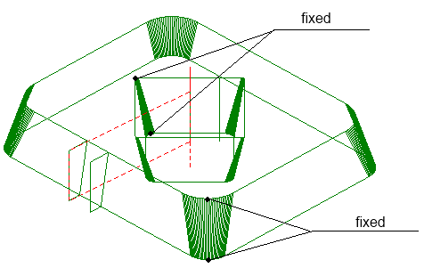

Use the second tab of the properties dialog to specify direction and side of the machining for each job assignment item.


In the graphic window direction is shown with a sky-blue arrow, machining side is shown with a lime arrow.

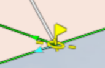

This parameters can be modified either via the properties dialog or by clicking in the arrow in the graphic window.
